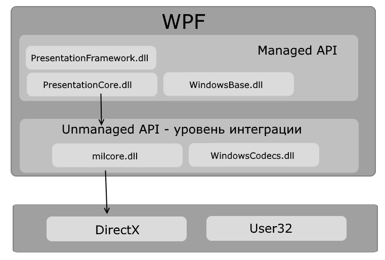
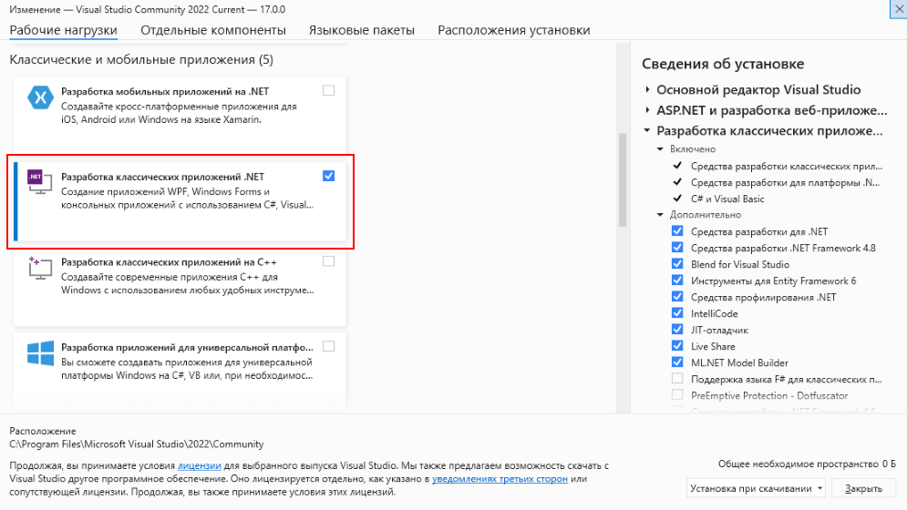
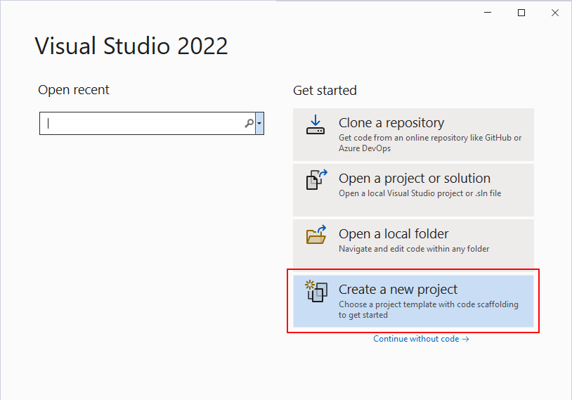
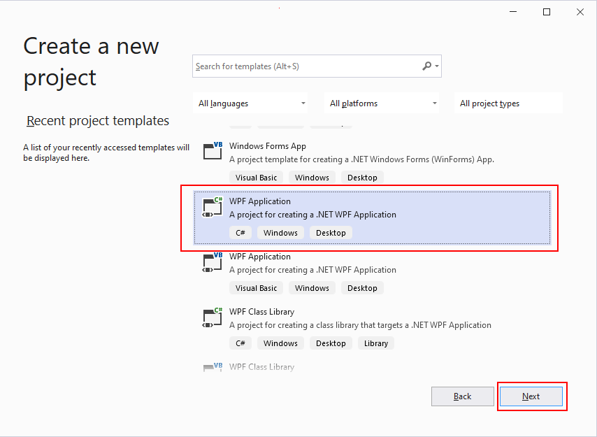
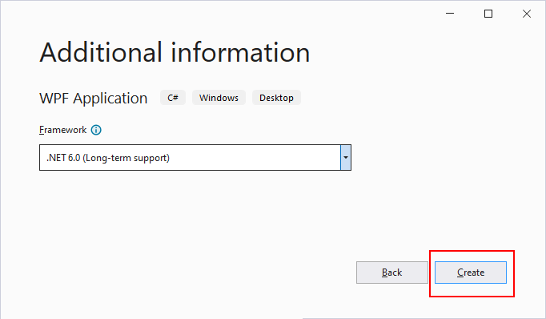

# Введение в WPF

## Особенности платформы WPF

Технология WPF (Windows Presentation Foundation) является часть экосистемы платформы .NET и представляет собой подсистему для построения графических интерфейсов.

Если при создании традиционных приложений на основе WinForms за отрисовку элементов управления и графики отвечали такие части ОС Windows, как User32 и GDI+, то приложения WPF основаны на DirectX. В этом состоит ключевая особенность рендеринга графики в WPF: используя WPF, значительная часть работы по отрисовке графики, как простейших кнопочек, так и сложных 3D-моделей, ложиться на графический процессор на видеокарте, что также позволяет воспользоваться аппаратным ускорением графики.

Одной из важных особенностей является использование языка декларативной разметки интерфейса XAML, основанного на XML: вы можете создавать насыщенный графический интерфейс, используя или декларативное объявление интерфейса, или код на управляемых языках C#, VB.NET и F#, либо совмещать и то, и другое.

Первая версия - WPF 3.0 вышла вместе с .NET Framework 3.0 и операционной системой Windows Vista в 2006 году. И с тех пор платформа WPF является частью экосистемы .NET и развивается вместе с фреймворком .NET. Например, на сегодняшний день последней версией фреймворка .NET является .NET 6, и WPF полностью поддерживается этой версией фреймворка.

## Преимущества WPF

Что вам, как разработчику, предлагает WPF?
- Использование традиционных языков .NET-платформы - C#, F# и VB.NET для создания логики приложения
- Возможность декларативного определения графического интерфейса с помощью специального языка разметки XAML, основанном на xml и представляющем альтернативу программному созданию графики и элементов управления, а также возможность комбинировать XAML и C#/VB.NET
- Независимость от разрешения экрана: поскольку в WPF все элементы измеряются в независимых от устройства единицах, приложения на WPF легко масштабируются под разные экраны с разным разрешением.
- Новые возможности, которых сложно было достичь в WinForms, например, создание трехмерных моделей, привязка данных, использование таких элементов, как стили, шаблоны, темы и др.
- Хорошее взаимодействие с WinForms, благодаря чему, например, в приложениях WPF можно использовать традиционные элементы управления из WinForms.
- Богатые возможности по созданию различных приложений: это и мультимедиа, и двухмерная и трехмерная графика, и богатый набор встроенных элементов управления, а также возможность самим создавать новые элементы, создание анимаций, привязка данных, стили, шаблоны, темы и многое другое
- Аппаратное ускорение графики - вне зависимости от того, работаете ли вы с 2D или 3D, графикой или текстом, все компоненты приложения транслируются в объекты, понятные Direct3D, и затем визуализируются с помощью процессора на видеокарте, что повышает производительность, делает графику более плавной.
- Создание приложений под множество ОС семейства Windows
- В тоже время WPF имеет определенные ограничения. Несмотря на поддержку трехмерной визуализации, для создания приложений с большим количеством трехмерных изображений, прежде всего игр, лучше использовать другие средства - DirectX или специальные фреймворки, такие как Monogame или Unity.

Также стоит учитывать, что по сравнению с приложениями на Windows Forms объем программ на WPF и потребление ими памяти в процессе работы в среднем несколько выше. Но это с лихвой компенсируется более широкими графическими возможностями и провышенной производительностью при отрисовке графики.

Кроме того, несмотря на то, что WPF работает поверх кроссплатформенной среды .NET 5/6, но в силу природы WPF и зависимости от компонентов Windows, на данный момент создавать приложения на WPF можно только под ОС Windows.

# Архитектура WPF

Схематически архитектуру WPF можно представить следующим образом:



Как видно на схеме, WPF разбивается на два уровня: managed API и unmanaged API (уровень интеграции с DirectX). Managed API (управляемый API-интерфейс) содержит код, исполняемый под управлением общеязыковой среды выполнения .NET - Common Language Runtime. Этот API описывает основной функционал платформы WPF и состоит из следующих компонентов:

- PresentationFramework.dll: содержит все основные реализации компонентов и элементов управления, которые можно использовать при построении графического интерфейса
- PresentationCore.dll: содержит все базовые типы для большинства классов из PresentationFramework.dll
- WindowsBase.dll: содержит ряд вспомогательных классов, которые применяются в WPF, но могут также использоваться и вне данной платформы

Unmanaged API используется для интеграции вышележащего уровня с DirectX:

- milcore.dll: собственно обеспечивает интеграцию компонентов WPF с DirectX. Данный компонент написан на неуправляемом коде (С/С++) для взаимодействия с DirectX.
- WindowsCodecs.dll: библиотека, которая предоставляет низкоуровневую поддержку для изображений в WPF

Еще ниже собственно находятся компоненты операционной системы и DirectX, которые произвоят визуализацию компонентов приложения, либо выполняют прочую низкоуровневую обработку. В частности, с помощью низкоуровневого интерфейса Direct3D, который входит в состав DirectX, происходит трансляция

Здесь также на одном уровне находится библиотека user32.dll. И хотя выше говорилось, что WPF не использует эту библиотеку для рендеринга и визуализации, однако для ряда вычислительных задач (не включающих визуализацию) данная библиотека продолжает использоваться.

# Начало работы с WPF

Для создания приложений с помощью технологии WPF нам потребуется среда разработки Visual Studio. В дальнейшем мы будем использовать бесплатную и полнофункциональную среду разработки - Visual Studio Community 2022, которую можно загрузить по следующему адресу: https://www.visualstudio.com/en-us/downloads.


Чтобы добавить в Visual Studio поддержку проектов для WPF и C# и .NET 6, в программе установки среди рабочих нагрузок нужно выбрать только пункт Разработка классических приложений .NET. Можно выбрать и больше опций или вообще все опции, однако стоит учитывать свободный размер на жестком диске - чем больше опций будет выбрано, соответственно тем больше места на диске будет занято.



После установки среды и всех ее компонентов, запустим Visual Studio и создадим проект графического приложения. На стартовом экране выберем Create a new project (Создать новый проект)



На следующем окне в качестве типа проекта выберем WPF Application:



Далее на следующем этапе нам будет предложено указать имя проекта и каталог, где будет располагаться проект.


В поле Project Name дадим проекту какое-либо название. В моем случае это HelloApp.

На следующем окне Visual Studio предложит нам выбрать версию .NET, которая будет использоваться для проекта. По умолчанию здесь выбрана последняя на данный момент версия - .NET 6.0. Оставим и нажмен на кнопку Create (Создать) для создания проекта.



После этого Visual Studio откроет наш проект с созданными по умолчанию файлами:


# Структура проекта

Справа находится окно Solution Explorer, в котором можно увидеть структуру нашего проекта. В данном случае у нас сгенерированная по умолчанию структура:

- Dependencies - это узел содержит сборки dll, которые добавлены в проект по умолчанию. Эти сборки как раз содержат классы библиотеки .NET, которые будет использовать C#
- App.xaml задает ресурсы приложения и ряд конфигурационных настроек в виде кода XAML. В частности, в файле App.xaml задается файл окна программы, которое будет открываться при запуске приложения. Если вы откроете этот файл, то можете найти в нем строку StartupUri="MainWindow.xaml" - то есть в данном случае, когда мы запустим приложение, будет создаваться интерфейс из файла MainWindow.xaml.
 App.xaml.cs - это файл кода на C#, связанный с файл App.xaml, который также позволяет задать ряд общих ресурсов и общую логику для приложения, но в вид кода C#.
- AssemblyInfo.cs содержит информацию о создаваемой в процессе компиляции сборке
- MainWindow.xaml.cs - это файл логики кода на C#, связанный с окном MainWindow.xaml.

По умолчанию эти файлы открыти в текстовом редакторе Visual Studio. Причем файл MainWindow.xaml имеет два представления: визуальное - в режиме WYSIWIG отображает весь графический интерфейс данного окна приложения, и под ним декларативное объявление интерфейса в XAML. Если мы изменим декларативную разметку, например, определим там кнопку, то эти изменения отображаться в визуальном представлении. Таким образом, мы сможем сразу же получить представление об интерфейсе окна приложения.


# Настройка компиляции проекта

Кроме того, проект WPF имеет еще один важный файл, как и все проекты на языке C# - файл конфигурации проекта. Для его открытия нажмем двойным кликом левой кнопкой мыши на название проекта или нажмем правой кнопкой мыши на название проекта и появившемся контекстном меню выберем пункт Edit Project File


В итоге нам откроектся файл с расширением csproj, который называется по имени проекта (например, HelloApp.csproj) со следующим содержимым:


```Csharp
<Project Sdk="Microsoft.NET.Sdk">
 
  <PropertyGroup>
    <OutputType>WinExe</OutputType>
    <TargetFramework>net6.0-windows</TargetFramework>
    <Nullable>enable</Nullable>
    <UseWPF>true</UseWPF>
  </PropertyGroup>
 
</Project>
```
Для компиляции приложения WPF указаны следующие настройки:

- OutputType: определяет выходной тип проекта. Должен иметь значение WinExe - то есть выполняемое приложение с расширением exe под Windows
- TargetFramework: определяет применяемую для компиляции версию фреймворка .NET. Поскольку при создании проекта была выбрана версия .NET 6, а сам проект зависит от компонентов Windows, то здесь должно быть значение net6.0-windows
- Nullable: подключает в проект функциональность ссылочных nullable-типов
- UseWPF: указывает, будет ли проект использовать WPF. (при значении true проект использует WPF)

# Запуск проекта

Чтобы запустить приложение в режиме отладки, нажмем на клавишу F5 или на зеленую стрелочку на панели Visual Studio. И после этого запустится пустое окно по умолчанию.

После запуска приложения студия компилирует его в файл с расширением exe. Найти данный файл можно, зайдя в папку проекта и далее в каталог \bin\Debug\net6.0-windows

Рассмотрев вкратце создание проекта графического приложения, мы можем перейти к обзору основных компонентов и начнем мы с форм.

# Создание первого приложения

Однако приложение с пустым окном - не слишком показательный пример. Добавим в него чуть больше функционала. Для этого откроем файл логики кода окна приложения - MainWindow.xaml.cs. Сейчас он имеет следующий код:

```Csharp
using System;
using System.Collections.Generic;
using System.Linq;
using System.Text;
using System.Threading.Tasks;
using System.Windows;
using System.Windows.Controls;
using System.Windows.Data;
using System.Windows.Documents;
using System.Windows.Input;
using System.Windows.Media;
using System.Windows.Media.Imaging;
using System.Windows.Navigation;
using System.Windows.Shapes;
 
namespace HelloApp
{
    public partial class MainWindow : Window
    {
        public MainWindow()
        {
            InitializeComponent();
        }
    }
}
```

Здесь определен класс MainWindow, который наследуется от класса Window и берет от него всю базовую функциональность окон. А в конструкторе этого класса вызывается метод InitializeComponent(), который позволяет применить интерфейс из файла MainWindow.xaml.

Теперь изменим файл MainWindow.xaml.cs следующим образом:

```Csharp
using System.Windows;
 
namespace HelloApp
{
    public partial class MainWindow : Window
    {
        public MainWindow()
        {
            InitializeComponent();
        }
 
        private void Button_Click(object sender, RoutedEventArgs e)
        {
            MessageBox.Show("WPF на METANIT.COM");
        }    
    }
}
```

Здесь добавлен метод Button_Click, который будет выступать в качестве обработчика нажатия кнопки. Ообработчики нажатия кнопки должны принимать два параметра типов object и RoutedEventArgs. В самом обработчике вызывается метод MessageBox.Show, который отображает окно с сообщением. Отображаемое сообщение передается в качестве параметра.

Теперь определим саму кнопку. Для этого перейдем к файлу MainWindow.xaml, который содержит разметку визуального интерфейса в виде кода XAML. По умолчанию он имее следующее содержимое:

```Csharp
<Window x:Class="HelloApp.MainWindow"
        xmlns="http://schemas.microsoft.com/winfx/2006/xaml/presentation"
        xmlns:x="http://schemas.microsoft.com/winfx/2006/xaml"
        xmlns:d="http://schemas.microsoft.com/expression/blend/2008"
        xmlns:mc="http://schemas.openxmlformats.org/markup-compatibility/2006"
        xmlns:local="clr-namespace:HelloApp"
        mc:Ignorable="d"
        Title="MainWindow" Height="450" Width="800">
    <Grid>
 
    </Grid>
</Window>
```
XAML в целом напоминает язык разметки HTML: здесь у нас сначала определен элемент верхнего уровня Window - окно приложения, в нем определен элемент Grid - контейнер верхнего уровня, в который мы можем добавлять другие элементы. Каждый элемент может иметь определенные атрибуты. Более подробно с языком XAML и элементами мы познакомимся позднее, а пока изменим эту разметку на следующую:

```Csharp
<Window x:Class="HelloApp.MainWindow"
        xmlns="http://schemas.microsoft.com/winfx/2006/xaml/presentation"
        xmlns:x="http://schemas.microsoft.com/winfx/2006/xaml"
        xmlns:d="http://schemas.microsoft.com/expression/blend/2008"
        xmlns:mc="http://schemas.openxmlformats.org/markup-compatibility/2006"
         
        mc:Ignorable="d"
        Title="MainWindow" Height="450" Width="800">
    <Grid>
        <Button Content="Нажать" FontSize="22" Width="200" Height="80"
                Click="Button_Click" />
    </Grid>
</Window>
```
Для определения кнопки внутри элемента Grid определен элемент Button. Для этого элемента с помощью атрибутов можно установать различные его характеристика. Так, в данном случае устанавливаются следующие атрибуты:

- Content: содержимое кнопки
- FontSize: высота шрифта
- Width: ширина кнопки
- Height: высота кнопки
- Click: обработчик нажатия кнопки. Здесь подключается созданные выше в файле кода C# метод Button_Click. В итоге по нажатию на эту кнопку сработает метод Button_Click

Запустим приложение и нажмем на кнопку, и нам должно отобразиться сообщение:

