# Компоновка

## Введение в компоновку

Чтобы перейти уже непосредственно к созданию красивых интерфейсов и их компонентов, сначала необходимо познакомиться с компоновкой. Компоновка (layout) представляет собой процесс размещения элементов внутри контейнера. Возможно, вы обращали внимание, что одни программы и веб-сайты на разных экранах с разным разрешением выглядят по-разному: где-то лучше, где-то хуже. В большинстве своем такие программы используют жестко закодированные в коде размеры элементов управления. WPF уходит от такого подхода в пользу так называемого "резинового дизайна", где весь процесс позиционирования элементов осуществляется с помощью компоновки.

Благодаря компоновке мы можем удобным нам образом настроить элементы интерфейса, позиционировать их определенным образом. Например, элементы компоновки в WPF позволяют при ресайзе - сжатии или растяжении масштабировать элементы, что очень удобно, а визуально не создает всяких шероховатостей типа незаполненных пустот на форме.


В WPF компоновка осуществляется при помощи специальных контейнеров. Фреймворк предоставляет нам следующие контейнеры: **Grid**, **UniformGrid**, **StackPanel**, **WrapPanel**, **DockPanel** и **Canvas**.

Различные контейнеры могут содержать внутри себя другие контейнеры. Кроме данных контейнеров существует еще ряд элементов, такие как **TabPanel**, которые могут включать другие элементы и даже контейнеры компоновки, однако на саму компоновку не столь влияют в отличие от выше перечисленных. Кроме того, если нам не хватает стандартных контейнеров, мы можем определить свои с нужной нам функциональностью.

Контейнеры компоновки позволяют эффективно распределить доступное пространство между элементами, найти для него наиболее предпочтительные размеры.

Все выше перечисленные контейнеры компоновки наследуются от абстрактного класса **Panel**, а само дерево наследования можно представить следующим образом:

<p align="center">
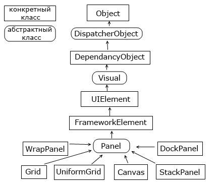
</p>

В WPF при компоновке и расположении элементов внутри окна нам надо придерживаться следующих принципов:

- Нежелательно указывать явные размеры элементов (за исключеним минимальных и максимальных размеров). Размеры должны определяться контейнерами.
- Нежелательно указывать явные позицию и координаты элементов внутри окна. Позиционирование элементов всецело должно быть прерогативой контейнеров. И контейнер сам должен определять, как элемент будет располагаться. Если нам надо создать сложную систему компоновки, то мы можем вкладывать один контейнер в другой, чтобы добиться максимально удобного расположения элементов управления.

## Процесс компоновки

Процесс компоновки проходит два этапа: измерение (measure) и расстановка (arrange). На этапе измерения контейнер производит измерение предпочтительного для дочерних элементов места. Однако не всегда контейнер имеет достаточно места, чтобы расставить все элементы по их предпочтительным размером, поэтому их размеры приходится усекать. Затем происходит этап непосредственной расстановки дочерних элементов внутри контейнера.

Теперь рассмотрим контейнеры компоновки подробнее.

## Grid

Это наиболее мощный и часто используемый контейнер, напоминающий обычную таблицу. Он содержит столбцы и строки, количество которых задает разработчик. Для определения строк используется свойство **RowDefinitions**, а для определения столбцов - свойство **ColumnDefinitions**:

```xml
<Grid.RowDefinitions>
    <RowDefinition></RowDefinition>
    <RowDefinition></RowDefinition>
    <RowDefinition></RowDefinition>
</Grid.RowDefinitions>
<Grid.ColumnDefinitions>
    <ColumnDefinition></ColumnDefinition>
    <ColumnDefinition></ColumnDefinition>
    <ColumnDefinition></ColumnDefinition>
</Grid.ColumnDefinitions>
```

Каждая строка задается с помощью вложенного элемента **RowDefinition**, который имеет открывающий и закрывающий тег. При этом задавать дополнительную информацию необязательно. То есть в данном случае у нас определено в гриде 3 строки.

Каждая столбец задается с помощью вложенного элемента **ColumnDefinition**. Таким образом, здесь мы определили 3 столбца. То есть в итоге у нас получится таблица 3х3.

Чтобы задать позицию элемента управления с привязкой к определенной ячейке **Grid**, в разметке элемента нужно прописать значения свойств **Grid.Column** и **Grid.Row**, тем самым указывая, в каком столбце и строке будет находиться элемент. Кроме того, если мы хотим растянуть элемент управления на несколько строк или столбцов, то можно указать свойства **Grid.ColumnSpan** и **Grid.RowSpan**, как в следующем примере:

```xml

<Window x:Class="LayoutApp.MainWindow"
        xmlns="http://schemas.microsoft.com/winfx/2006/xaml/presentation"
        xmlns:x="http://schemas.microsoft.com/winfx/2006/xaml"
        xmlns:d="http://schemas.microsoft.com/expression/blend/2008"
        xmlns:mc="http://schemas.openxmlformats.org/markup-compatibility/2006"
        xmlns:local="clr-namespace:LayoutApp"
        mc:Ignorable="d"
        Title="Grid" Height="250" Width="350">
    <Grid ShowGridLines="True">
        <Grid.RowDefinitions>
            <RowDefinition></RowDefinition>
            <RowDefinition></RowDefinition>
            <RowDefinition></RowDefinition>
        </Grid.RowDefinitions>
        <Grid.ColumnDefinitions>
            <ColumnDefinition></ColumnDefinition>
            <ColumnDefinition></ColumnDefinition>
            <ColumnDefinition></ColumnDefinition>
        </Grid.ColumnDefinitions>
        <Button Grid.Column="0" Grid.Row="0" Content="Строка 0 Столбец 0"  />
        <Button Grid.Column="0" Grid.Row="1" Content="Объединение трех столбцов" Grid.ColumnSpan="3"  />
        <Button Grid.Column="2" Grid.Row="2" Content="Строка 2 Столбец 2"  />
    </Grid>
</Window>

```

Атрибут ```ShowGridLines="True"``` у элемента Grid задает видимость сетки, по умолчанию оно равно ```False```.

То есть у нас получится следующая картина:

<p align="center">
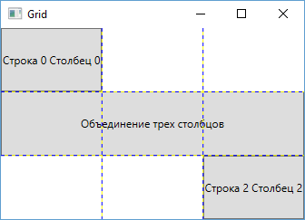
</p>

## Установка размеров

Но если в предыдущем случае у нас строки и столбцы были равны друг другу, то теперь попробуем их настроить столбцы по ширине, а строки - по высоте. Есть несколько вариантов настройки размеров.

### Автоматические размеры

Здесь столбец или строка занимает то место, которое им нужно

```xml
<ColumnDefinition Width="Auto" />
<RowDefinition Height="Auto" />
```

### Абсолютные размеры

В данном случае высота и ширина указываются в единицах, независимых от устройства:

```xml
<ColumnDefinition Width="150" />
<RowDefinition Height="150" />
```

Также абсолютные размеры можно задать в пикселях, дюймах, сантиметрах или точках:

|||
|:------|:---|
|пиксели|px|
|дюймы|in|
|сантиметры|cm|
|точки|pt|

Например,

```xml
<ColumnDefinition Width="1 in" />
<RowDefinition Height="10 px" />
```

### Пропорциональные размеры.

Например, ниже задаются два столбца, второй из которых имеет ширину в четверть от ширины первого:

```xml
<ColumnDefinition Width="*" />
<ColumnDefinition Width="0.25*" />
```

Если строка или столбец имеет высоту, равную \*, то данная строка или столбце будет занимать все оставшееся место. Если у нас есть несколько сток или столбцов, высота которых равна \*, то все доступное место делится поровну между всеми такими сроками и столбцами. Использование коэффициентов (0.25*) позволяет уменьшить или увеличить выделенное место на данный коэффициент. При этом все коэффициенты складываются (коэффициент * аналогичен 1*) и затем все пространство делится на сумму коэффициентов.

Например, если у нас три столбца:

```xml
<ColumnDefinition Width="*" />
<ColumnDefinition Width="0.5*" />
<ColumnDefinition Width="1.5*" />
```

В этом случае сумма коэффициентов равна 1* + 0.5* + 1.5* = 3*. Если у нас грид имеет ширину 300 единиц, то для коэфициент 1* будет соответствовать пространству 300 / 3 = 100 единиц. Поэтому первый столбец будет иметь ширину в 100 единиц, второй - 100*0.5=50 единиц, а третий - 100 * 1.5 = 150 единиц.


Можно комбинировать все типы размеров. В этом случае от ширины/высоты грида отнимается ширина/высота столбцов/строк с абсолютными или автоматическими размерами, и затем оставшееся место распределяется между столбцами/строками с пропорциональными размерами:


<p align="center">
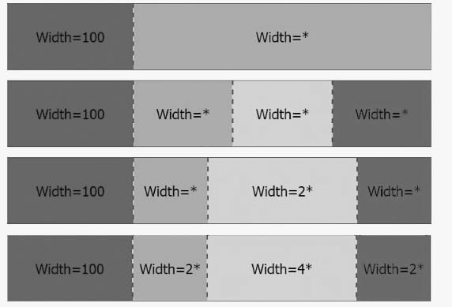
</p>


## UniformGrid

Аналогичен контейнеру ```Grid``` контейнер ```UniformGrid```, только в этом случае все столбцы и строки одинакового размера и используется упрощенный синтаксис для их определения:


```xml
<UniformGrid Rows="2" Columns="2">
    <Button Content="Left Top" />
    <Button Content="Right Top" />
    <Button Content="Left Bottom" />
    <Button Content="Right Bottom" />
</UniformGrid>
```


<p align="center">
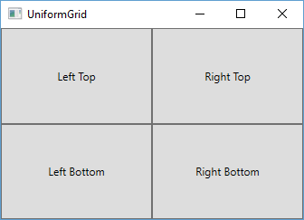
</p>

## GridSplitter

Элемент **GridSplitter** помогает создавать интерфейсы наподобие элемента ```SplitContainer``` в WinForms, только более функциональные. Он представляет собой некоторый разделитель между столбцами или строками, путем сдвига которого можно регулировать ширину столбцов и высоту строк. В качестве примера можно привести стандартный интерфейс проводника в Windows, где разделительная полоса отделяет древовидный список папок от панели со списком файлов. Например,

```xml
<Grid>
    <Grid.ColumnDefinitions>
        <ColumnDefinition Width="*" />
        <ColumnDefinition Width="Auto" />
        <ColumnDefinition Width="*" />
    </Grid.ColumnDefinitions>
    <Button Grid.Column="0" Content="Левая кнопка" />
    <GridSplitter Grid.Column="1" ShowsPreview="False" Width="3"
        HorizontalAlignment="Center" VerticalAlignment="Stretch" />
    <Button Grid.Column="2" Content="Правая кнопка" />
</Grid>
```


<p align="center">
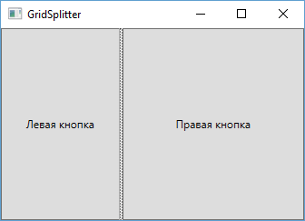
</p>


Двигая центральную линию, разделяющую правую и левую части, мы можем устанавливать их ширину.

Итак, чтобы использовать элемент ```GridSplitter```, нам надо поместить его в ячейку в Gride. По сути это обычный элемент, такой же, как кнопка. Как выше, у нас три ячейки (так как три столбца и одна строка), и ```GridSplitter``` помещен во вторую ячейку. Обычно строка или столбец, в которые помещают элемент, имеет для свойств ```Height``` или ```Width``` значение Auto.

Если у нас несколько строк, и мы хотим, чтобы разделитель распространялся на несколько строк, то мы можем задать свойство ```Grid.RowSpan```:

```xml
<Grid.ColumnDefinitions>
    <ColumnDefinition Width="*" />
    <ColumnDefinition Width="Auto" />
    <ColumnDefinition Width="*" />
</Grid.ColumnDefinitions>
<Grid.RowDefinitions>
    <RowDefinition></RowDefinition>
    <RowDefinition></RowDefinition>
</Grid.RowDefinitions>
<GridSplitter Grid.Column="1" Grid.RowSpan="2" ShowsPreview="False" Width="3"
    HorizontalAlignment="Center" VerticalAlignment="Stretch" />
```

В случае, если мы задаем горизонтальный разделитель, то тогда соответственно надо использовать свойство Grid.ColumnSpan

Затем нам надо настроить свойства. Во-первых, надо настроить ширину (Width) для вертикальных сплитеров и высоту (Height) для горизонтальных. Если не задать соответствующее свойство, то сплитер мы не увидим, так как он изначально очень мал.

Затем нам надо задать выравнивание. Если мы хотим, что сплитер заполнял всю высоту доступной области (то есть если у нас вертикальный сплитер), то нам надо установить для свойства **VerticalAlignment** значение Stretch.

Если же у нас горизонтальный сплитер, то надо установить свойство **HorizontalAlignment** в Stretch

Также в примере выше используется свойство **ShowsPreview**. Если оно равно False, то изменение границ кнопок будет происходить сразу же при перемещении сплитера. Если же оно равно True, тогда изменение границ будет происходить только после того, как перемещение сплитера завершится, и при перемещении сплиттера мы увидим его проекцию.

В отличие от элемента SplitContainer в WinForms, в WPF можно установить различное количество динамически регулируемых частей окна. Немного усовершенствуем предыдущий пример:

```xml
<Grid>
    <Grid.ColumnDefinitions>
        <ColumnDefinition Width="*" />
        <ColumnDefinition Width="Auto" />
        <ColumnDefinition Width="*" />
    </Grid.ColumnDefinitions>
    <Grid.RowDefinitions>
        <RowDefinition Height="*"></RowDefinition>
        <RowDefinition Height="Auto"></RowDefinition>
        <RowDefinition Height="*"></RowDefinition>
    </Grid.RowDefinitions>
    <GridSplitter Grid.Column="1"  Grid.Row="0" ShowsPreview="False" Width="3"
        HorizontalAlignment="Center" VerticalAlignment="Stretch" />
    <GridSplitter Grid.Row="1" Grid.ColumnSpan="3" Height="3"
        HorizontalAlignment="Stretch" VerticalAlignment="Center" />
    <Canvas Grid.Column="0" Grid.Row="0">
        <TextBlock>Левая панель</TextBlock>
    </Canvas>
    <Canvas Grid.Column="2" Grid.Row="0" Background="LightGreen">
        <TextBlock>Правая панель</TextBlock>
    </Canvas>
    <Canvas Grid.ColumnSpan="3" Grid.Row="2" Background="#dfffff">
        <TextBlock Canvas.Left="60">Нижняя панель</TextBlock>
    </Canvas>
</Grid>
```

<p align="center">
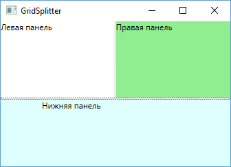
</p>

Здесь у нас сразу два сплитера: один между двумя верхними и нижней панелями, а второй - между правой и левой панелями.


## StackPanel

Это более простой элемент компоновки. Он располагает все элементы в ряд либо по горизонтали, либо по вертикали в зависимости от ориентации. Например,

```xml
<Window x:Class="LayoutApp.MainWindow"
        xmlns="http://schemas.microsoft.com/winfx/2006/xaml/presentation"
        xmlns:x="http://schemas.microsoft.com/winfx/2006/xaml"
        xmlns:d="http://schemas.microsoft.com/expression/blend/2008"
        xmlns:mc="http://schemas.openxmlformats.org/markup-compatibility/2006"
        xmlns:local="clr-namespace:LayoutApp"
        mc:Ignorable="d"
        Title="StackPanel" Height="300" Width="300">
    <Grid>
        <StackPanel>
            <Button Background="Blue" Content="1" />
            <Button Background="White" Content="2" />
            <Button Background="Red" Content="3" />
        </StackPanel>
    </Grid>
</Window>
```

<p align="center">
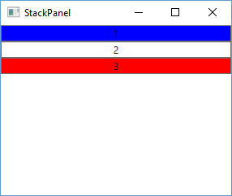
</p>


В данном случае для свойства Orientation по умолчанию используется значение Vertical, то есть StackPanel создает вертикальный ряд, в который помещает все вложенные элементы сверху вниз. Мы также можем задать горизонтальный стек. Для этого нам надо указать свойство Orientation="Horizontal":

```xml
<Window x:Class="LayoutApp.MainWindow"
        xmlns="http://schemas.microsoft.com/winfx/2006/xaml/presentation"
        xmlns:x="http://schemas.microsoft.com/winfx/2006/xaml"
        xmlns:d="http://schemas.microsoft.com/expression/blend/2008"
        xmlns:mc="http://schemas.openxmlformats.org/markup-compatibility/2006"
        xmlns:local="clr-namespace:LayoutApp"
        mc:Ignorable="d"
        Title="StackPanel" Height="300" Width="300">
    <StackPanel Orientation="Horizontal">
        <Button Background="Blue" MinWidth="30" Content="1" />
        <Button Background="White" MinWidth="30" Content="2" />
        <Button Background="Red" MinWidth="30" Content="3" />
    </StackPanel>
</Window>
```
<p align="center">
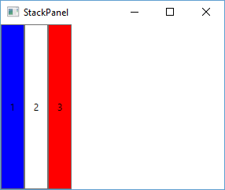
</p>

При горизонтальной ориентации все вложенные элементы располагаются слева направо. Если мы хотим, чтобы наполнение стека начиналось справа налево, то нам надо задать свойство FlowDirection: <StackPanel Orientation="Horizontal" FlowDirection="RightToLeft">. По умолчанию это свойство имеет значение LeftToRight - то есть слева направо.


## DockPanel

Этот контейнер прижимает свое содержимое к определенной стороне внешнего контейнера. Для этого у вложенных элементов надо установить сторону, к которой они будут прижиматься с помощью свойства DockPanel.Dock. Например,


```xml
<Window x:Class="LayoutApp.MainWindow"
        xmlns="http://schemas.microsoft.com/winfx/2006/xaml/presentation"
        xmlns:x="http://schemas.microsoft.com/winfx/2006/xaml"
        xmlns:d="http://schemas.microsoft.com/expression/blend/2008"
        xmlns:mc="http://schemas.openxmlformats.org/markup-compatibility/2006"
        xmlns:local="clr-namespace:LayoutApp"
        mc:Ignorable="d"
        Title="DockPanel" Height="250" Width="300">
    <DockPanel LastChildFill="True">
        <Button DockPanel.Dock="Top" Background="AliceBlue" Content="Верхняя кнопка" />
        <Button DockPanel.Dock="Bottom" Background="BlanchedAlmond" Content="Нижняя кнопка" />
        <Button DockPanel.Dock="Left" Background="Aquamarine" Content="Левая кнопка" />
        <Button DockPanel.Dock="Right" Background="DarkGreen" Content="Правая кнопка" />
        <Button Background="LightGreen" Content="Центр" />
    </DockPanel>
</Window>
```

В итоге получаем массив кнопок, каждая из которых прижимается к определенной стороне элемента DockPanel:


<p align="center">
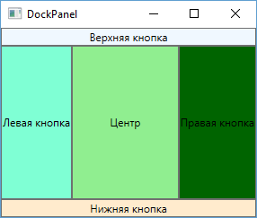
</p>

Причем у последней кнопки мы можем не устанавливать свойство DockPanel.Dock. Она уже заполняет все оставшееся пространство. Такой эффект получается благодаря установке у DockPanel свойства LastChildFill="True", которое означает, что последний элемент заполняет все оставшееся место. Если у этого свойства поменять True на False, то кнопка прижмется к левой стороне, заполнив только о место, которое ей необходимо.

Также обратите внимание на порядок прикрепления к кнопкам свойства DockPanel.Dock. Например, если мы изменим порядок на:

```xml
<DockPanel LastChildFill="True">
    <Button DockPanel.Dock="Top" Background="AliceBlue" Content="Верхняя кнопка" />
    <Button DockPanel.Dock="Left" Background="Aquamarine" Content="Левая кнопка" />
    <Button DockPanel.Dock="Right" Background="DarkGreen" Content="Правая кнопка" />
    <Button DockPanel.Dock="Bottom" Background="BlanchedAlmond" Content="Нижняя кнопка" />
    <Button Background="LightGreen" Content="Центр" />
</DockPanel>
```

В этом случае нижняя кнопка уже будет заполнять меньшее место.

Мы также можем прижать к одной стороне сразу несколько элементов. В этом случае они просто будут располагаться по порядку:

```xml
<DockPanel LastChildFill="True">
    <Button DockPanel.Dock="Top" Background="AliceBlue" Content="Верхняя кнопка 1" />
    <Button DockPanel.Dock="Top" Background="AliceBlue" Content="Верхняя кнопка 2" />
    <Button DockPanel.Dock="Bottom" Background="BlanchedAlmond" Content="Нижняя кнопка" />
    <Button DockPanel.Dock="Left" Background="Aquamarine" Content="Левая кнопка1" />
    <Button DockPanel.Dock="Left" Background="Aquamarine" Content="Левая кнопка2" />
    <Button DockPanel.Dock="Right" Background="DarkGreen" Content="Правая кнопка" />
    <Button Background="LightGreen" Content="Центр" />
</DockPanel>
```

<p align="center">
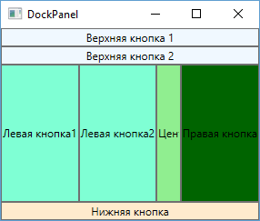
</p>

Контейнер DockPanel особенно удобно использовать для создания стандартных интерфейсов, где верхнюю и левую часть могут занимать какие-либо меню, нижнюю - строка состояния, правую - какая-то дополнительная информация, а в центре будет находиться основное содержание.


## WrapPanel

Эта панель, подобно StackPanel, располагает все элементы в одной строке или колонке в зависимости от того, какое значение имеет свойство Orientation - Horizontal или Vertical. Главное отличие от StackPanel - если элементы не помещаются в строке или столбце, создаются новые столбец или строка для не поместившихся элементов.

```xml
<Window x:Class="LayoutApp.MainWindow"
        xmlns="http://schemas.microsoft.com/winfx/2006/xaml/presentation"
        xmlns:x="http://schemas.microsoft.com/winfx/2006/xaml"
        xmlns:d="http://schemas.microsoft.com/expression/blend/2008"
        xmlns:mc="http://schemas.openxmlformats.org/markup-compatibility/2006"
        xmlns:local="clr-namespace:LayoutApp"
        mc:Ignorable="d"
        Title="WrapPanel" Height="250" Width="300">
    <WrapPanel>
        <Button Background="AliceBlue" Content="Кнопка 1" />
        <Button Background="Blue" Content="Кнопка 2" />
        <Button Background="Aquamarine" Content="Кнопка 3" Height="30"/>
        <Button Background="DarkGreen" Content="Кнопка 4" Height="20"/>
        <Button Background="LightGreen" Content="Кнопка 5"/>
        <Button Background="RosyBrown" Content="Кнопка 6" Width="80" />
        <Button Background="GhostWhite" Content="Кнопка 7" />
    </WrapPanel>
</Window>
```

<p align="center">
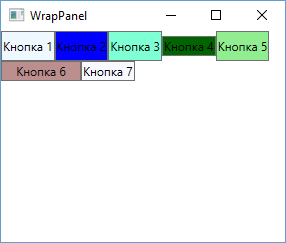
</p>

В горизонтальном стеке те элементы, у которых явным образом не установлена высота, будут автоматически принимать высоту самого большого элемента из стека.

Вертикальный WrapPanel делается аналогично:

```xml
<WrapPanel Orientation="Vertical">
    <Button Background="AliceBlue" Content="Кнопка 1" Height="50" />
    <Button Background="Blue" Content="Кнопка 2" />
    <Button Background="Aquamarine" Content="Кнопка 3" Width="60"/>
    <Button Background="DarkGreen" Content="Кнопка 4" Width="80"/>
    <Button Background="LightGreen" Content="Кнопка 5"/>
    <Button Background="RosyBrown" Content="Кнопка 6" Height="80" />
    <Button Background="GhostWhite" Content="Кнопка 7" />
    <Button Background="Bisque" Content="Кнопка 8" />
</WrapPanel>
```

<p align="center">
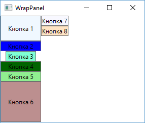
</p>

В вертикальном стеке элементы, у которых явным образом не указана ширина, автоматически принимают ширину самого широкого элемента.

Мы также можем установить для всех вложенных элементов какую-нибудь определенную ширину (с помощью свойства ItemWidth) или высоту (свойство ItemHeight):

```xml
<WrapPanel ItemHeight="30" ItemWidth="80" Orientation="Horizontal">
    <Button Background="AliceBlue" Content="1" />
    <Button Background="Blue" Content="2" />
    <Button Background="Aquamarine" Content="3"/>
    <Button Background="DarkGreen" Content="4"/>
    <Button Background="LightGreen" Content="5"/>
    <Button Background="AliceBlue" Content="6"  />
    <Button Background="Blue" Content="7" />
</WrapPanel>
```

<p align="center">
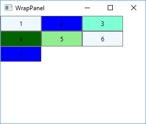
</p>

## Canvas

Контейнер Canvas является наиболее простым контейнером. Для размещения на нем необходимо указать для элементов точные координаты относительно сторон Canvas. Для установки координат элементов используются свойства Canvas.Left, Canvas.Right, Canvas.Bottom, Canvas.Top. Например, свойство Canvas.Left указывает, на сколько единиц от левой стороны контейнера будет находиться элемент, а свойство Canvas.Top - насколько единиц ниже верхней границы контейнера находится элемент.

При этом в качестве единиц используются не пиксели, а независимые от устройства единицы, которые помогают эффективно управлять масштабированием элементов. Каждая такая единица равна 1 /96 дюйма, и при стандартной установке в 96 dpi эта независимая от устройства единица будет равна физическому пикселю, так как 1/96 дюйма * 96 dpi (96 точек на дюйм) = 1. В тоже время при работе на других мониторах или при других установленных размеры, установленные в приложении, будут эффективно масштабироваться. Например, при разрешении в 120 dpi одна условная единица будет равна 1,25 пикселя, так как 1/96 дюйма * 120 dpi= 1,25 пикселя.

Если элемент не использует свойства Canvas.Top и другие, то по умолчанию свойства Canvas.Left и Canvas.Top будут равны нулю, то есть он будет находиться в верхнем левом углу.

Также надо учитывать, что нельзя одновременно задавать Canvas.Left и Canvas.Right или Canvas.Bottom и Canvas.Top. Если подобное произойдет, то последнее заданное свойство не будет учитываться. Например:

```xml
<Window x:Class="Layout.MainWindow"
        xmlns="http://schemas.microsoft.com/winfx/2006/xaml/presentation"
        xmlns:x="http://schemas.microsoft.com/winfx/2006/xaml"
        Title="MainWindow" Height="300" Width="300">
    <Grid>
        <Canvas Background="Lavender">
            <Button Background="AliceBlue" Content="Top 20 Left 40" Canvas.Top="20" Canvas.Left="40" />
            <Button Background="LightSkyBlue" Content="Top 20 Right 20" Canvas.Top="20" Canvas.Right="20"/>
            <Button Background="Aquamarine" Content="Bottom 30 Left 20" Canvas.Bottom="30" Canvas.Left="20"/>
            <Button Background="LightCyan" Content="Bottom 20 Right 40" Canvas.Bottom="20" Canvas.Right="40"/>
        </Canvas>
    </Grid>
</Window>
```

<p align="center">
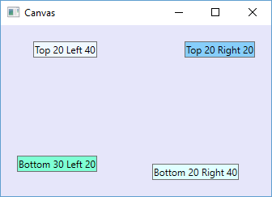
</p>

## Свойства компоновки элементов

Элементы WPF обладают набором свойств, которые помогают позиционировать данные элементы. Рассмотрим некоторые из этих свойств.

### Ширина и высота

У элемента можно установить ширину с помощью свойства Width и высоту с помощью свойства Height. Эти свойства принимают значение типа double. Хотя общая рекомендация состоит в том, что желательно избегать жестко закодированных в коде ширины и высоты.

Также мы можем задать возможный диапазон ширины и высоты с помощью свойств MinWidth/MaxWidth и MinHeight/MaxHeight. И при растяжении или сжатии контейнеров элементы с данными заданными свойствами не будут выходить за пределы установленных значений.

Возможно, возникает вопрос, а в каких единицах измерения устанавливаются ширина и высота? Да и в общем какие единицы измерения используются? В WPF можно использовать несколько единиц измерения: сантиметры (cm), точки (pt), дюймы (in) и пиксели (px). Например, зададим размеры в других единицах: ```<Button Content="Кнопка" Width="5cm" Height="0.4in" />```

Если единица измерения не задана явно, а просто стоит число, то используются по умолчанию пиксели. Но эти пиксели не равны обычным пикселям, а являются своего рода "логическими пикселями", независимыми от конкретного устройства. Каждый такой пиксель представляет 1/96 дюйма вне зависимости от разрешения экрана.

### Выравнивание

### HorizontalAlignment

С помощью специальных свойств мы можем выровнять элемент относительно определенной стороны контейнера по горизонтали или вертикали.

Свойство **HorizontalAlignment** выравнивает элемент по горизонтали относительно правой или левой стороны контейнера и соответственно может принимать значения Left, Right, Center (положение по центру), Stretch (растяжение по всей ширине). Например:

```xml
<Grid>
    <Button Content="Left" Width="60" Height="30" HorizontalAlignment="Left" />
    <Button Content="Center" Width="60" Height="30" HorizontalAlignment="Center" />
    <Button Content="Right" Width="60" Height="30" HorizontalAlignment="Right" />
    <Button Content="Stretch" Height="30" HorizontalAlignment="Stretch" Margin="10 -80 10 0" />
</Grid>
```

<p align="center">
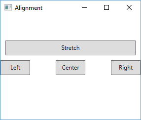
</p>

### VerticalAlignment

Также мы можем задать для элемента выравнивание по вертикали с помощью свойства VerticalAlignment, которое принимает следующие значения: Top (положение в верху контейнера), Bottom (положение внизу), Center (положение по центру), Stretch (растяжение по всей высоте). Например:

```xml
<Grid>
    <Button Content="Bottom" Width="60" Height="30" VerticalAlignment="Bottom" />
    <Button Content="Center" Width="60" Height="30" VerticalAlignment="Center" />
    <Button Content="Top" Width="60" Height="30" VerticalAlignment="Top" />
    <Button Content="Stretch" Width="60" VerticalAlignment="Stretch" Margin="150 10 0 10" />
</Grid>
```


<p align="center">
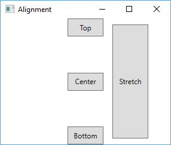
</p>


## Отступы margin

Свойство **Margin** устанавливает отступы вокруг элемента. Синтаксис: Margin="левый_отступ верхний_отступ правый_отступ нижний_отступ". Например, установим отступы у одной кнопки слева и сверху, а у другой кнопки справа и снизу:

```xml
<Grid>
    <Button Content="15 10 0 0" Width="60" Height="30" Margin ="15 10 0 0"
                        HorizontalAlignment="Left" VerticalAlignment="Top"/>
    <Button Content="0 0 20 10" Width="60" Height="30" Margin ="0 0 20 10"
                    HorizontalAlignment="Right" VerticalAlignment="Bottom"/>
</Grid>
```

Если мы зададим свойство таким образом: Margin="20", то сразу установим отступ для всех четырех сторон.


<p align="center">
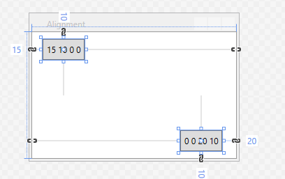
</p>


## Panel.ZIndex

При создании интерфейса возможна ситуация, когда одни элементы будут полностью или частично перекрывать другие. По умолчанию те элементы, которые определены позже, перекрывают те элементы, которые определены ранее. Однако мы можем изменить подобное действие с помощью свойства **Panel.ZIndex**.

По умолчанию для всех создаваемых элементов Panel.ZIndex="0". Однако назначив данному свойству более высокое значение, мы можем передвинуть его на передний план. Элементы с большим значением этого свойства будут перекрывать те элементы, у которых меньшее значение этого свойства:

```xml
<Grid>
    <Button Width="60" Height="30" Panel.ZIndex="2" Margin="10 10 0 0">Один</Button>
    <Button Width="60" Height="30" Panel.ZIndex="1" Margin="45 45 0 0">Два</Button>
    <Button Width="60" Height="30" Panel.ZIndex="0" Margin="75 75 0 0">Три</Button>
</Grid>
```

<p align="center">
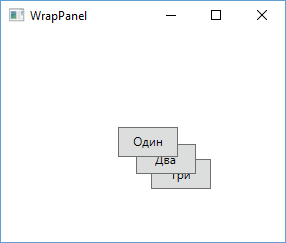
</p>