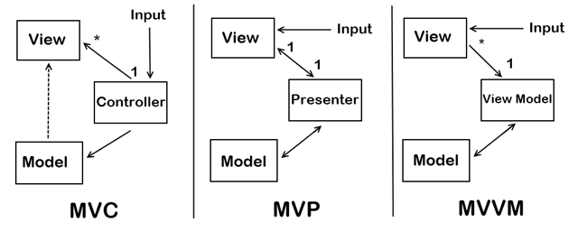

# WPF
## Паттерны проектирования




## App.config

```xml
<?xml version="1.0" encoding="utf-8" ?>
<configuration>


	<connectionStrings>
		<add 
			 name="DefaultConnection"
			 connectionString="Server=localhost,63027;Database=UserDatabase;Trusted_Connection=True"
			 providerName="System.Data.SqlClient"/>

		<add
			 name="ConnectionLocalDb"
			 connectionString="Server=(localdb)\mssqllocaldb;Database=UserDatabase;Trusted_Connection=True;"
			 providerName="System.Data.SqlClient"/>


		<add name="ConnectionSQLite"
			 connectionString="Data Source=FabricShop.db"
			 providerName="System.Data.SQLite" />

	</connectionStrings>


</configuration>
```

## UserContext

```Csharp
protected override void OnConfiguring(DbContextOptionsBuilder optionsBuilder)
        {
            if (!optionsBuilder.IsConfigured)
            {

                // SQL Server connection with port
                //optionsBuilder.UseSqlServer("Server=localhost,63027;Database=UserDatabase;Trusted_Connection=True;");

                // SQL Server connection with localdb
                //optionsBuilder.UseSqlServer("Server=(localdb)\\mssqllocaldb;Database=UserDatabase;Trusted_Connection=True;");

                // SQL Server connection from App.config
                //optionsBuilder.UseSqlServer(ConfigurationManager.ConnectionStrings["DefaultConnection"].ToString());

                optionsBuilder.UseSqlServer(ConfigurationManager.ConnectionStrings["ConnectionLocalDb"].ToString());

                // SQlite
                //optionsBuilder.UseSqlite(ConfigurationManager.ConnectionStrings["ConnectionSQLite"].ToString());
                //optionsBuilder.UseSqlite(@"DataSource=ColledgeStore.db;");

            }
        }
```

## Загрузка ```View``` вручную в ```App.cs```

```Csharp

public partial class App : Application
    {
        protected override void OnStartup(StartupEventArgs e)
        {
            base.OnStartup(e);
            MainWindow mv = new MainWindow();
            //MainWindowViewModel vm = new MainWindowViewModel();
            //mv.DataContext = vm;
            mv.Show();
        }

    }

```

## Команда как свойство во ```ViewModel``` и определение команды в конструкторе

```Csharp

#region Команда CloseApplicationCommand
        public ICommand CloseApplicationCommand { get; set; }

        private void OnCloseApplicationCommandExecuteed(object p)
        {
            Application.Current.Shutdown();
        }

        private bool CanCloseApplicationCommandExecute(object p)
        {
            return true;
        }
        #endregion

        #region Команда MessageCommand
        private TestCommand messageCommand;
        public TestCommand MessageCommand
        {
            get
            {
                if (messageCommand == null)
                    messageCommand = new TestCommand();
                return messageCommand;
            }
            set
            {
                messageCommand = value;
            }
        } 
        #endregion


        public MainWindowViewModel()
        {
            CloseApplicationCommand = new LambdaCommand(OnCloseApplicationCommandExecuteed, CanCloseApplicationCommandExecute);
        }

```

# Команда ```LambdaCommand```

```Csharp

internal class LambdaCommand : Command
    {

        // если поля помечены readonly, то они будут работать быстрее
        private readonly Action<object> _execute;
        private readonly Func<object, bool> _canExecute;

        // в конструкторе надо получить два делегата Action и Func
        public LambdaCommand(Action<object> Execute, Func<object, bool>  CanExecute = null) 
        {
            _execute = Execute ?? throw new ArgumentNullException(nameof(Execute));
            _canExecute = CanExecute;
        }

        public override bool CanExecute(object? parameter) => _canExecute?.Invoke(parameter) ?? true;
                
        public override void Execute(object? parameter)
        {
            _execute(parameter);
        }
    }
    
```

# Базовая ```ViewModel```

```Csharp

internal abstract class ViewModel : INotifyPropertyChanged, IDisposable 
    {

        #region NotifyPropertyChanged
        public event PropertyChangedEventHandler? PropertyChanged;

        protected virtual void OnPropertyChanged([CallerMemberName] string PropertyName = null)
        {
            PropertyChanged?.Invoke(this, new PropertyChangedEventArgs(PropertyName));
        }

        // разрешить кольцевые обновления свойств без зацикливания
        protected virtual bool Set<T>(ref T field, T value, [CallerMemberName] string PropertyName = null)
        {
            if (Equals(field, value)) return false;
            field = value;
            OnPropertyChanged(PropertyName);
            return true;
        }
        #endregion

        #region Disposable
        // деструктор
        ~ViewModel()
        {
            Dispose(false);
        }

        public void Dispose()
        {
            Dispose(true);
        }

        private bool _Disposed;

        protected virtual void Dispose(bool Disposing)
        {
            if (!Disposing || _Disposed) return;
            _Disposed = true;
            // Освобождение управляемых ресурсов 
        } 
        #endregion

    }

```

# Базовый класс ```Command```

```Csharp

// команды тоже как свойства ViewModel

    internal abstract class Command : ICommand
    {

        /*
         CanExecuteChanged уведомляет любые источники команд
         (такие как Button или CheckBox), привязанные к этому ICommand,
         об изменении значения, возвращаемого CanExecute.
         Источники команд заботятся об этом, потому что обычно им необходимо
         соответствующим образом обновлять свой статус (например, кнопка отключится, если CanExecute() вернет false).
         */

        public event EventHandler? CanExecuteChanged
        {
            add => CommandManager.RequerySuggested+= value;
            remove => CommandManager.RequerySuggested-=value;
        }

        // возможно ли выполнить команду?
        public abstract bool CanExecute(object? parameter);
        

        // логика команды
        public abstract void Execute(object? parameter);    
        
    }

```

## Связь команд с событиями 

Подключить ```Microsoft.Xaml.Behavior.Wpf```

```Csharp
                <i:Interaction.Triggers>
                    <i:EventTrigger EventName="MouseDoubleClick">
                        <i:InvokeCommandAction
                        Command="{Binding EditUserCommand}"
                        CommandParameter="{Binding ElementName=userList, Path=SelectedItem}"/>
                    </i:EventTrigger>
                </i:Interaction.Triggers>
```


## DataGrid определение

```csharp
    <DataGrid 
                AutoGenerateColumns="False"
        x:Name="productGrid"
                Grid.Row="1"
                Grid.RowSpan="1"
                IsReadOnly="True"
                SelectionMode="Single"
                RowDetailsVisibilityMode="VisibleWhenSelected"
                HorizontalContentAlignment="Left"
        >
        
        <DataGrid.Columns>
            <DataGridTemplateColumn Header="Фото" IsReadOnly="True" >
                <DataGridTemplateColumn.CellTemplate>
                    <DataTemplate>
                        <Image Height="100" Width="100" Source="{Binding ImagePath}" />
                    </DataTemplate>
                </DataGridTemplateColumn.CellTemplate>
            </DataGridTemplateColumn>


            <DataGridTextColumn Binding="{Binding Title}" Header="Название"/>
            
            <DataGridTextColumn Binding="{Binding Price}" Header="Цена"/>
            <DataGridTextColumn Binding="{Binding Category.Name}" Header="Категория" />
            
            <DataGridTextColumn Width="*" Header="Описание" Binding="{Binding Description}">
                    <DataGridTextColumn.ElementStyle>
                        <Style>
                            <Setter Property="TextBlock.TextWrapping" Value="Wrap" />
                            <Setter Property="TextBlock.TextAlignment" Value="Justify" />
                        </Style>
                    </DataGridTextColumn.ElementStyle>
            </DataGridTextColumn>
            
        </DataGrid.Columns>
    </DataGrid>

```


## Интерфейс INotifyPropertyChanged

```Csharp
  public class User : INotifyPropertyChanged
    {

        private int id;
        private string name;
        private int age;

        public int Id
        {
            get {return id; }

            set {
                id = value;
                OnPropertyChanged("Id");
            }
        }

        public string Name
        {
            get { return name; }

            set
            {
                name = value;
                OnPropertyChanged("Name");
            }

        }

        public int Age
        {
            get { return age; }

            set
            {
                age = value;
                OnPropertyChanged("Age");
            }

        }


        public event PropertyChangedEventHandler PropertyChanged;
        
        public void OnPropertyChanged(string prop = "")
        {
            if (PropertyChanged != null)
                PropertyChanged(this, new PropertyChangedEventArgs(prop));
        }

    }
```

## Entity Framework Core 6. Cвязь моделей 1 : M

### Model User

```csharp

using System;
using System.Collections.Generic;

namespace FabricShop.Models
{
    public partial class User
    {
        public int Id { get; set; }
        public string Surname { get; set; } = null!;
        public string Name { get; set; } = null!;
        public string Patronymic { get; set; } = null!;
        public string Login { get; set; } = null!;
        public string Password { get; set; } = null!;
       
        public int RoleId { get; set; }
        public virtual Role Role { get; set; }
    }
}
```

### Модель Role

```csharp
using System;
using System.Collections.Generic;

namespace FabricShop.Models
{
    public partial class Role
    {
        public Role()
        {
            Users = new HashSet<User>();
        }

        public int Id { get; set; }
        public string RoleName { get; set; } = null!;
        
	public virtual ICollection<User> Users { get; set; }
    }
}
```
																  
## MaterialDesign

App.xaml
								  
```xaml
<Application.Resources>
        <ResourceDictionary>
            <ResourceDictionary.MergedDictionaries>
                <ResourceDictionary Source="pack://application:,,,/MaterialDesignThemes.Wpf;component/Themes/MaterialDesignTheme.Light.xaml" />
                <ResourceDictionary Source="pack://application:,,,/MaterialDesignThemes.Wpf;component/Themes/MaterialDesignTheme.Defaults.xaml" />
                <ResourceDictionary Source="pack://application:,,,/MaterialDesignColors;component/Themes/Recommended/Primary/MaterialDesignColor.DeepPurple.xaml" />
                <ResourceDictionary Source="pack://application:,,,/MaterialDesignColors;component/Themes/Recommended/Accent/MaterialDesignColor.Lime.xaml" />
            </ResourceDictionary.MergedDictionaries>
        </ResourceDictionary>
    </Application.Resources>								  
```							

## Подключение MaterialDesign
 
```xml
xmlns:materialDesign="http://materialdesigninxaml.net/winfx/xaml/themes"
        
        TextElement.Foreground="{DynamicResource MaterialDesignBody}"
        TextElement.FontWeight="Regular"
        TextElement.FontSize="13"
        TextOptions.TextFormattingMode="Ideal"
        TextOptions.TextRenderingMode="Auto"
        Background="{DynamicResource MaterialDesignPaper}"
        FontFamily="{DynamicResource MaterialDesignFont}"
```

## Пример MaterialDesign

```xml
<Grid>
        <Grid>
            <Border MinWidth="100"
                    Margin="15"
                    Background="AliceBlue"
                    VerticalAlignment="Center"
                    Padding="40"
                    MaxHeight="400"
                    CornerRadius="30">
                
                <Border.Effect>
                    <DropShadowEffect BlurRadius="30"
                                      Color="LightGray"
                                      ShadowDepth="0"/>
                </Border.Effect>

                <StackPanel>
                    <TextBlock Text="База данных магазина компьютерной техники"
                               FontSize="30"
                               FontWeight="Bold"
                               Margin="0 0 0 20"/>
                    <TextBox Name="loginField"
                             materialDesign:HintAssist.Hint="Введите логин"
                             Style="{StaticResource MaterialDesignFloatingHintTextBox}"/>
                    <PasswordBox Name="passwordField"
                                 materialDesign:HintAssist.Hint="Введите пароль"
                                 Style="{StaticResource MaterialDesignFloatingHintPasswordBox}"/>

                    <TextBox Name="emailField"
                             materialDesign:HintAssist.Hint="Введите email"
                             Style="{StaticResource MaterialDesignFloatingHintTextBox}"/>
                    <Button Name="createButton"
                            Content="Создать"
                            Margin="0 20"
                            />
                </StackPanel>
            </Border>

        </Grid>
    </Grid>

```


## Scaffold

**Замечание**: надо установить ```Microsoft.EntityFrameworkCore.Tools```.

В консоли диспетчера пакетов Nuget прописать команду

```Scaffold-DbContext "Server=localhost;Database=Users;Trusted_Connection=True;" Microsoft.EntityFrameworkCore.SqlServer -OutputDir Models```
	
Команда создает модели из каждой сущности в базе данных, учитывая связи, а также создает класс контекста для работы с данными как с классами.

```Scaffold-DbContext "Data Source=.\ComputerDatabase.db" Microsoft.EntityFrameworkCore.Sqlite -OutputDir Models```

**Примечание**: если Scaffold для SQLite, ему нужна база из проекта, а не в ```Debug```. При инициализации контекста база данных ```SQLite``` создается в ```Debug``` по умолчанию.


В консоле диспетчера пакетов для SQLServer

```
Scaffold-DbContext "Server=(localdb)\mssqllocaldb;Database=UserDatabase;Trusted_Connection=True;" Microsoft.EntityFrameworkCore.SqlServer -OutputDir Models2
```

## Обновление объектов базы данных в DataGrid на странице

Событие IsVisibleChanged="Page1_InVisibleChanged"

```Csharp
private void Page1_InVisibleChanged(object sender, DependencyPropertyChangedEventArgs e)
        {
            if (Visibility == Visibility.Visible)
            {
                AppContext db = new AppContext();
                db.ChangeTracker.Entries().ToList().ForEach(p => p.Reload());
                ProductGrid.ItemsSource = db.Users.ToList();
            }
        }
```

## Вызов контекста на кнопке

```Csharp
    private void EditButton_Click(object sender, RoutedEventArgs e)
    {
        ManagerPages.Mainframe.Navigate(new Page2((sender as Button).DataContext as User));
    }
```

## Кнопка удаления с диалогом

```Csharp

private void DeleteButton_Click(object sender, RoutedEventArgs e)
        {
            var selectedUsers = ProductGrid.SelectedItems.Cast<User>().ToList();

            if (MessageBox.Show($"Вы точно хотите удалить {selectedUsers.Count()} пользователей", "Внимание!",
                 MessageBoxButton.YesNo, MessageBoxImage.Question) == MessageBoxResult.Yes)
            {
                try
                {
                    AppContext db = new AppContext();
                    db.Users.RemoveRange(selectedUsers);
                    db.SaveChanges();
                    ProductGrid.ItemsSource = db.Users.ToList();
                    MessageBox.Show("Пользователи удалены!");
                }
                catch (Exception ex)
                {
                    MessageBox.Show($"{ex.Message}");
                }
            }
        }
```

## Задание начальных значений для списка

```csharp
var allTypes = db.Users.ToList();

allTypes.Insert(0, new User { Login = "Все типы" });
ComboBox.ItemsSource = allTypes;//.Select(p => p.Login);

ComboBox.SelectedIndex = 0;
```

## Список ```Combobox``` в xaml

```xml
 <ComboBox Width="100"
	   Name="ComboBox"
	   DisplayMemberPath="Login"
	   SelectionChanged="ComboBox_SelectionChanged"></ComboBox>
```

## ```ListView```

```xml
<ListView Grid.Row ="0"
	  x:Name="ListView"
	  ScrollViewer.HorizontalScrollBarVisibility="Disabled"HorizontalContentAlignment="Center" >
	  
            <ListView.ItemsPanel>
                <ItemsPanelTemplate>
                    <WrapPanel Orientation="Horizontal" HorizontalAlignment="Center"/>
                </ItemsPanelTemplate>
            </ListView.ItemsPanel>
	    
            <ListView.ItemTemplate>
                <DataTemplate>
                    <Grid>
                        <Grid.RowDefinitions>
                            <RowDefinition/>
                            <RowDefinition/>
                            <RowDefinition/>
                        </Grid.RowDefinitions>
			
                        <Image Grid.Row="2"
			       HorizontalAlignment="Center"
			       Height="100"
			       Width="100">

                                <Image.Source>

                                <Binding Path="Password" >
   
                                    <Binding.TargetNullValue>
                                        <ImageSource>products/tire_0.jpg</ImageSource>
                                    </Binding.TargetNullValue>
                                    
                                </Binding>
                            </Image.Source>
                        </Image>
                        
                        <TextBlock Text="{Binding Login}"
				   VerticalAlignment="Center"
				   TextAlignment="Center"
				   TextWrapping="Wrap"
				   HorizontalAlignment="Center"
				   Margin="5 5"
                                   FontSize="10"
				   Grid.Row="0"/>
                        <TextBlock Text="{Binding Password, StringFormat={}{0}}"
				   VerticalAlignment="Center"
				   TextAlignment="Center"
				   TextWrapping="Wrap"
				   HorizontalAlignment="Center"
				   Margin="5 5"
                                   FontSize="10" Grid.Row="1"/>     
                    </Grid>
                </DataTemplate>
            </ListView.ItemTemplate>
        </ListView>
```

## Внешний ключ SQL Server

```SQL
CONSTRAINT [FK_Abiturients_Specialty] FOREIGN KEY ([specialty_id]) REFERENCES [dbo].[Specialty] ([Id])
```

## Применение глобального шрифта к страницам Page или Window
							    
```Csharp
Style = (Style)FindResource(typeof(Page));
```

## Include

```Csharp
productGrid.ItemsSource = db.Abiturients.Include(p => p.Specialty).ToList();
//Без использования метода Include мы бы не могли бы получить связанную команду и ее свойства: p.Specialty.Name
```

## Переход на страницу Вперед

```Csharp
private void ForwardButton_Click(object sender, RoutedEventArgs e)
    {
        productGrid.ItemsSource = db.Abiturients.Skip(step).Take(10).ToList();
        if (step + 10 < db.Abiturients.Count())
            step += 10;

        CountAbiturients.Text = $"Количество: {db.Abiturients.Skip(step).Take(10).ToList().Count} из {db.Abiturients.ToList().Count}";
    }	
```
						   
## Переход на страницу Назад

```Csharp
private void BackButton_Click(object sender, RoutedEventArgs e)
    {
        if (step > 0)
            step -= 10;
        productGrid.ItemsSource = db.Abiturients.Skip(step).Take(10).ToList();

        CountAbiturients.Text = $"Количество: {db.Abiturients.Skip(step).Take(10).ToList().Count} из {db.Abiturients.ToList().Count}";
    }
```

## Атрибуты для DataGrid

```xml
    Grid.Row="1"
            Margin="5"
            AutoGenerateColumns="False"
            x:Name="productGrid"
            
            MouseDoubleClick="Edit_MouseDoubleClick"
            IsReadOnly="True"
            GridLinesVisibility="None"
            SelectionMode="Extended"
            SelectionUnit="FullRow"
            
            ColumnWidth="Auto"
            HorizontalAlignment="Stretch" 
            VerticalAlignment="Stretch" 
            HorizontalContentAlignment="Stretch"
            EnableRowVirtualization="false"
            EnableColumnVirtualization="false"
            CanUserAddRows="False"
            CanUserReorderColumns="False"
            CanUserResizeColumns="True" IsSynchronizedWithCurrentItem="False"
```

## Триггеры в DataGrid на Row

```xml
    <DataGrid.RowStyle>
        <Style TargetType="DataGridRow">
            <Style.Triggers>
                <DataTrigger Binding="{Binding Ball}" Value="5" >
                    <Setter Property="Background" Value="Orange"/>
                </DataTrigger>
            </Style.Triggers>
        </Style>
    </DataGrid.RowStyle>
```

## Вinding даты через Stringformat
	
```xml
    Binding="{Binding BirthDay, StringFormat={}{0:dd.MM.yyyy}}"
```
	
## Авторизация логика

```Csharp
using(ColledgeStoreContext db = new ColledgeStoreContext())
    {
        var currentUser = db.Users.Where(user => user.Login == LoginBox.Text && user.Password == PasswordBox.Password).FirstOrDefault();
        if (currentUser != null)
        {
            ProxyFrame.CurrentUser = currentUser;
            MainWindow main = new MainWindow();
            main.Show();
            this.Close();
        }
        else
        {
            MessageBox.Show("Неправильный логин или пароль");
        }
    }
```

	
## Валидация

```Csharp
    
    StringBuilder errors = new StringBuilder();
    if (string.IsNullOrWhiteSpace(full_name.Text))
        errors.AppendLine("Укажите имя");
    if (string.IsNullOrWhiteSpace(specialty_id.Text))
        errors.AppendLine("Укажите специальность");
    if (string.IsNullOrWhiteSpace(birth_day.Text))
        errors.AppendLine("Укажите дату рождения");
    if (string.IsNullOrWhiteSpace(date_certificate.Text))
        errors.AppendLine("Укажите дату выдачи аттестата");
    if (string.IsNullOrWhiteSpace(passport_issued.Text))
        errors.AppendLine("Укажите дату выдачи паспорта");

    //
    if (errors.Length > 0)
    {
        MessageBox.Show(errors.ToString());
        return;
    }
```


## Binding по полному пути картинки

```xml
    <Image>
        <Image.Source>
            <BitmapImage DecodePixelWidth="100" DecodePixelHeight="100"
            UriSource = "{Binding ImagePath}"/>
        </Image.Source>
    </Image>
```

## DataPicker

```xml
    <DatePicker SelectedDate="{Binding BirthDay}"  Name="birth_day"/>
```
	
## ComboBox

```xml
<ComboBox SelectedValue="{Binding Specialty}"
          Text="{Binding Specialty.Name}"
          Name="specialty_id"
          Margin="1"
          Height="30"
          Width="150" 
          IsEditable="True" />
```
	
```csharp
    specialty_id.ItemsSource = db.Specialties.ToList(); // загрузка в комбобокс объектов специальностей
    specialty_id.DisplayMemberPath = "Name"; // отображение в списке объектов конкретные свойства, а не весь объект
```

## Изображение по абсолютному пути

```Csharp
    BitmapImage image = new BitmapImage(new Uri(System.IO.Path.Combine(Environment.CurrentDirectory, $"{_currentAbiturient.Image}"), UriKind.Absolute));
    ImagePicture.Source = image;
```
		
## Замена . на , для SQL Server

```csharp
    Ball = Convert.ToDouble(ball.Text.Replace(".", ",")) // SQL Server принимает дробные значения с запятой
```
	
## Полные сообщения об ошибках

```csharp
    catch (Exception ex)
    {
        MessageBox.Show($"Ошибка: {ex.InnerException.Message}");
    }
```

## Captcha

```Csharp
    public static class CaptchaBuild
        {
            public static string Refresh()
            {

                string captcha = "A1fd";

                Random rand = new Random();

                for (int i = 0; i < 4; i++)
                {
                    captcha += (char)rand.Next('A', 'Z' + 1);
                }

                return captcha;
            }
        }								  
```

## Асинхронная задача для выключения кнопки

```csharp
	async void disableButton()
		{
		    LoginButtonName.IsEnabled = false;
		    await Task.Delay(TimeSpan.FromSeconds(10));
		    LoginButtonName.IsEnabled = true;
		}
```

## App.xaml. Стили и ресурсы для приложения

```xml
    <Application.Resources>

        <SolidColorBrush x:Key="ColorPrimery" Color="White"></SolidColorBrush>
        <SolidColorBrush x:Key="ColorSecondary" Color="#FFFFFFE1"></SolidColorBrush>
        <SolidColorBrush x:Key="ColorAccent" Color="#FF76E383"></SolidColorBrush>


        <Style TargetType="{x:Type Window}">
            <Setter Property="FontSize" Value="15"></Setter>
            <Setter Property="FontFamily" Value="Comic Sans MS"></Setter>
            <Setter Property="Background" Value="White">
            </Setter>
        </Style>

        <Style TargetType="{x:Type Page}">
            <Setter Property="FontSize" Value="20"></Setter>
            <Setter Property="FontFamily" Value="Comic Sans MS"></Setter>
        </Style>

        <Style TargetType="{x:Type DataGrid}">
            
            <Setter Property="Background" Value="#FF76E383">
            </Setter>
        </Style>

        <Style TargetType="Button">
            <Setter Property="Margin" Value="4"></Setter>
            <Setter Property="Width" Value="120"></Setter>
            <Setter Property="Height" Value="30"></Setter>
            <Setter Property="Background" Value="#FF498C51"></Setter>
        </Style>

        <Style TargetType="StackPanel">
            <Setter Property="Margin" Value="15"></Setter>
            <Setter Property="HorizontalAlignment" Value="Center"></Setter>
            <Setter Property="VerticalAlignment" Value="Center"></Setter>
        </Style>

        <Style TargetType="WrapPanel">
            <Setter Property="Margin" Value="10"></Setter>
        </Style>


        <Style TargetType="TextBox">
            <Setter Property="Width" Value="150"></Setter>
            <Setter Property="Height" Value="30"></Setter>
            <Setter Property="Margin" Value="1"></Setter>
        </Style>

        <Style TargetType="DatePicker">
            <Setter Property="Width" Value="150"></Setter>
            <Setter Property="Height" Value="30"></Setter>
            <Setter Property="Margin" Value="1"></Setter>
        </Style>
        
    </Application.Resources>
```

## Триггер для ListView

```xml
    <ListView.ItemContainerStyle>
        <Style TargetType="ListViewItem">
            
            <Style.Triggers>
                <DataTrigger Binding="{Binding QuantityInStock}" Value="0">
                    <Setter Property="Background" Value="Gray" />
                </DataTrigger>
            </Style.Triggers>
        </Style>
    </ListView.ItemContainerStyle>
```

## Border

```xml
    <Border
        CornerRadius="3"
        BorderThickness="2"
        Width="800"
        Height="Auto"
        BorderBrush="{StaticResource ColorAccent}"

        <Border.Effect>
            <DropShadowEffect BlurRadius="30"
            Color="LightGray"
            ShadowDepth="0"/>
        </Border.Effect>
    </Border>
```

**Замечание**: в Border может быть только один элемент.


## Выборка по столбцу Select в EF

```csharp
    var Suppliers = db.Products.Select(p => p.Supplier).Distinct().ToList();
```

## Начальные значения для сортировки и фильтрации

```csharp
    SortComboBox.ItemsSource = new List<String>() { "Цена", "По убыванию", "По возрастанию" };   //.Select(p => p.Login);
    SortComboBox.SelectedIndex = 0;

    Suppliers.Insert(0, "Все производители");
    FilterComboBox.ItemsSource = Suppliers;
    FilterComboBox.SelectedIndex = 0;
```
**Замечания**: событие SelectionChanged выбора срабатывает после смены значения в списке, т.е вначале первое значение стоит поставить нейтральное


## Добавление изображения

```Csharp
private void AddImageToProduct(object sender, RoutedEventArgs e)
    {
        Stream myStream;
        Microsoft.Win32.OpenFileDialog dlg = new Microsoft.Win32.OpenFileDialog();
        if(dlg.ShowDialog() == true)
        {
            if ( (myStream = dlg.OpenFile()) != null )
            {
                string strfilename = dlg.FileName;
                string filetext = File.ReadAllText(strfilename);

                dlg.DefaultExt = ".png";
                dlg.Filter = "JPEG Files (*.jpeg)|*.jpeg|PNG Files (*.png)|*.png|JPG Files (*.jpg)|*.jpg|GIF Files (*.gif)|*.gif";
                dlg.Title = "Open Image";
                dlg.InitialDirectory = "./";
                
                BitmapImage image = new BitmapImage(new Uri(dlg.FileName));
                ImageBox.Source = image;

                try
                {
                        string newRelativePath = $"{System.DateTime.Now.ToString("HHmmss")}_{dlg.SafeFileName}";
                        File.Copy(dlg.FileName, System.IO.Path.Combine(Environment.CurrentDirectory, $"images/{newRelativePath}"));
                        ImagePath = newRelativePath;
                }
                catch(Exception ex)
                {
                    MessageBox.Show(ex.Message);
                }
            }       
            myStream.Dispose();
            
        }
    }
```


## Перезапуск localDb в Visual Studio

1. Open Nuget Console in Tools -> Nuget Package Manager -> Package Manager Console

2. Stop LocalDB Instance typing: sqllocaldb stop MSSQLLocalDB

3. Try to update the table

4. Start LocalDB Instance typing: sqllocaldb start MSSQLLocalDB


## Подключение LocalDb в Dbeaver

https://github.com/dbeaver/dbeaver/issues/2959


# Миграции для WPF

## Установка Nuget-пакетов

Microsoft.EntityFrameworkCore.Design

Microsoft.EntityFrameworkCore.Tools

## Обновление пакета инструментов в консоле:
dotnet tool update --global dotnet-ef

## Создание миграции:
dotnet ef migrations add Itinial

## Применение миграции
dotnet ef database update

### Результат:
В папке с проектом будет создана папка Migration

**Замечание**: если база данных уже существует:
dotnet ef migration add Initial
комментирование методов Up и Down
dotnet ef database update 

### Application.Current.MainWindow

Application.MainWindow автоматически устанавливается в первое окно, открытое в приложении. Когда окно закрывается, оно устанавливается либо на следующее открытое окно, либо на ноль, если открытых окон нет.

## TextBlock

```xml

<TextBlock.Effect>
 <BlurEffect RenderingBias="Quality" KernelType="Box" Radius="0.5"/>
</TextBlock.Effect>

```

## Стили в ```App.xaml```

```

 <Style TargetType="Button">
            <Setter Property="Background" Value="#FF76E383" />
            <Setter Property="FontFamily" Value="Comic Sans MS"/>
            <Setter Property="FontSize" Value="10"/>
        </Style>

        <Style TargetType="ListBox">
            <Setter Property="Background" Value="#FF498C51" />
            <Setter Property="FontFamily" Value="Comic Sans MS"/>
            <Setter Property="FontSize" Value="10"/>
        </Style>

        <Style TargetType="TextBox">
            <Setter Property="FontFamily" Value="Comic Sans MS"/>
            <Setter Property="FontSize" Value="10"/>
        </Style>

        <Style TargetType="TextBlock">
            <Setter Property="FontFamily" Value="Comic Sans MS"/>
            <Setter Property="FontSize" Value="10"/>
        </Style>

        <Style TargetType="Window">
            <Setter Property="FontFamily" Value="Comic Sans MS"/>
            <Setter Property="FontSize" Value="10"/>
        </Style>

```

## Image в ListView

```xml

 <Border BorderBrush="#FF498C51" BorderThickness="2">
                            <Image 
			                       HorizontalAlignment="Center"
			                       Height="200"
			                       Width="200"
                                   ToolTip="{Binding Description}">

                                <Image.Source>
                                    <BitmapImage UriSource = "{Binding ImagePath,TargetNullValue=Resources/picture.png}"
                                                 CacheOption="OnLoad"
                                                 CreateOptions="IgnoreImageCache"
                                                 
                                                 >
                                    </BitmapImage>

                                </Image.Source>
                            </Image>
                        </Border>

```

## UpdateProducts

```Csharp

 using (SportStoreContext db = new SportStoreContext())
            {

                var currentProducts = db.Products.ToList();
                productlistView.ItemsSource = currentProducts;

                //Сортировка
                if (sortUserComboBox.SelectedIndex != -1)
                {
                    if (sortUserComboBox.SelectedValue == "По убыванию цены")
                    {
                        currentProducts = currentProducts.OrderByDescending(u => u.Cost).ToList();

                    }

                    if (sortUserComboBox.SelectedValue == "По возрастанию цены")
                    {
                        currentProducts = currentProducts.OrderBy(u => u.Cost).ToList();

                    }
                }


                // Фильтрация
                if (filterUserComboBox.SelectedIndex != -1)
                {
                    if (db.Products.Select(u => u.Manufacturer).Distinct().ToList().Contains(filterUserComboBox.SelectedValue))
                    {
                        currentProducts = currentProducts.Where(u => u.Manufacturer == filterUserComboBox.SelectedValue.ToString()).ToList();
                    }
                    else
                    {
                        currentProducts = currentProducts.ToList();
                    }
                }

                // Поиск

                if (searchBox.Text.Length > 0)
                {

                    currentProducts = currentProducts.Where(u => u.Name.Contains(searchBox.Text) || u.Description.Contains(searchBox.Text)).ToList();

                }

                productlistView.ItemsSource = currentProducts;

                countProducts.Text = $"Количество: {currentProducts.Count} из {db.Products.ToList().Count}";

            }

```

## MainWindow

```Csharp

MainWindow mainWindow = Application.Current.Windows.OfType<MainWindow>().FirstOrDefault();

```

## Добавление изображения

```Csharp

 private void AddImageToProduct(object sender, RoutedEventArgs e)
        {

            Stream myStream;

            if (currentProduct != null)
            {
                oldImage = System.IO.Path.Combine(Environment.CurrentDirectory, $"images/{currentProduct.Photo}");
            }
            else
            {
                oldImage = null;
            }

            // проверяем, есть ли изображение у товара и запоминаем путь к изображению сейчас

            Microsoft.Win32.OpenFileDialog dlg = new Microsoft.Win32.OpenFileDialog();

            if (dlg.ShowDialog() == true)
            {
                if ((myStream = dlg.OpenFile()) != null)
                {
                    dlg.DefaultExt = ".png";
                    dlg.Filter = "JPEG Files (*.jpeg)|*.jpeg|PNG Files (*.png)|*.png|JPG Files (*.jpg)|*.jpg|GIF Files (*.gif)|*.gif";
                    dlg.Title = "Open Image";
                    dlg.InitialDirectory = "./";

                    // Предпросмотр изображения
                    BitmapImage image = new BitmapImage();
                    image.BeginInit();
                    image.CacheOption = BitmapCacheOption.OnLoad;
                    image.CreateOptions = BitmapCreateOptions.IgnoreImageCache;
                    image.UriSource = new Uri(dlg.FileName);
                    
                    //MessageBox.Show($"Изображения: {image.Width} на {image.Height} пикселей. Размер будет приведен к 200 на 300 пикселей! ");
                    //image.DecodePixelWidth = 300;
                    //image.DecodePixelHeight = 200;
                    imageBoxPath.Source = image;
                    image.EndInit();

                    try
                    {
                        
                        newImage = dlg.SafeFileName;
                        //MessageBox.Show($"newImage: {newImage}");
                        newImagePath = dlg.FileName;
                        //MessageBox.Show($"newImagePath: {newImagePath}");
                        //MessageBox.Show(File.Exists(newImagePath).ToString());

                    }
                    catch (Exception ex)
                    {
                        MessageBox.Show(ex.Message);
                    }
                }

                myStream.Dispose();
            }

        }

```

## Разметка xaml для добавления или редактирования

```xml

 <Grid>
        <StackPanel Orientation="Horizontal"
                    VerticalAlignment="Center"
                    HorizontalAlignment="Center">

            <StackPanel VerticalAlignment="Center"
                        HorizontalAlignment="Center"
                        Margin="10">

                <StackPanel Name="idPanel">
                    <TextBlock Margin="1"
                               Height="20"
                               Width="100"
                               Text="Id"/>
                    <TextBox Name="idBox"
                             Margin="1"
                             Height="20"
                             IsReadOnly="True"
                             Text="{Binding Id}"/>

                </StackPanel>

                <StackPanel>
                    <TextBlock Margin="1" Height="20" Width="100" Text="Имя"/>
                    <TextBox Name="nameBox"
                             Margin="1"
                             Height="20"
                             Text="{Binding Name}"/>
                </StackPanel>

                <StackPanel>
                    <TextBlock  Margin="1"
                                Height="20"
                                Text="Категория"/>
                    <ComboBox Name="categoryBox"
                              Margin="1"
                              Height="20"
                              Width="100"
                              SelectedValue="{Binding Category}"/>
                </StackPanel>

                <StackPanel>
                    <TextBlock  Margin="1"
                                Height="20"
                                Text="Производитель"/>
                    <TextBox Name="manufacturerBox"
                             Margin="1"
                             Height="20"
                             Text="{Binding Manufacturer}"/>
                </StackPanel>

                <StackPanel>
                    <TextBlock  Margin="1"
                                Height="20"
                                Text="Стоимость"/>
                    <TextBox Name="costBox"
                             Margin="1"
                             Height="20">
                        <TextBox.Text>
                            <Binding Path="Cost">
                                <Binding.ValidationRules>
                                    <ExceptionValidationRule />
                                    <DataErrorValidationRule />
                                </Binding.ValidationRules>
                            </Binding>
                        </TextBox.Text>

                    </TextBox>

                </StackPanel>

                <StackPanel>
                    <TextBlock  Margin="1"
                                Height="20"
                                Text="Скидка"/>
                    <TextBox Name="discountAmountBox" Margin="1" Height="20"
                         Text="{Binding DiscountAmount}"/>


                </StackPanel>

            </StackPanel>


            <StackPanel Margin="10"
                        VerticalAlignment="Center"
                        HorizontalAlignment="Center">


                <StackPanel>
                    <TextBlock Margin="1"
                               Height="20"
                               Width="100"
                               Text="Артикль"/>
                    <TextBox Name="articleBox"
                             Margin="1"
                             Height="20"
                             Text="{Binding ArticleNumber}"/>
                </StackPanel>


                <StackPanel>
                    <TextBlock  Margin="1"
                                Height="20"
                                Text="Поставщик"/>
                    <TextBox Name="supplierBox" Margin="1" Height="20" Width="100"
                         Text="{Binding Supplier}"/>
                </StackPanel>

                <StackPanel>
                    <TextBlock  Margin="1"
                                Height="20"
                                Text="Ед.измерения"/>
                    <TextBox Name="unitBox" Margin="1" Height="20" Width="100"
                         Text="{Binding Unit}"/>
                </StackPanel>

                <StackPanel>
                    <TextBlock  Margin="1"
                                Height="20"
                                Text="Количество"/>
                    <TextBox Name="quantityInStockBox"
                             Margin="1"
                             Height="20">
                        <TextBox.Text>
                            <Binding Path="QuantityInStock">
                                <Binding.ValidationRules>
                                    <DataErrorValidationRule />
                                </Binding.ValidationRules>
                            </Binding>
                        </TextBox.Text>
                    </TextBox>

                </StackPanel>

                <StackPanel>
                    <TextBlock  Margin="1"
                                Height="20"
                                Text="Статус"/>
                    <TextBox Name="statusBox" Margin="1" Height="20"
                         Text="{Binding Status}"/>
                </StackPanel>

                <StackPanel>
                    <TextBlock  Margin="1"
                                Height="20"
                                Text="Макс.скидка"/>
                    <TextBox Name="maxDiscountBox" Margin="1" Height="20"
                         Text="{Binding MaxDiscount}"/>
                </StackPanel>

            </StackPanel>

            <StackPanel Margin="10"
                        VerticalAlignment="Center"
                        HorizontalAlignment="Center">

                <StackPanel>
                    <TextBlock  Margin="1"
                                Height="20"
                                Text="Описание"/>
                    <TextBox Name="descriptionBox"
                             Margin="1"
                             Height="200"
                             Width="150"
                             TextWrapping="Wrap"
                             Text="{Binding Description}"
                        />
                    <Button Margin="0 10 0 0"
                        Height="20"
                        Content="Сохранить"
                        Click="saveProductButtonClick"/>
                </StackPanel>
            </StackPanel>

            <StackPanel Margin="10"
                        VerticalAlignment="Center"
                        HorizontalAlignment="Center">

                <TextBlock  Margin="1" Height="20" Text="Фото"/>

                <TextBox Name="imageBox"
                         Margin="1"
                         Height="20"
                         IsReadOnly="True"
                         Visibility="Collapsed"
                         Text="{Binding Photo}"/>

                <Border Margin="1"
                        Height="200"
                        Width="150"
                        BorderBrush="#FF76E383"
                        BorderThickness="2"
                        >
                    <Image Name="imageBoxPath"
                           Margin="1"
                           
                           Source="{Binding ImagePath}">
                    </Image>
                </Border>


                <Button Height="20"
                        Margin="0 10 0 0"
                        Content="Добавить"
                        Click="AddImageToProduct"/>

            </StackPanel>


        </StackPanel>
    </Grid>

```

## Разметка xaml для авторизации

```xml


<Grid>
        <StackPanel VerticalAlignment="Center"
                    HorizontalAlignment="Center">
            <StackPanel>
                <Image Name="logo"  Source="Resources/logo.png" Height="100" Width="100" RenderTransformOrigin="0.5,0.5"/>
            </StackPanel>

            <StackPanel>
                <TextBlock Margin="1" Height="20" Width="135" Text="Логин"/>
                <TextBox Name="loginBox" Margin="1" Height="20" />
            </StackPanel>

            <StackPanel>
                <TextBlock Margin="1" Height="20" Text="Пароль"/>
                <PasswordBox Name="passwordBox" Margin="1" Height="20"/>
            </StackPanel>

            <StackPanel>
                <Button Name="loginButton"
                        Margin="0 10 0 0"
                        Height="20"
                        IsDefault="True"
                        Content="Авторизация"
                        Click="loginButton_Click"/>
            </StackPanel>

            <StackPanel>
                <Button Margin="0 10 0 0" Height="20" Content="Гость"
                        Click="guestButtonClick"/>
            </StackPanel>

            <StackPanel>
                <TextBlock Name="captchaBlock"
                           Margin="0 10 0 0">
                    
                    <TextBlock.Effect>
                        <BlurEffect RenderingBias="Quality" KernelType="Box" Radius="0.5"/>
                    </TextBlock.Effect>

                </TextBlock>
                
                <TextBox Name="captchaBox"/>

            </StackPanel>

        </StackPanel>
    </Grid>


```

## Разметка xaml MainWindow

```xml

<Grid>
        <Grid.RowDefinitions>
            <RowDefinition Height="*"/>
            <RowDefinition Height="4*"/>
            <RowDefinition Height="*"/>
        </Grid.RowDefinitions>


        <Grid VerticalAlignment="Center" HorizontalAlignment="Stretch" >
            <Grid.ColumnDefinitions>
                <ColumnDefinition Width="*"/>
                <ColumnDefinition Width="*"/>
                <ColumnDefinition Width="*"/>
                <ColumnDefinition Width="*"/>
                <ColumnDefinition Width="Auto"/>
                <ColumnDefinition Width="Auto"/>
                <ColumnDefinition Width="2*"/>
                
                
            </Grid.ColumnDefinitions>

            <StackPanel 
                        VerticalAlignment="Center"
                        HorizontalAlignment="Center"
                        Grid.Column="0">
                <Image Source="Resources/logo.png" Height="100" Width="150"/>
            </StackPanel>


            <StackPanel Margin="1" Grid.Column="1" VerticalAlignment="Center"
                        HorizontalAlignment="Center">
                <TextBlock Margin="1" Text="Сортировка" Height="20" />
                <ComboBox Margin="1" Name="sortUserComboBox" Height="20" Width="150"
                          SelectionChanged="sortUserComboBox_SelectionChanged"/>
            </StackPanel>


            <StackPanel Margin="1" Grid.Column="2" VerticalAlignment="Center"
                        HorizontalAlignment="Center">
                <TextBlock Margin="1" Text="Фильтр" Height="20" />
                <ComboBox Margin="1" Name="filterUserComboBox" Height="20" Width="150"     
                          SelectionChanged="filterUserComboBox_SelectionChanged"/>
            </StackPanel>


            <StackPanel Margin="1" Grid.Column="3" VerticalAlignment="Center"
                        HorizontalAlignment="Center">
                <TextBlock Margin="1" Text="Поиск" Height="20" Width="100"/>
                <TextBox Margin="1" Name="searchBox" Width="100" Height="20"
                         TextChanged="searchBox_TextChanged" />
            </StackPanel>


            <StackPanel Margin="1"
                        VerticalAlignment="Center"
                        HorizontalAlignment="Center"
                        Grid.Column="4">
                <TextBlock Margin="1"
                           TextAlignment="Center"
                           Name="countProducts"
                           Height="20" Width="150"
                           Text="Количество: "/>

                <Button Margin="1"
                            Name="сlearButton"
                        
                            Width="100"
                            Height="20"
                            Content="Очистить"
                            Click="сlearButton_Click"
                             />
            </StackPanel>

            <StackPanel 
                        VerticalAlignment="Center"
                        HorizontalAlignment="Center"
                        Grid.Column="6">

                <TextBlock Name="statusUser" Margin="1" Text="Роль: Иванов Иван Иванович" Height="20" Width="200" TextAlignment="Center"/>
                <Button Margin="1" Content="Выход" Height="20" Width="100"
                        Click="exitButtonClick"/>

            </StackPanel>

        </Grid>

        <ListView Grid.Row ="1"
	              x:Name="productlistView"
	              ScrollViewer.HorizontalScrollBarVisibility="Disabled"
                  HorizontalContentAlignment="Center"
                  MouseDoubleClick="EditProduct_MouseDoubleClick"
                  >

            <ListView.ItemsPanel>
                <ItemsPanelTemplate>
                    <WrapPanel Orientation="Horizontal"
                               HorizontalAlignment="Center"/>
                </ItemsPanelTemplate>
            </ListView.ItemsPanel>

            <ListView.ItemTemplate>
                <DataTemplate>
                    <StackPanel Width="300">

                        <TextBlock Text="{Binding Name, StringFormat=Название: {0}}"
				                       VerticalAlignment="Center"
				                       TextAlignment="Center"
				                       TextWrapping="Wrap"
				                       HorizontalAlignment="Center"
				                       Margin="0"
                                       FontSize="15"
				                       />

                        <Border BorderBrush="#FF498C51" BorderThickness="2">
                            <Image 
			                       HorizontalAlignment="Center"
			                       Height="200"
			                       Width="200"
                                   ToolTip="{Binding Description}">

                                <Image.Source>
                                    <BitmapImage UriSource = "{Binding ImagePath,TargetNullValue=Resources/picture.png}"
                                                 CacheOption="OnLoad"
                                                 CreateOptions="IgnoreImageCache"
                                                 
                                                 >
                                    </BitmapImage>

                                </Image.Source>
                            </Image>
                        </Border>


                        <TextBlock Text="{Binding ArticleNumber, StringFormat=Артикль: {0}}"

				                       Margin="5 5"
                                       FontSize="15"
                                       />
                        <!--
                            <TextBlock Text="{Binding Description, StringFormat=Описание: {0}}"
				                       Margin="5 5"
                                       FontSize="15"
                                       />
                         -->

                        <TextBlock Text="{Binding Category, StringFormat=Категория: {0}}"
				                       Margin="5 5"
                                       FontSize="15"
                                       />
                        <TextBlock Text="{Binding Manufacturer, StringFormat=Производитель: {0}}"
				                       Margin="5 5"
                                       FontSize="15"
                                       />
                        <TextBlock Text="{Binding Cost, StringFormat=Стоимость: {0}}"
				                       Margin="5 5"
                                       FontSize="15"
                                       />
                        <TextBlock Text="{Binding DiscountAmount, StringFormat=Скидка: {0}%}"
				                       Margin="5 5"
                                       FontSize="15"
                                      />
                        <TextBlock Text="{Binding QuantityInStock, StringFormat=Количество на складе: {0}}"
				                       Margin="5 5"
                                       FontSize="15"
                                       />
                        <TextBlock Text="{Binding Status, StringFormat= Статус: {0}}"
				                       Margin="5 5"
                                       FontSize="15"
                                      />
                        <TextBlock Text="{Binding MaxDiscount, StringFormat= Максимальная скидка: {0}}"
				                       Margin="5 5"
                                       FontSize="15"
                                       />
                        <TextBlock Text="{Binding Supplier, StringFormat= Поставщик: {0}}"
				                       Margin="5 5"
                                       FontSize="15"
                                       />
                        <TextBlock Text="{Binding Unit, StringFormat= Ед.измерения: {0}}"
				                       Margin="5 5"
                                       FontSize="15"
                                       />


                    </StackPanel>

                </DataTemplate>
            </ListView.ItemTemplate>


            <ListView.ItemContainerStyle>
                <Style TargetType="ListViewItem">

                    <Style.Triggers>
                        <DataTrigger Binding="{Binding QuantityInStock}" Value="0">
                            <Setter Property="Background" Value="Gray" />
                        </DataTrigger>
                    </Style.Triggers>
                </Style>
            </ListView.ItemContainerStyle>

        </ListView>


        <StackPanel Grid.Row="2"
                    VerticalAlignment="Center"
                    HorizontalAlignment="Center">

            <StackPanel Orientation="Horizontal"
                        HorizontalAlignment="Center"
                        >

                <Button Name="addProduct" Margin="5"
                            Content="Добавить товар" Height="20" Width="100"
                            Click="addProductButtonClick"/>

                <Button Name="deleteProduct" Margin="5"
                            Content="Удалить товар" Height="20" Width="100"
                            Click="delUserButton"/>

            </StackPanel>

        </StackPanel>

    </Grid>

```

## Свойство ImagePath

```Csharp

    public virtual string? ImagePath { 
        
        get {
            if (File.Exists(System.IO.Path.Combine(Environment.CurrentDirectory, $"images/{Photo}")))
            {
                return System.IO.Path.Combine(Environment.CurrentDirectory, $"images/{Photo}");
            }
            else
            {
                Photo = "picture.png";
                return null;
            }
        }
    
    }

```

## Библиотека классов

``Csharp

namespace SF2022UserLib
{
    public class Calculations
    {
        public string[] AvailablePeriods(TimeSpan[] startTimes,
                                       int[] durations,
                                       TimeSpan beginWorkingTime,
                                       TimeSpan endWorkingTime,
                                       int consultationTime)
        {

            TimeSpan consultation = TimeSpan.FromMinutes(consultationTime);

            List<string> protectIntervals = new List<string> {

                startTimes[0].ToString(),
                startTimes[1].ToString(),
                startTimes[2].ToString(),
                startTimes[3].ToString(),
                startTimes[4].ToString()

            };

            List<int> durations1 = new List<int>{

                durations[0],
                durations[1],
                durations[2],
                durations[3],
                durations[4]

            };

            List<string> reserveTime = new List<string>(); // "10:00:00 60"

            List<string> Intervals = new List<string>();
            List<string> IntervalsReserve = new List<string>();

            for (int i = 0; i < protectIntervals.Count; i++)
            {
                reserveTime.Add($"{protectIntervals[i]} {durations1[i]}");
            }

            Console.WriteLine();
            Console.WriteLine("Резервные интервалы: ");

            foreach (string interval in reserveTime)
            {
                Console.WriteLine(interval);
            }

            Console.WriteLine();

            while (true)
            {

                // если начальное время не существует в резерве
                if (!protectIntervals.Contains(beginWorkingTime.ToString()))
                {

                    Console.WriteLine($"{beginWorkingTime:hh\\:mm} не содержится в резерве");

                    // если в период консультации есть резерв, то пропустить время для консультации
                    foreach (string str in protectIntervals)
                    {
                        TimeSpan span = TimeSpan.Parse(str);

                        bool result = (beginWorkingTime < span) && ((beginWorkingTime + consultation) > span);


                        if (result == true)
                        {
                            Console.WriteLine($"{span} находится между {beginWorkingTime:hh\\:mm} и {(beginWorkingTime + consultation):hh\\:mm}");
                            beginWorkingTime = span;
                            Console.WriteLine("Выход из цикла for");
                            Console.WriteLine($"{beginWorkingTime:hh\\:mm}");
                            break;

                        }
                    }

                    if (!protectIntervals.Contains(beginWorkingTime.ToString()))
                    {
                        // запись в массив разрешенных интервалов
                        Intervals.Add($"{beginWorkingTime:hh\\:mm}-{(beginWorkingTime + consultation):hh\\:mm}");
                        // обновление начала
                        beginWorkingTime = beginWorkingTime + consultation;
                        Console.WriteLine($"Начало: {beginWorkingTime:hh\\:mm}");
                    }

                }
                else
                {
                    Console.WriteLine($"{beginWorkingTime:hh\\:mm} содержится в резерве");
                    // если начало существует в резерве

                    // находим элемент, с которым начало совпало в резерве
                    foreach (string p in reserveTime)
                    {

                        if (beginWorkingTime == TimeSpan.Parse(p.Split(" ")[0]))
                        {
                            TimeSpan span = TimeSpan.Parse(p.Split(" ")[0]);
                            // вычисляем длительность резерва
                            // добавляем интервал в резервный массив
                            IntervalsReserve.Add($"{span:hh\\:mm}-{(span + TimeSpan.FromMinutes(Convert.ToInt32(p.Split(" ")[1]))):hh\\:mm}");
                            // вычисляем начало
                            beginWorkingTime = span + TimeSpan.FromMinutes(Convert.ToInt32(p.Split(" ")[1]));
                            Console.WriteLine($"Начало: {beginWorkingTime:hh\\:mm}");
                        }
                    }

                }

                if (beginWorkingTime >= endWorkingTime)
                {
                    break;
                }
            }

            Console.WriteLine();
            Console.WriteLine("Разрешенные интервалы: ");

            int t = 0;
            string[] str1 = new string[Intervals.Count];

            foreach (string interval in Intervals)
            {
                Console.WriteLine(interval);
                str1[t] = interval;
                t++;
            }

            Console.WriteLine();
            Console.WriteLine("Зарезервированные интервалы: ");

            foreach (string interval in IntervalsReserve)
            {
                Console.WriteLine(interval);
            }

            return str1; // массив строк формата HH:mm - HH:mm
        }
    }
}

```

## Каскадное удаление или обновление SQLServer

```sql

CREATE TABLE [dbo].[RelatedProducts] (
    [Id]              INT IDENTITY (1, 1) NOT NULL,
    [ProductId]       INT NOT NULL,
    [RelatedProdutId] INT NOT NULL,
    CONSTRAINT [PK_RelatedProducts] PRIMARY KEY CLUSTERED ([Id] ASC),
    CONSTRAINT [FK__RelatedProducts__ProductId__571DF1D5] FOREIGN KEY ([ProductId]) REFERENCES [dbo].[Product] ([Id]) ON DELETE CASCADE,
    CONSTRAINT [FK__RelatedProducts__RelatedProdutId__571DF1D5] FOREIGN KEY ([RelatedProdutId]) REFERENCES [dbo].[Product] ([Id])
);

```


## Команда ```TestCommand``` как отдельный класс

```Csharp

internal class TestCommand : Command
    {

        /*
          при загрузке окна он проверит возвращаемое значение CanExecute,
          и если он вернет true, то он включит элемент управления кнопки,
          и метод Execute готов к использованию, 
          в противном случае элемент управления кнопки отключен.
         */

        public override bool CanExecute(object? parameter)
        {
            return true;
        }


        // CommandParameter отправляется как для событий CanExecute, так и для событий Execute.

        public override void Execute(object? parameter)
        {
            //MessageBox.Show("Логика команды");

            MessageBox.Show(CanExecute(null).ToString());

            new Window1(parameter).Show();

            Application.Current.MainWindow.Close();

        }
    }

```


**Замечание**: дизайнер WPF работает с бинарниками, поэтому каждый раз как что-то поменяли в коде надо пересобрать проект


## Вынесение команды в ресурсы как синглтон

```xml

    <Window.Resources>
        <command:TestCommand x:Key="TestCommand"/>
    </Window.Resources>
```

## Команда на клавиши

```xml

<Window.InputBindings>
        <KeyBinding Modifiers="Ctrl" Key="Q" Command="{Binding CloseApplicationCommand}"/>
</Window.InputBindings>

```

## Подключение команды в XAML

```xml
<!-- Подключение команды как свойства ViewModel  -->
 Command="{Binding CloseApplicationCommand}" CommandParameter="{Binding ElementName=items, Path=SelectedItem}"

```

## Подключение команды в разметке XAML как контент
```xml

<!-- Отдельная команда в отдельном классе            
 Лучше вынести в отдельные ресурсы, ибо может быть расточительно для памяти -->
                
<Button.Command>
  <command:TestCommand/>
</Button.Command>

```

## Применение команд через ```InputBinding```
```xml
            <Rectangle Width="45"
                               Height="45"
                               Fill="Green"
                               RadiusX="3"
                               RadiusY="3">

                <Rectangle.InputBindings>
                    <MouseBinding Command="{Binding CloseApplicationCommand}" MouseAction="LeftDoubleClick" />
                </Rectangle.InputBindings>
            </Rectangle>

            <Rectangle Width="45"
                               Height="45"
                               Fill="Blue"
                               RadiusX="3"
                               RadiusY="3">

                <Rectangle.InputBindings>
                    <MouseBinding Command="{StaticResource TestCommand}" MouseAction="LeftDoubleClick" />
                </Rectangle.InputBindings>
            </Rectangle>

```


