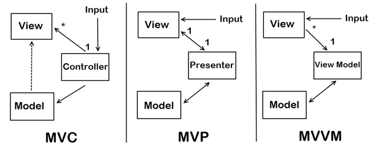

# WPF

## Алгоритм действий при создании нового проекта WPF .NET Core 6

1. App.config, package.config
2. Install Nuget package: EF,MaterialDesign.
3. Script Database 
4. Scaffold
5. Настройка структуры папок в проекте и решении.
6. Общие стили приложения в App.xaml
7. DbFirst и Scaffold или CodeFirst и Migration
8. Сделать интерфейс приложения с навигацией.Надо сделать простой функционалВ главном окне размеcтить сетку и фреймы


## Паттерны проектирования


## SQLite в WPF
https://metanit.com/sharp/wpf/21.1.php


## Компоновка

В WPF при компоновке и расположении элементов внутри окна нам надо придерживаться следующих принципов:

- Нежелательно указывать явные размеры элементов (за исключеним **минимальных** и **максимальных** размеров). Размеры должны определяться контейнерами.
- Нежелательно указывать явные позицию и координаты элементов внутри окна. Позиционирование элементов всецело должно быть прерогативой контейнеров. И контейнер сам должен определять, как элемент будет располагаться. Если нам надо создать сложную систему компоновки, то мы можем вкладывать один контейнер в другой, чтобы добиться максимально удобного расположения элементов управления.

**Примечание**: Атрибут ShowGridLines="True" у элемента Grid задает видимость сетки, по умолчанию оно равно False.Это полезно при разработке интерфейса, потом стоит отключать эту опцию.

## Конфигурация базы данных
Добавим в проект файл ```App.config```. Подключение для SQL Server и для SQLite

```xml
<?xml version="1.0" encoding="utf-8" ?>
<configuration>
	<configSections>
		<sectionGroup name="applicationSettings" type="System.Configuration.ApplicationSettingsGroup, System, Version=4.0.0.0, Culture=neutral, PublicKeyToken=b77a5c561934e089" >

			<section name="entityFramework" type="System.Data.Entity.Internal.ConfigFile.EntityFrameworkSection, EntityFramework, Version=6.0.0.0, Culture=neutral, PublicKeyToken=b77a5c561934e089" requirePermission="false" />

			<section name="AdmissionsCommitteeColledge.Properties.Settings"
                     type="System.Configuration.ClientSettingsSection, System, Version=4.0.0.0, Culture=neutral, PublicKeyToken=b77a5c561934e089"
                     requirePermission="false" />

		</sectionGroup>
	</configSections>


	<startup>
		<supportedRuntime version="v4.0" sku=".NETFramework,Version=v4.8" />
	</startup>

	<connectionStrings>
		<add name="DefaultConnection"
			 connectionString="Server=localhost;Database=FabricShop;Integrated Security=True;"
			 providerName="System.Data.SqlClient"/>

		<add name="ConnectionSQLite" connectionString="Data Source=FabricShop.db" providerName="System.Data.SQLite" />

	</connectionStrings>

</configuration>
```
## Взаимодействие с базой данных SQL Server через ADO.NET


Хранимая процедура, которая осуществляет добавление нового объекта в базу данных. 

```sql

CREATE PROCEDURE [dbo].[sp_InsertPhone]
    @title nvarchar(50),
    @company nvarchar(50),
    @price int,
    @Id int out
AS
    INSERT INTO Phones (Title, Company, Price)
    VALUES (@title, @company, @price)
   
    SET @Id=SCOPE_IDENTITY()
GO

```

Атрибут connectionString собственно хранит строку подключения. Он состоит из трех частей:

- Data Source=localhost: указывает на название сервера. По умолчанию для MS SQL Server Express используется "localhost"

- Initial Catalog=mobiledb: название базы данных.
- Integrated Security=True: задает режим аутентификации

Вывод данных в DataGrid. **AutoGenerateColumns="False"** позволяет делать привязку к нужным столбцам.

```xaml

        <DataGrid AutoGenerateColumns="False"
		  x:Name="phonesGrid">
            <DataGrid.Columns>
                <DataGridTextColumn Binding="{Binding Title}" Header="Модель" Width="120"/>
                <DataGridTextColumn Binding="{Binding Company}" Header="Производитель" Width="125"/>
                <DataGridTextColumn Binding="{Binding Price}" Header="Цена" Width="80"/>
            </DataGrid.Columns>
        </DataGrid>

```

Вся работа с бд производится стандартными средствами ADO.NET и прежде всего классом SqlDataAdapter. Вначале мы получаем в конструкторе строку подключения, которая определена выше в файле app.config:

```csharp
connectionString = ConfigurationManager.ConnectionStrings["DefaultConnection"].ConnectionString;
```
Чтобы задействовать эту функциональность, нам надо добавить в проект библиотеку **System.Configuration.dll**.

Далее в обработчике загрузки окна Window_Loaded создаем объект SqlDataAdapter:
```csharp 
adapter = new SqlDataAdapter(command);
```

В качестве команды для добавления объекта устанавливаем ссылку на хранимую процедуру:

```csharp
adapter.InsertCommand = new SqlCommand("sp_InsertPhone", connection);
```
Получаем данные из БД и осуществляем привязку:

```csharp
adapter.Fill(phonesTable);
phonesGrid.ItemsSource = phonesTable.DefaultView;
```

За обновление отвечает метод UpdateDB():

```csharp

private void UpdateDB()
{
    SqlCommandBuilder comandbuilder = new SqlCommandBuilder(adapter);
    adapter.Update(phonesTable);
}

```
Чтобы обновить данные через SqlDataAdapter, нам нужна команда обновления, которую можно получить с помощью объекта SqlCommandBuilder. Для самого обновления вызывается метод adapter.Update().

	Причем не важно, что мы делаем в программе - добавляем, редактируем или удаляем строки. Метод adapter.Update сделает все необходимые действия. Дело в том, что при загрузке данных в объект DataTable система отслеживает состояние загруженных строк. В методе adapter.Update() состояние строк используется для генерации нужных выражений языка SQL, чтобы выполнить обновление базы данных. В обработчике кнопки обновления просто вызывается этот метод UpdateDB, а в обработчике кнопки удаления предварительно удаляются все выделенные строки.
	Таким образом, мы можем вводить в DataGrid новые данные, редактировать там же уже существующие, сделать множество изменений, и после этого нажать на кнопку обновления, и все эти изменения синхронизируются с базой данных.
	Причем важно отметить действие хранимой процедуры - при добавлении нового объекта данные уходят на сервер, и процедура возвращает нам id добавленной записи. Этот id играет большую роль при генерации нужного sql-выражения, если мы захотим эту запись изменить или удалить. И если бы не хранимая процедура, то нам пришлось бы после добавления данных загружать заново всю таблицу в datagrid, только чтобы у новой добавленной записи был в datagrid id. И хранимая процедура избавляет нас от этой работы.


```csharp

private void Window_Loaded(object sender, RoutedEventArgs e)
        {
            string sql = "SELECT * FROM users";
            usersTable = new DataTable();
            SqlConnection connection = null;
            try
            {
                connection = new SqlConnection(connectionString);
                SqlCommand command = new SqlCommand(sql, connection);
                adapter = new SqlDataAdapter(command);

                //установка команды на добавление для вызова хранимой процедуры
                adapter.InsertCommand = new SqlCommand("sp_InsertUsers", connection);
                adapter.InsertCommand.CommandType = CommandType.StoredProcedure;
                adapter.InsertCommand.Parameters.Add(new SqlParameter("@name", SqlDbType.NVarChar, 10, "name"));
                adapter.InsertCommand.Parameters.Add(new SqlParameter("@age", SqlDbType.Int, 10, "age"));
                
                SqlParameter parameter = adapter.InsertCommand.Parameters.Add("@id", SqlDbType.Int, 0, "id");
                parameter.Direction = ParameterDirection.Output;

                connection.Open();
                adapter.Fill(usersTable);
                usersGrid.ItemsSource = usersTable.DefaultView;  // Заметь, что не DataSource, а ItemSource, чтобы Binding работал в xaml
            }
            catch (Exception ex)
            {
                MessageBox.Show(ex.Message);
            }
            finally
            {
                if (connection != null)
                    connection.Close();
            }
        }

```


```csharp

 private void UpdateDB()
        {
            SqlCommandBuilder commandbuilder = new SqlCommandBuilder(adapter);
            adapter.Update(usersTable);
            MessageBox.Show("Данные обновлены");
        }

```

```csharp

private void updateButton_Click(object sender, RoutedEventArgs e)
        {
            UpdateDB();       
        }
        
```

Метод удаления
```csharp

private void deleteButton_Click(object sender, RoutedEventArgs e)
        {
            if (usersGrid.SelectedItems != null)
            {
                for (int i = 0; i < usersGrid.SelectedItems.Count; i++)
                {
                    DataRowView datarowView = usersGrid.SelectedItems[i] as DataRowView;
                    if (datarowView != null)
                    {
                        DataRow dataRow = (DataRow)datarowView.Row;
                        dataRow.Delete();
                    }
                }
            }
            UpdateDB();
        }

```

## Entity Framework Core 6

## Cвязь моделей 1 : M

Класс модели. Можно все модели поместить в папку Models

Модель ```User```
```csharp
using System;
using System.Collections.Generic;

namespace FabricShop.Models
{
    public partial class User
    {
        public int Id { get; set; }
        public string Surname { get; set; } = null!;
        public string Name { get; set; } = null!;
        public string Patronymic { get; set; } = null!;
        public string Login { get; set; } = null!;
        public string Password { get; set; } = null!;
       
        public int RoleId { get; set; }
        public virtual Role Role { get; set; }
    }
}

```
Модель ```Role```

```csharp

using System;
using System.Collections.Generic;

namespace FabricShop.Models
{
    public partial class Role
    {
        public Role()
        {
            Users = new HashSet<User>();
        }

        public int Id { get; set; }
        public string RoleName { get; set; } = null!;
        
	public virtual ICollection<User> Users { get; set; }
    }
}


```


Для взаимодействия с базой данных через Entity Framework нам нужен контекст данных, поэтому добавим в папку Models еще один класс, который назовем AppContext:

```csharp
using System;
using System.Collections.Generic;
using System.Configuration;
using Microsoft.EntityFrameworkCore;
using Microsoft.EntityFrameworkCore.Metadata;

namespace FabricShop.Models
{
    public partial class FabricShopContext : DbContext
    {
        public FabricShopContext()
        {
            //Database.EnsureDeleted();
            //Database.EnsureCreated();
        }

        public FabricShopContext(DbContextOptions<FabricShopContext> options)
            : base(options)
        {
        }

        public virtual DbSet<Order> Orders { get; set; } = null!;
        public virtual DbSet<OrderProduct> OrderProducts { get; set; } = null!;
        public virtual DbSet<Product> Products { get; set; } = null!;
        public virtual DbSet<Role> Roles { get; set; } = null!;
        public virtual DbSet<User> Users { get; set; } = null!;
        public virtual DbSet<Category> Categories { get; set; } = null!;

        protected override void OnConfiguring(DbContextOptionsBuilder optionsBuilder)
        {
            if (!optionsBuilder.IsConfigured)
            {
                //optionsBuilder.UseSqlServer("Server=localhost;Database=FabricShop;Trusted_Connection=True;");


                // SQlite
                optionsBuilder.UseSqlite(ConfigurationManager.ConnectionStrings["ConnectionSQLite"].ToString());
                //optionsBuilder.UseSqlite(@"DataSource=ColledgeStore.db;");

            }
        }
        
    }
}

```
**Замечание**: Product - это класс модели, Products - это название таблицы в базе данных
Класс контекста наследуется от класса **DbContext**. В своем конструкторе он передает в конструктор базового класса название строки подключения из файла ```App.config```. Также в контексте данных определяется свойство по типу ```DbSet<Product>``` - через него мы будем взаимодействовать с таблицей, которая хранит объекты Product.


В разметки Xaml
	

```xaml

	<DataGrid AutoGenerateColumns="False" x:Name="usersGrid">
            <DataGrid.Columns>
                <DataGridTextColumn Binding="{Binding Title}" Header="Модель" Width="100"/>
                <DataGridTextColumn Binding="{Binding Company}" Header="Производитель" Width="110"/>
                <DataGridTextColumn Binding="{Binding Price}" Header="Цена" Width="70"/>
            </DataGrid.Columns>
        </DataGrid>
	
```	
Определим в файле кода c# привязку данных и возможные обработчики кнопок:
	
```csharp

using Microsoft.EntityFrameworkCore;
using System.Windows;

namespace WpfApp
{
	
    public partial class MainWindow2 : Window
    {

        AppContext db;

        public MainWindow()
        {
            InitializeComponent();

            try
            {
                db = new AppContext();
                db.Product.Load();
                ProductGrid.ItemsSource = db.Product.Local.ToBindingList();
		// using Linq
		// ProductGrid.ItemsSource = db.Product.ToList(); 
            }
            catch(Exception ex)
            {
                MessageBox.Show($"{ex.Message}");
            }
            
        }

    }
}
```
	
**Замечание**: при таком подходе надо изначально создавать базу данных на сервере или в классе AppContext прописать создание базы данных автоматически
																  
## MaterialDesign

App.xaml
								  
```xaml
<Application.Resources>
        <ResourceDictionary>
            <ResourceDictionary.MergedDictionaries>
                <ResourceDictionary Source="pack://application:,,,/MaterialDesignThemes.Wpf;component/Themes/MaterialDesignTheme.Light.xaml" />
                <ResourceDictionary Source="pack://application:,,,/MaterialDesignThemes.Wpf;component/Themes/MaterialDesignTheme.Defaults.xaml" />
                <ResourceDictionary Source="pack://application:,,,/MaterialDesignColors;component/Themes/Recommended/Primary/MaterialDesignColor.DeepPurple.xaml" />
                <ResourceDictionary Source="pack://application:,,,/MaterialDesignColors;component/Themes/Recommended/Accent/MaterialDesignColor.Lime.xaml" />
            </ResourceDictionary.MergedDictionaries>
        </ResourceDictionary>
    </Application.Resources>								  
```							

## Подключение в разметке XAML

```xaml

xmlns:materialDesign="http://materialdesigninxaml.net/winfx/xaml/themes"
        
        TextElement.Foreground="{DynamicResource MaterialDesignBody}"
        TextElement.FontWeight="Regular"
        TextElement.FontSize="13"
        TextOptions.TextFormattingMode="Ideal"
        TextOptions.TextRenderingMode="Auto"
        Background="{DynamicResource MaterialDesignPaper}"
        FontFamily="{DynamicResource MaterialDesignFont}"

```


## Page навигация в WPF


Переход с помощью Navigate можно только по Page, а не по Window.

Чтобы получить доступ к фрейму из другой страницы можно создать класс посредник ProxyClass, который будет хранить в статическом поле объект фрейма.

```csharp
using System;
using System.Collections.Generic;
using System.Linq;
using System.Text;
using System.Threading.Tasks;
using System.Windows.Controls; // for Frame

namespace WpfApp1
{
    public class ManagerPages
    {
        public static Frame Mainframe { get; set; }
    }
}
```

**Замечание**: при создание обрабочика кнопки в разметке XAML после нажатия F12 в коде создается обработчик. В средствах VS можно выбрать - Перейти к определению.

**Замечание**: чтобы отправить файлы в ресурсы надо выбрать проект и нажать кнопку с "ключиком" и открыть свойства проекта. Далее перейти в Ресурсы и создаться папка Resources и файл ```Properties/Resources.resx```, в котором можно добавлять ресурсы. При этом в свойствах отдельного ресурса ```Действия при сборке``` должны быть выбраны ```Ресурс```

**Замечание**: можно создавать базу данных и таблицы в Visual Studio. Также при импорте данных в значениях float SQL Server принимает значения с запятой  - ,

## Scaffold базы данных
	
В консоли диспетчера пакетов Nuget прописать команду
```Scaffold-DbContext "Server=localhost;Database=Users;Trusted_Connection=True;" Microsoft.EntityFrameworkCore.SqlServer -OutputDir Models```
	
**Замечание**: надо установить ```Microsoft.EntityFrameworkCore.Tools```.

Команда создает модели из каждой сущности в базе данных, учитывая связи, а также создает класс контекста для работы с данными как с классами.

```Scaffold-DbContext "Data Source=.\ComputerDatabase.db" Microsoft.EntityFrameworkCore.Sqlite -OutputDir Models```
**Примечание**: если будет делать Scaffold, ему нужна база из проекта, а не в Debug. При инициализации контекста база данных SQLite создается в Debug по умолчанию.


## Привязка данных Binding

<TextBox Name="textBox" Height="40" Width="100" Text="{Binding ElementName=textBlock,Path=Text,Mode=TwoWay}"   />

## Обновление объектов в таблице

Событие IsVisibleChanged="Page1_InVisibleChanged"

```Csharp
private void Page1_InVisibleChanged(object sender, DependencyPropertyChangedEventArgs e)
        {
            if (Visibility == Visibility.Visible)
            {
                AppContext db = new AppContext();
                db.ChangeTracker.Entries().ToList().ForEach(p => p.Reload());
                ProductGrid.ItemsSource = db.Users.ToList();
            }
        }
```

## Вызов контекста на кнопке Редактировать

```Csharp
        private void EditButton_Click(object sender, RoutedEventArgs e)
        {
            ManagerPages.Mainframe.Navigate(new Page2((sender as Button).DataContext as User));
        }
```

## Кнопка удаления с диалогом

```Csharp

private void DeleteButton_Click(object sender, RoutedEventArgs e)
        {
            var selectedUsers = ProductGrid.SelectedItems.Cast<User>().ToList();

            if (MessageBox.Show($"Вы точно хотите удалить {selectedUsers.Count()} пользователей", "Внимание!",
                 MessageBoxButton.YesNo, MessageBoxImage.Question) == MessageBoxResult.Yes)
            {
                try
                {
                    AppContext db = new AppContext();
                    db.Users.RemoveRange(selectedUsers);
                    db.SaveChanges();
                    ProductGrid.ItemsSource = db.Users.ToList();
                    MessageBox.Show("Пользователи удалены!");
                }
                catch (Exception ex)
                {
                    MessageBox.Show($"{ex.Message}");
                }
            }
        }
```

## Задание начальных значений для списка

```csharp
            var allTypes = db.Users.ToList();

            allTypes.Insert(0, new User { Login = "Все типы" });
            ComboBox.ItemsSource = allTypes;//.Select(p => p.Login);

            CheckBox.IsChecked = true;
            ComboBox.SelectedIndex = 0;
```

## Список combobox в xaml

```xaml
 <ComboBox Width="100"
	   Name="ComboBox"
	   DisplayMemberPath="Login"
	   SelectionChanged="ComboBox_SelectionChanged"></ComboBox>
```

## ListView

```xaml
<ListView Grid.Row ="0"
	  x:Name="ListView"
	  ScrollViewer.HorizontalScrollBarVisibility="Disabled"HorizontalContentAlignment="Center" >
	  
            <ListView.ItemsPanel>
                <ItemsPanelTemplate>
                    <WrapPanel Orientation="Horizontal" HorizontalAlignment="Center"/>
                </ItemsPanelTemplate>
            </ListView.ItemsPanel>
	    
            <ListView.ItemTemplate>
                <DataTemplate>
                    <Grid>
                        <Grid.RowDefinitions>
                            <RowDefinition/>
                            <RowDefinition/>
                            <RowDefinition/>
                        </Grid.RowDefinitions>
			
                        <Image Grid.Row="2"
			       HorizontalAlignment="Center"
			       Height="100"
			       Width="100">

                                <Image.Source>

                                <Binding Path="Password" >
   
                                    <Binding.TargetNullValue>
                                        <ImageSource>products/tire_0.jpg</ImageSource>
                                    </Binding.TargetNullValue>
                                    
                                </Binding>
                            </Image.Source>
                        </Image>
                        
                        <TextBlock Text="{Binding Login}"
				   VerticalAlignment="Center"
				   TextAlignment="Center"
				   TextWrapping="Wrap"
				   HorizontalAlignment="Center"
				   Margin="5 5"
                                   FontSize="10"
				   Grid.Row="0"/>
                        <TextBlock Text="{Binding Password, StringFormat={}{0}}"
				   VerticalAlignment="Center"
				   TextAlignment="Center"
				   TextWrapping="Wrap"
				   HorizontalAlignment="Center"
				   Margin="5 5"
                                   FontSize="10" Grid.Row="1"/>     
                    </Grid>
                </DataTemplate>
            </ListView.ItemTemplate>
        </ListView>
```

## Передача параметров в конструктор для текущего пользователя

```Csharp
private User _currentUser = new User();

        public Page2(User selectedUser)
        {
            InitializeComponent();

            if(selectedUser != null)
            {
                _currentUser = selectedUser;
            }

            DataContext = _currentUser;
        }
```

## В Visual Studio работа с базой данных. Связь двух таблиц внешним ключом

```SQL
CONSTRAINT [FK_Abiturients_Specialty] FOREIGN KEY ([specialty_id]) REFERENCES [dbo].[Specialty] ([Id])
```
## Автоинкремент в SQL Server 

```SQL
[Id] int Identity(1,1)
```

## Пример MaterialDesign

```xaml
<Grid>
        <Grid>
            <Border MinWidth="100"
                    Margin="15"
                    Background="AliceBlue"
                    VerticalAlignment="Center"
                    Padding="40"
                    MaxHeight="400"
                    CornerRadius="30">
                
                <Border.Effect>
                    <DropShadowEffect BlurRadius="30"
                                      Color="LightGray"
                                      ShadowDepth="0"/>
                </Border.Effect>

                <StackPanel>
                    <TextBlock Text="База данных магазина компьютерной техники"
                               FontSize="30"
                               FontWeight="Bold"
                               Margin="0 0 0 20"/>
                    <TextBox Name="loginField"
                             materialDesign:HintAssist.Hint="Введите логин"
                             Style="{StaticResource MaterialDesignFloatingHintTextBox}"/>
                    <PasswordBox Name="passwordField"
                                 materialDesign:HintAssist.Hint="Введите пароль"
                                 Style="{StaticResource MaterialDesignFloatingHintPasswordBox}"/>

                    <TextBox Name="emailField"
                             materialDesign:HintAssist.Hint="Введите email"
                             Style="{StaticResource MaterialDesignFloatingHintTextBox}"/>
                    <Button Name="createButton"
                            Content="Создать"
                            Margin="0 20"
                            />
                </StackPanel>
            </Border>

        </Grid>
    </Grid>

```

## Работа с Word

```Csharp
          //  using(AppContext db = new AppContext())
            {
                //var products = db.Products.ToList();

                //var application = new Word.Application();

                //Word.Document document = application.Documents.Add();


                // Создаем параграф для хранения страниц


                // Основной структурной единицей текста является параграф, представленный объектом
                // Paragraph. Все абзацы объединяются в коллекцию Paragraphs, причем новые параграфы
                // добавляются с помощью метода Add. Доступ к тексту предоставляет объект Range,
                // являющийся свойством Paragraph, а текстовое содержание абзаца доступно через
                // Range.Text. В данном случае для хранения ФИО каждого пользователя создается новый параграф

                /*foreach (var p in products)
                {
                    Word.Paragraph productParagraph = document.Paragraphs.Add();
                    Word.Range productRange = productParagraph.Range;


                  

                    // Добавляем названия страниц
                    productRange.Text = p.Title;
                    //productParagraph.set_Style("Title");
                    productRange.InsertParagraphAfter();

                    //Добавляем и форматируем таблицу для хранения информации о продуктах
                    Word.Paragraph tableParagraph = document.Paragraphs.Add();
                    Word.Range tableRange = tableParagraph.Range;
                    Word.Table paymentsTable = document.Tables.Add(tableRange, products.Count() + 1, 3);


                    //После создания параграфа для таблицы и получения его Range, добавляется таблица
                    //с указанием числа строк (по количеству категорий + 1) и столбцов. Последние две строчки
                    //касаются указания границ (внутренних и внешних) и выравнивания ячеек (по центру и по вертикали)

                    paymentsTable.Borders.InsideLineStyle = paymentsTable.Borders.OutsideLineStyle
                        = Word.WdLineStyle.wdLineStyleSingle;
                    paymentsTable.Range.Cells.VerticalAlignment = Word.WdCellVerticalAlignment.wdCellAlignVerticalCenter;


                    Word.Range cellRange;

                    cellRange = paymentsTable.Cell(1, 1).Range;
                    cellRange.Text = "Текст 1";
                    cellRange = paymentsTable.Cell(1, 2).Range;
                    cellRange.Text = "Текст 2";
                    cellRange = paymentsTable.Cell(1, 3).Range;
                    cellRange.Text = "Текст 3";

                    paymentsTable.Rows[1].Range.Bold = 1;
                    paymentsTable.Rows[1].Range.ParagraphFormat.Alignment = Word.WdParagraphAlignment.wdAlignParagraphCenter;*/


                    // Положение ячейки заносится в переменную cellRange. Метод AddPicture() класса
                    // InlineShape позволяет добавить изображение в ячейку. Иконки категорий размещаются
                    // в новой папке Assets, основные шаги создания которой изображены на скриншоте


                   /* for (int i = 0; i < products.Count(); i++)
                    {
                        var currentProduct = products[i];
                        cellRange = paymentsTable.Cell(i + 2, 1).Range;
                        
                        
                        
                        //Word.InlineShape imageShape = cellRange.InlineShapes.AddPicture(AppDomain.CurrentDomain.BaseDirectory
                          //  + "..\\..\\" + currentProduct.Id);

                        // Для первой колонки устанавливаются длина, ширина,
                        // а также горизонтальное выравнивание по центру

                        //imageShape.Width = imageShape.Height = 40;
                        //cellRange.ParagraphFormat.Alignment = Word.WdParagraphAlignment.wdAlignParagraphCenter;

                        cellRange = paymentsTable.Cell(i + 2, 2).Range;
                        cellRange.Text = currentProduct.Title;


                    }*/

            }

```
## Применение глобального шрифта к страницам Page или Window
							    
```Csharp
Style = (Style)FindResource(typeof(Page));
```

## Количество элементов
```Csharp
CountAbiturients.Text = $"Количество: {db.Abiturients.Take(10).ToList().Count} из {db.Abiturients.ToList().Count}";
```

## Включение в выборку связнных записей
```Csharp
productGrid.ItemsSource = db.Abiturients.Include(p => p.Specialty).ToList();
//Без использования метода Include мы бы не могли бы получить связанную команду и ее свойства: p.Specialty.Name
```

## Переход на страницу и передача объекта
```Cshawrp
ProxyFrame.Mainframe.Navigate(new AddAbiturientPage(productGrid.SelectedItem as Abiturient));
```

## Переход на страницу Вперед

```Csharp
private void ForwardButton_Click(object sender, RoutedEventArgs e)
        {
            productGrid.ItemsSource = db.Abiturients.Skip(step).Take(10).ToList();
            if (step + 10 < db.Abiturients.Count())
                step += 10;

            CountAbiturients.Text = $"Количество: {db.Abiturients.Skip(step).Take(10).ToList().Count} из {db.Abiturients.ToList().Count}";
        }	
```
						   
## Переход на страницу Назад

```Csharp
private void BackButton_Click(object sender, RoutedEventArgs e)
        {
            if (step > 0)
                step -= 10;
            productGrid.ItemsSource = db.Abiturients.Skip(step).Take(10).ToList();

            CountAbiturients.Text = $"Количество: {db.Abiturients.Skip(step).Take(10).ToList().Count} из {db.Abiturients.ToList().Count}";
        }
```

## Очистка параметров сортировки, фильтрации и поиска

```Csharp
private void Clear_ButtonClick(object sender, RoutedEventArgs e)
        {
            SortCombobox.Text = "Сортировка";
            FilterComboBox.Text = "Все типы";
            SearchBox.Text = "";
        }
```

## Опции атрибуты для DataGrid

```xaml
	Grid.Row="1"
            Margin="5"
            AutoGenerateColumns="False"
            x:Name="productGrid"
            
            MouseDoubleClick="Edit_MouseDoubleClick"
            IsReadOnly="True"
            GridLinesVisibility="None"
            SelectionMode="Extended"
            SelectionUnit="FullRow"
            
            ColumnWidth="Auto"
            HorizontalAlignment="Stretch" 
            VerticalAlignment="Stretch" 
            HorizontalContentAlignment="Stretch"
            EnableRowVirtualization="false"
            EnableColumnVirtualization="false"
            CanUserAddRows="False"
            CanUserReorderColumns="False"
            CanUserResizeColumns="True" IsSynchronizedWithCurrentItem="False"
```

## Триггеры в DataGrid на Row

```xaml
<DataGrid.RowStyle>
                <Style TargetType="DataGridRow">
                    <Style.Triggers>
                        <DataTrigger Binding="{Binding Ball}" Value="5" >
                            <Setter Property="Background" Value="Orange"/>
                        </DataTrigger>
                    </Style.Triggers>
                </Style>
</DataGrid.RowStyle>
```

##  Вinding Stringformat даты
	
```xaml
Binding="{Binding BirthDay, StringFormat={}{0:dd.MM.yyyy}}"
```
	
## Опции окна Window
```xaml
 	Title="Главное меню"
        Height="700"
        Width="1100"
        Background="White"
        WindowStartupLocation="CenterScreen"
        MinHeight="500"
        MinWidth="900"
        Icon="emblscc.ico"
```
	
## Авторизация

```Csharp
using(ColledgeStoreContext db = new ColledgeStoreContext())
            {
                var currentUser = db.Users.Where(user => user.Login == LoginBox.Text && user.Password == PasswordBox.Password).FirstOrDefault();
                if (currentUser != null)
                {
                    ProxyFrame.CurrentUser = currentUser;
                    MainWindow main = new MainWindow();
                    main.Show();
                    this.Close();
                }
                else
                {
                    MessageBox.Show("Неправильный логин или пароль");
                }
            }
```
	
## Дополнительный свойства на основе существующих свойств

```Csharp
        
public string? Image { get; set; }
public string? ImagePath { get { return System.IO.Path.Combine(Environment.CurrentDirectory, $"images/{Image}"); }  }

```

## Binding по полному пути картинки

```csharp
                                <Image>
                                    <Image.Source>
                                        <BitmapImage DecodePixelWidth="100" DecodePixelHeight="100"
                                        UriSource = "{Binding ImagePath}"/>
                                    </Image.Source>
                                </Image>
```

## DataPicker

```xaml
<DatePicker
	SelectedDate="{Binding BirthDay}" 
	Name="birth_day"/>
```
	
## ComboBox

```xaml
<ComboBox
SelectedValue="{Binding Specialty}"
Text="{Binding Specialty.Name}"
Name="specialty_id"
Margin="1"
Height="30"
Width="150" 
IsEditable="True" />
```
	
```csharp
 specialty_id.ItemsSource = db.Specialties.ToList(); // загрузка в комбобокс объектов специальностей
 specialty_id.DisplayMemberPath = "Name"; // отображение в списке объектов конкретные свойства, а не весь объект
```

## Изображение по абсолютному пути

```Csharp
BitmapImage image = new BitmapImage(new Uri(System.IO.Path.Combine(Environment.CurrentDirectory, $"{_currentAbiturient.Image}"), UriKind.Absolute));
ImagePicture.Source = image;
```
	
	
## Валидация

```Csharp
// Валидация полей

                StringBuilder errors = new StringBuilder();
                if (string.IsNullOrWhiteSpace(full_name.Text))
                    errors.AppendLine("Укажите имя");
                if (string.IsNullOrWhiteSpace(specialty_id.Text))
                    errors.AppendLine("Укажите специальность");
                if (string.IsNullOrWhiteSpace(birth_day.Text))
                    errors.AppendLine("Укажите дату рождения");
                if (string.IsNullOrWhiteSpace(date_certificate.Text))
                    errors.AppendLine("Укажите дату выдачи аттестата");
                if (string.IsNullOrWhiteSpace(passport_issued.Text))
                    errors.AppendLine("Укажите дату выдачи паспорта");

                //
                if (errors.Length > 0)
                {
                    MessageBox.Show(errors.ToString());
                    return;
                }
```
	
## Замена . на , для SQL Server

```csharp
Ball = Convert.ToDouble(ball.Text.Replace(".", ",")) // SQL Server принимает дробные значения с запятой
```
	
## Полные сообщения об ошибках

```csharp
catch (Exception ex)
{
    MessageBox.Show($"Ошибка: {ex.InnerException.Message}");
}
```
	
	
## Работа с Word. Поиск и замена значений
```Csharp
 try
            {
                Abiturient abiturient = UsersComboBox.SelectedItem as Abiturient;
                File.Copy(System.IO.Path.Combine(Environment.CurrentDirectory, "заявление.doc"), System.IO.Path.Combine(Environment.CurrentDirectory, $"заявление {abiturient.FullName}.doc"));

                Word.Application wordApp = new Microsoft.Office.Interop.Word.Application { Visible = false };
                Word.Document aDoc = wordApp.Documents.Open(Environment.CurrentDirectory + "/" + $"заявление {abiturient.FullName}.doc", ReadOnly: false, Visible: false); // файлу дать разрешения для записdи
                Word.Range range = aDoc.Content;

                //range.Find.ClearFormatting();
                range.Find.Execute(FindText: "[Фамилия]", ReplaceWith: abiturient.FullName.Split(" ")[0], Replace: Word.WdReplace.wdReplaceAll);
                range.Find.Execute(FindText: "[Имя]", ReplaceWith: abiturient.FullName.Split(" ")[1], Replace: Word.WdReplace.wdReplaceAll);
                range.Find.Execute(FindText: "[Отчество]", ReplaceWith: abiturient.FullName.Split(" ")[2], Replace: Word.WdReplace.wdReplaceAll);
                range.Find.Execute(FindText: "[Дата рождения]", ReplaceWith: abiturient.BirthDay, Replace: Word.WdReplace.wdReplaceAll);
                range.Find.Execute(FindText: "[Место рождения]", ReplaceWith: abiturient.PlaceOfBirth, Replace: Word.WdReplace.wdReplaceAll);
                range.Find.Execute(FindText: "[Гражданство]", ReplaceWith: abiturient.Citizenship, Replace: Word.WdReplace.wdReplaceAll);
                range.Find.Execute(FindText: "[серия] ", ReplaceWith: abiturient.SeriesNumberPassport.Split(" ")[0], Replace: Word.WdReplace.wdReplaceAll);
                range.Find.Execute(FindText: "[номер]", ReplaceWith: abiturient.SeriesNumberPassport.Split(" ")[1], Replace: Word.WdReplace.wdReplaceAll);
                range.Find.Execute(FindText: "[Кем и когда выдан]", ReplaceWith: abiturient.PassportIssued, Replace: Word.WdReplace.wdReplaceAll);
                range.Find.Execute(FindText: "[Адрес регистрации]", ReplaceWith: abiturient.RegistrationAddress, Replace: Word.WdReplace.wdReplaceAll);
                range.Find.Execute(FindText: "[Адрес фактического проживания]", ReplaceWith: abiturient.AddressActualResidence, Replace: Word.WdReplace.wdReplaceAll);
                range.Find.Execute(FindText: "[телефон]", ReplaceWith: abiturient.NumberPhone, Replace: Word.WdReplace.wdReplaceAll);
                range.Find.Execute(FindText: "[код] ", ReplaceWith: (db.Specialties.Find(abiturient.SpecialtyId) as Specialty).Code   , Replace: Word.WdReplace.wdReplaceAll);
                range.Find.Execute(FindText: "[наименование]", ReplaceWith: db.Specialties.Find(abiturient.SpecialtyId).Name, Replace: Word.WdReplace.wdReplaceAll);
                range.Find.Execute(FindText: "[образовательное учреждение]", ReplaceWith: abiturient.Education, Replace: Word.WdReplace.wdReplaceAll);
                range.Find.Execute(FindText: "[год окончания]", ReplaceWith: abiturient.SchoolGraduationYear, Replace: Word.WdReplace.wdReplaceAll);
                range.Find.Execute(FindText: "[номер аттестата]", ReplaceWith: abiturient.CertificateNumber, Replace: Word.WdReplace.wdReplaceAll);
                range.Find.Execute(FindText: "[дата выдачи]", ReplaceWith: abiturient.DateCertificate, Replace: Word.WdReplace.wdReplaceAll);
                range.Find.Execute(FindText: "[иностранный язык]", ReplaceWith: abiturient.Language, Replace: Word.WdReplace.wdReplaceAll);
                range.Find.Execute(FindText: "[национальность]", ReplaceWith: abiturient.Nationality, Replace: Word.WdReplace.wdReplaceAll);
                range.Find.Execute(FindText: "[общежитие]", ReplaceWith: abiturient.NeedHostel, Replace: Word.WdReplace.wdReplaceAll);
                range.Find.Execute(FindText: "[дата]", ReplaceWith: DateTime.Now.ToShortDateString(), Replace: Word.WdReplace.wdReplaceAll);
		
                if (abiturient.Specialty.Base == "9")
                {
                    if (range.Find.Execute("общего"))
                      
                      range.Font.Underline = Word.WdUnderline.wdUnderlineDouble;
                }
                else
                {
                    if (range.Find.Execute("среднего"))
                        
                        range.Font.Underline = Word.WdUnderline.wdUnderlineDouble;
                }

                // создаю новый range так как старый range становится весь другой. С этим можно разобраться

                Word.Range range1 = aDoc.Content;

                if (abiturient.Specialty.FormEducation == "очная")
                {
                    if (range1.Find.Execute("очное"))
                        
                        range1.Font.Underline = Word.WdUnderline.wdUnderlineSingle;
                }
                else
                {
                    
                    if (range1.Find.Execute("заочное"))
                        
                         range1.Font.Underline = Word.WdUnderline.wdUnderlineSingle;
                }

                MessageBox.Show("Заявление создано!", MessageBoxButton.OK.ToString());
              
                // Надо сохранять в файл с правами записи
                string gesturefile = System.IO.Path.Combine(Environment.CurrentDirectory + "/" + $"заявление {abiturient.FullName}.doc");
                string gesturefilePdf = System.IO.Path.Combine(Environment.CurrentDirectory + "/" + $"заявление {abiturient.FullName}.pdf");
		
                if (PdfCheck.IsChecked == true)
                {
                    aDoc.SaveAs2(gesturefilePdf, Word.WdExportFormat.wdExportFormatPDF);
                }
		
                aDoc.Close();
                wordApp.Quit();

            }
            catch (Exception ex)
            {
                MessageBox.Show($"{ex.Message}");
            }
```

## Добавление фото в Word

```csharp
 // находим диапазон с фото
                Word.Range range1 = aDoc.Content;
                range1.Find.Execute(FindText: "[Фото]");
                
                // добавляем рядом картинку
                Word.InlineShape ils = aDoc.InlineShapes.AddPicture(abiturient.ImagePath, false, true, Range: range1);
		
                // удаляем слово фото
                range1.Find.Execute(FindText: "[Фото]", ReplaceWith: "", Replace: Word.WdReplace.wdReplaceAll);
```

## Каптча

```Csharp
public static class CaptchaBuild
    {
        public static string Refresh()
        {

            string captcha = "A1fd";

            Random rand = new Random();

            for (int i = 0; i < 4; i++)
            {
                captcha += (char)rand.Next('A', 'Z' + 1);
            }

            return captcha;
        }
    }
								  
```
				  
```csharp
	CaptchaBox.Visibility = Visibility.Visible;
	CaptchaText.Visibility = Visibility.Visible;
	Captcha.Visibility = Visibility.Visible;
	LoginButtonName.IsEnabled = false;

	MessageBox.Show(CaptchaBuild.Refresh());
	Captcha.Text = CaptchaBuild.Refresh();
	Captcha.IsReadOnly = true;				  
```
```csharp
	private void CaptchaBox_TextChanged(object sender, TextChangedEventArgs e)
		{
		    if (CaptchaBox.Text == Captcha.Text)
		    {
			CaptchaBox.Visibility = Visibility.Collapsed;
			CaptchaText.Visibility = Visibility.Collapsed;
			Captcha.Visibility = Visibility.Collapsed;
			LoginButtonName.IsEnabled = true;
		    }
		    else
		    {
			Captcha.Text = CaptchaBuild.Refresh();
			disableButton();

		    }
		}
```

## Асинхронная задача для выключения кнопки

```csharp
	async void disableButton()
		{
		    LoginButtonName.IsEnabled = false;
		    await Task.Delay(TimeSpan.FromSeconds(10));
		    LoginButtonName.IsEnabled = true;
		}
```

## App.xaml. Стили и ресурсы для приложения

```xaml
<Application.Resources>

        <SolidColorBrush x:Key="ColorPrimery" Color="White"></SolidColorBrush>
        <SolidColorBrush x:Key="ColorSecondary" Color="#FFFFFFE1"></SolidColorBrush>
        <SolidColorBrush x:Key="ColorAccent" Color="#FF76E383"></SolidColorBrush>


        <Style TargetType="{x:Type Window}">
            <Setter Property="FontSize" Value="15"></Setter>
            <Setter Property="FontFamily" Value="Comic Sans MS"></Setter>
            <Setter Property="Background" Value="White">
            </Setter>
        </Style>

        <Style TargetType="{x:Type Page}">
            <Setter Property="FontSize" Value="20"></Setter>
            <Setter Property="FontFamily" Value="Comic Sans MS"></Setter>
        </Style>

        <Style TargetType="{x:Type DataGrid}">
           
            <Setter Property="Background" Value="#FF76E383">
            </Setter>
        </Style>

        <Style TargetType="Button">
            <Setter Property="Margin" Value="4"></Setter>
            <Setter Property="Width" Value="120"></Setter>
            <Setter Property="Height" Value="30"></Setter>
            <Setter Property="Background" Value="#FF498C51"></Setter>
        </Style>

        <Style TargetType="StackPanel">
            <Setter Property="Margin" Value="15"></Setter>
            <Setter Property="HorizontalAlignment" Value="Center"></Setter>
            <Setter Property="VerticalAlignment" Value="Center"></Setter>
        </Style>

        <Style TargetType="WrapPanel">
            <Setter Property="Margin" Value="10"></Setter>
        </Style>


        <Style TargetType="TextBox">
            <Setter Property="Width" Value="150"></Setter>
            <Setter Property="Height" Value="30"></Setter>
            <Setter Property="Margin" Value="1"></Setter>
        </Style>

        <Style TargetType="DatePicker">
            <Setter Property="Width" Value="150"></Setter>
            <Setter Property="Height" Value="30"></Setter>
            <Setter Property="Margin" Value="1"></Setter>
        </Style>
    </Application.Resources>
```

## Триггер для ListView

```xaml
            <ListView.ItemContainerStyle>
                <Style TargetType="ListViewItem">
                  
                    <Style.Triggers>
                        <DataTrigger Binding="{Binding QuantityInStock}" Value="0">
                            <Setter Property="Background" Value="Gray" />
                        </DataTrigger>
                    </Style.Triggers>
                </Style>
            </ListView.ItemContainerStyle>
```

## Border
```xaml
<Border
	CornerRadius="3"
	BorderThickness="2"
	Width="800"
	Height="Auto"
	BorderBrush="{StaticResource ColorAccent}"

	<Border.Effect>
		<DropShadowEffect BlurRadius="30"
		Color="LightGray"
		ShadowDepth="0"/>
	</Border.Effect>
</Border>
```
Замечание: в Border может быть только один элемент.

## По ролям 

```сsharp
 if (Proxy.CurrentUser != null)
            {
                nameUser.Text = Proxy.CurrentUser.Name + " " + Proxy.CurrentUser.Surname;
                roleUser.Text = $"Ваша роль: {Proxy.CurrentUser.RoleNavigation.RoleName}";
                AddProduct.Visibility = Visibility.Visible;
                DeleteProduct.Visibility = Visibility.Visible;
            }
            else
            {
                nameUser.Text = "Вы зашли как гость!";
            }
```

## Выборка по столбцу Select в EF

```сsharp
 var Suppliers = db.Products.Select(p => p.Supplier).Distinct().ToList();
```

## Начальные значения для сортировки и фильтрации

```сsharp
 SortComboBox.ItemsSource = new List<String>() { "Цена", "По убыванию", "По возрастанию" };   //.Select(p => p.Login);
                SortComboBox.SelectedIndex = 0;

                Suppliers.Insert(0, "Все производители");
                FilterComboBox.ItemsSource = Suppliers;
                FilterComboBox.SelectedIndex = 0;
```
Замечания: событие SelectionChanged выбора срабатывает после смены значения в списке, т.е вначале первое значение стоит поставить нейтральное


## Обновленный общий метод для сортировки, фильтрации и поиска

```сsharp
  private void UpdateProducts()
        {
            using(FabricShopContext db = new FabricShopContext())
            {
                var currentProducts = db.Products.ToList();
                ListViewProduct.ItemsSource = currentProducts;

                // Сортировка
                if (SortComboBox.SelectedIndex > 0)
                {
                    
                    if (SortComboBox.SelectedItem == "По возрастанию")
                    {
                        currentProducts = currentProducts.OrderBy(p => p.Cost).ToList();
                    }

                    if (SortComboBox.SelectedItem == "По убыванию")
                    {
                        currentProducts = currentProducts.OrderByDescending(p => p.Cost).ToList();
                    }
                    ListViewProduct.ItemsSource = currentProducts;
                }

                // Поиск
                if (Search.Text != "")
                {
                    currentProducts = currentProducts.Where(p => p.Name.Contains(Search.Text) || p.Description.Contains(Search.Text) || 			p.Category.Contains(Search.Text)).ToList();
                    ListViewProduct.ItemsSource = currentProducts;
                };

                if (FilterComboBox.SelectedValue == "Все производители")
                    ListViewProduct.ItemsSource = currentProducts;
                // Фильтрация
                if (FilterComboBox.SelectedValue != null && FilterComboBox.SelectedValue != "Все производители")
                {
                    currentProducts = currentProducts.Where(p => p.Supplier.Trim() == FilterComboBox.SelectedValue.ToString()).ToList();
                    ListViewProduct.ItemsSource = currentProducts;

                    //MessageBox.Show(FilterComboBox.SelectedValue.ToString());
                    // В базу сохраняеются с пробелами при nchar!!!
                }

                CountBlock.Text = $"Количество: {currentProducts.Count} из {db.Products.ToList().Count}";
            }

        }
```

## Добавление изображения

```Csharp
private void AddImageToProduct(object sender, RoutedEventArgs e)
        {
            Stream myStream;
            Microsoft.Win32.OpenFileDialog dlg = new Microsoft.Win32.OpenFileDialog();
            if(dlg.ShowDialog() == true)
            {
                if ( (myStream = dlg.OpenFile()) != null )
                {
                    string strfilename = dlg.FileName;
                    string filetext = File.ReadAllText(strfilename);

                    dlg.DefaultExt = ".png";
                    dlg.Filter = "JPEG Files (*.jpeg)|*.jpeg|PNG Files (*.png)|*.png|JPG Files (*.jpg)|*.jpg|GIF Files (*.gif)|*.gif";
                    dlg.Title = "Open Image";
                    dlg.InitialDirectory = "./";
                    
                    BitmapImage image = new BitmapImage(new Uri(dlg.FileName));
                    ImageBox.Source = image;

                    try
                    {
                            string newRelativePath = $"{System.DateTime.Now.ToString("HHmmss")}_{dlg.SafeFileName}";
                            File.Copy(dlg.FileName, System.IO.Path.Combine(Environment.CurrentDirectory, $"images/{newRelativePath}"));
                            ImagePath = newRelativePath;
                    }
                    catch(Exception ex)
                    {
                        MessageBox.Show(ex.Message);
                    }
                }       
                myStream.Dispose();
                
            }
        }
```

## DataGrid определение

```csharp
        <DataGrid 
                  AutoGenerateColumns="False"
		  x:Name="productGrid"
                  Grid.Row="1"
                  Grid.RowSpan="1"
                  IsReadOnly="True"
                  SelectionMode="Single"
                  RowDetailsVisibilityMode="VisibleWhenSelected"
                  HorizontalContentAlignment="Left"
         >
            
            <DataGrid.Columns>
                <DataGridTemplateColumn Header="Фото" IsReadOnly="True" >
                    <DataGridTemplateColumn.CellTemplate>
                        <DataTemplate>
                            <Image Height="100" Width="100" Source="{Binding ImagePath}" />
                        </DataTemplate>
                    </DataGridTemplateColumn.CellTemplate>
                </DataGridTemplateColumn>


                <DataGridTextColumn Binding="{Binding Title}" Header="Название"/>
               
                <DataGridTextColumn Binding="{Binding Price}" Header="Цена"/>
                <DataGridTextColumn Binding="{Binding Category.Name}" Header="Категория" />
               
                <DataGridTextColumn Width="*" Header="Описание" Binding="{Binding Description}">
                        <DataGridTextColumn.ElementStyle>
                            <Style>
                                <Setter Property="TextBlock.TextWrapping" Value="Wrap" />
                                <Setter Property="TextBlock.TextAlignment" Value="Justify" />
                            </Style>
                        </DataGridTextColumn.ElementStyle>
                </DataGridTextColumn>
                
            </DataGrid.Columns>
        </DataGrid>

```

## Односторонняя привязка Binding One Way

```csharp

<ComboBox 
	Name ="categoryBox"
	Width="200"
	Margin="5"
	DisplayMemberPath="Name"
	Text = "{Binding Category.Name, Mode=OneWay}"                     
/>

```


