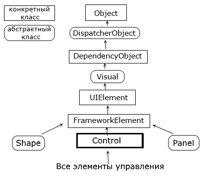

# Элементы управления

## Обзор элементов управления и их свойств

Чтобы как-то взаимодействовать с пользователем, получать от пользователя ввод с клавиатуры или мыши и использовать введенные данные в программе, нам нужны элементы управления. WPF предлагает нам богатый стандартный набор элементов управления

Все элементы управления могут быть условно разделены на несколько подгрупп:

- **Элементы управления содержимым**, например кнопки (Button), метки (Label)
- **Специальные контейнеры**, которые содержат другие элементы, но в отличие от элементов Grid или Canvas не являются контейнерами компоновки - ScrollViewer,GroupBox
- **Декораторы**, чье предназначение создание определенного фона вокруг вложенных элементов, например, Border или Viewbox.

- **Элементы управления списками**, например, ListBox, ComboBox.
- **Текстовые элементы управления**, например, TextBox, RichTextBox.

- **Элементы, основанные на диапазонах значений**, например, ProgressBar, Slider.
- **Элементы для работ с датами**, например, DatePicker и Calendar.
- **Остальные элементы управления**, которые не вошли в предыдущие подгруппы, например, Image.

Все элементы управления наследуются от общего класса **System.Window.Controls.Control** и имеют ряд общих свойств. А общую иерархию элементов управления можно представить следующим образом:



Вкратце рассмотрим, что представляют все эти типы в иерархии.

**System.Threading.DispatcherObject**

В основе WPF лежит модель STA (Single-Thread Affinity), согласно которой за пользовательский интерфейс отвечает один поток. И чтобы пользовательский интерфейс мог взаимодействовать с другими потоками, WPF использует концепцию диспетчера - специального объекта, управляющего обменом сообщениями, через которые взаимодействуют потоки. Наследование типов от класса DispatcherObject позволяет получить доступ к подобному объекту-диспетчеру и и другим функциям по управлению параллелизмом.

**System.Windows.DependencyObject**

Наследование от этого класса позволяет взаимодействовать с элементами в приложении через их специальную модель свойств, которые называются свойствами зависимостей (dependency properties). Эта модель упрощает применение ряда особенностей WPF, например, привязки данных. Так, система свойств зависимостей отслеживает зависимости между значениями свойств, автоматически проверяет их и изменяет при изменении зависимости.

**System.Windows.Media.Visual**

Класс Visual содержит инструкции, которые отвечают за отрисовку, визуализацию объекта.

**System.Windows.UIElement**

Класс UIElement добавляет возможности по компоновке элемента, обработку событий и получение ввода.

**System.Windows.FrameworkElement**

Класс FrameworkElement добавляет поддержку привязки данных, анимации, стилий. Также добавляет ряд свойств, связанных с компоновкой (выравнивание, отступы) и ряд других.

**System.Windows.Controls.Control**

Класс Control представляет элемент управления, с которым взаимодействует пользователь. Этот класс добавляет ряд дополнительных свойств для поддержки элементами шрифтов, цветов фона, шрифта, а также добавляет поддержку шаблонов - специального механизма в WPF, который позволяет изменять стандартное представление элемента, кастомизировать его.

И далее от класса Control наследуются непосредственно конкретные элементы управления или их базовые классы, которые получают весь функционал, добавляемый к типам в этой иерархии классов.

Рассмотрим некоторые из основных свойств, которые наследуются элементами управления.

## Name

Данное свойство определяет имя элемента управления, через которое впоследствии можно будет обращаться к данному элементу, как в коде, так и в xaml разметке. Например, в xaml-коде у нас определена следующая кнопка:

```xml
<Button x:Name="button1" Width="60" Height="30" Content="Текст" Click="button1_Click" />
```

Здесь у нас задан атрибут Click с названием метода обработчика button1_Click, который будет определен в файле кода C# и будет вызываться по нажатию кнопки. Тогда в связанном файле кода C# мы можем обратиться к этой кнопке:

```Csharp
private void button1_Click(object sender, RoutedEventArgs e)
{
    button1.Content = "Привет!";
}
```

Поскольку свойство Name имеет значение button1, то через это значение мы можем обратиться к кнопке в коде.

## FieldModifier

Свойство FieldModifier задает модификатор доступа к объекту:

```xml
<StackPanel>
    <Button x:FieldModifier="private" x:Name="button1" Content="Hello World" />
    <Button x:FieldModifier="internal" x:Name="button2" Content="Hello WPF" />
</StackPanel>
```

В качестве значения используются стандартные модификатора доступа языка C#: private, protected, internal, protected internal и public. В данном случае объявление кнопок с модификаторами будет равноценно следующему их определению в коде:

```Csharp
private Button button1;
internal Button button2;
```
Если для элемента не определен атрибут x:FieldModifier, то по умолчанию он равен "protected internal".

## **Visibility**

Это свойство устанавливает параметры видимости элемента и может принимать одно из трех значений:

- **Visible** - элемент виден и участвует в компоновке.
- **Collapsed** - элемент не виден и не участвует в компоновке.
- **Hidden** - элемент не виден, но при этом участвует в компоновке.

Различия между Collapsed и Hidden можно продемонстрировать на примере:

```xml
<Grid>
    <Grid.ColumnDefinitions>
        <ColumnDefinition Width="*" />
        <ColumnDefinition Width="*" />
    </Grid.ColumnDefinitions>
    <StackPanel Grid.Column="0" Background="Lavender">
        <Button Visibility="Collapsed" Content="Панель Collapsed" />
        <Button Height="20" Content="Visible Button" />
    </StackPanel>
    <StackPanel Grid.Column="1" Background="LightGreen">
        <Button Visibility="Hidden" Content="Панель Hidden" />
        <Button Height="20" Content="Visible Button" />
    </StackPanel>
</Grid>
```

<p align="center">


</p>


## Свойства настройки шрифтов

- **FontFamily** - определяет семейство шрифта (например, Arial, Verdana и т.д.)
- **FontSize** - определяет высоту шрифта
- **FontStyle** - определяет наклон шрифта, принимает одно из трех значений - Normal, Italic,Oblique.
- **FontWeight** - определяет толщину шрифта и принимает ряд значений, как Black,Bold и др.
- **FontStretch** - определяет, как будет растягивать или сжимать текст, например, значение Condensed сжимает текст, а Expanded - расстягивает.

Например:

```xml
<Button Content="Hello World!" FontFamily="Verdana" FontSize="13" FontStretch="Expanded" />
```

## Cursor

Это свойство позволяет нам получить или установить курсор для элемента управления в одно из значений, например, **Hand**, **Arrow**, **Wait** и др. Например, установка курсора в коде c#: button1.Cursor=Cursors.Hand;


## FlowDirection

Данное свойство задает направление текста. Если оно равно RightToLeft, то текст начинается с правого края, если - LeftToRight, то с левого.

```xml
<StackPanel>
    <TextBlock FlowDirection="RightToLeft">RightToLeft</TextBlock>
    <TextBlock FlowDirection="LeftToRight">LeftToRight</TextBlock>
</StackPanel>
```


## Цвета фона и шрифта

Свойства **Background** и **Foreground** задают соответственно цвет фона и текста элемента управления.

Простейший способ задания цвета в коде xaml: Background="#ffffff". В качестве значения свойство Background (Foreground) может принимать запись в виде шестнадцатеричного значения в формате #rrggbb, где rr - красная составляющая, gg - зеленая составляющая, а bb - синяя. Также можно задать цвет в формате #aarrggbb.

Простейший способ задания цвета в коде xaml: Background="#ffffff". В качестве значения свойство Background (Foreground) может принимать запись в виде шестнадцатеричного значения в формате #rrggbb, где rr - красная составляющая, gg - зеленая составляющая, а bb - синяя. Также можно задать цвет в формате #aarrggbb.

Либо можно использовать названия цветов напрямую:

```xml
<Button Width="60" Height="30" Background="LightGray" Foreground="DarkRed" Content="Цвет" />
```

Однако при компиляции будет создаваться объект SolidColorBrush, который и будет задавать цвет элемента. То есть определение кнопки выше фактически будет равноценно следующему:

```xml
<Button Width="60" Height="30" Content="Цвет">
    <Button.Background>
        <SolidColorBrush Color="LightGray" />
    </Button.Background>
    <Button.Foreground>
        <SolidColorBrush Color="DarkRed" />
    </Button.Foreground>
</Button>
```

SolidColorBrush представляет собой кисть, покрывающую элемент одним цветом. Позже мы подробнее поговорим о цветах. А пока надо знать, что эти записи эквивалентны, кроме того, вторая форма определения цвета позволяет задать другие кисти - например, градиент.

Это надо также учитывать при установке или получении цвета элемента в коде c#:

```xml
button1.Background = new SolidColorBrush(Colors.Red);
button1.Foreground = new SolidColorBrush(Color.FromRgb(0,255, 0));
```

Класс Colors предлагает ряд встроенный цветовых констант, которыми мы можем воспользоваться. А если мы захотим конкретизировать настройки цвета с помощью значений RGB, то можно использовать метод **Color.FromRgb**.


# Элементы управления содержимым

Элементы управления содержимым (content controls) представляют такие элементы управления, которые содержат в себе другой элемент. Все элементы управления содержимым наследуются от класса **ContentControl**, который в свою очередь наследуется от класса System.Window.Controls.Control.


К элементам управления содержимым относятся такие элементы как Button, Label, ToggleButton, ToolTip, RadioButton, CheckBox, GroupBox, TabItem, Expander, ScrollViewer. Также элементом управления содержимым является и главный элемент окна - Window.

Отличительной чертой всех этих элементов является наличие свойства **Content**, которое и устанавливает вложенный элемент. В этом элементы управления содержимым схожи с контейнерами компоновки. Только контейнеры могут иметь множество вложенных элементов, а элементы управления содержимым только один.

Свойство Content может представлять любой объект, который может относиться к одному из двух типов:

- Объект класса, не наследующего от UIElement. Для такого объекта вызывается метод ToString(), который возвращает строковое преставление объекта. Затем эта строка устанавливается в качестве содержимого.
- Объект класса, наследующего от UIElement. Для такого объекта вызывается метод UIElement.OnRender(), который выполняет отрисовку внутри элемента управления содержимым.

Рассмотрим на примере кнопки, которая является элементом управления содержимым:

```xml
<Button Content="Hello World!" />
```

В качестве содержимого устанавливается обычная строка. Этот же пример мы можем в XAML прописать иначе:

```xml
<Button>
    <Button.Content>
        Hello World!
    </Button.Content>
</Button>
```
Либо мы можем использовать сокращенное неявное определения свойства Content:

```xml
<Button>
    Hello World!
</Button>
```

Возьмем другой пример. Определим кнопку с именем button1:

```xml
<Window x:Class="ControlsApp.MainWindow"
        xmlns="http://schemas.microsoft.com/winfx/2006/xaml/presentation"
        xmlns:x="http://schemas.microsoft.com/winfx/2006/xaml"
        xmlns:d="http://schemas.microsoft.com/expression/blend/2008"
        xmlns:mc="http://schemas.openxmlformats.org/markup-compatibility/2006"
        xmlns:local="clr-namespace:ControlsApp"
        mc:Ignorable="d"
        Title="Элементы управления" Height="250" Width="300">
    <StackPanel>
        <Button x:Name="button1" />
    </StackPanel>
</Window>
```

А в файле коде MainWindow.xaml.cs присвоим ее свойству Content какой-либо объект:

```Csharp
using System;
using System.Windows;
 
namespace ControlsApp
{
    public partial class MainWindow : Window
    {
        public MainWindow()
        {
            InitializeComponent();
            double d = 5.6;
            button1.Content = d;
        }
    }
}
```
В итоге мы получим следующую кнопку:


В итоге число конвертируется в строку и устанавливается в качесте содержимого.

Иначе все будет работать, если мы в качестве содержимого используем объект, унаследованный от UIElement:

```xml
<Button x:Name="button1">
    <Button Content="Hello" />
</Button>
```

Теперь в качестве содержимого будет использоваться другая кнопка, для которой при визуализации будет вызываться метод OnRender():


Для создания той же кнопки через код C# мы бы могли прописать следующее выражение:

```xml
button1.Content = new Button { Content = "Hello" };
```

В отличие от контейнеров компоновки для элементов управления содержимым мы можем задать только один вложенный элемент. Если же нам надо вложить в элемент управления содержимым несколько элементов, то мы можем использовать те же контейнеры компоновки:

```xml
<Button x:Name="button1">
    <StackPanel>
        <TextBlock Text="Набор кнопкок" />
        <Button Background="Red" Height="20" Content="Red" />
        <Button Background="Yellow" Height="20" Content="Yellow" />
        <Button Background="Green" Height="20" Content="Green" />
    </StackPanel>
</Button>
```


То же самое мы могли бы прописать через код C#:

```Csharp
StackPanel stackPanel = new StackPanel();
stackPanel.Children.Add(new TextBlock { Text = "Набор кнопок" });
stackPanel.Children.Add(new Button { Content = "Red", Height = 20, Background = new SolidColorBrush(Colors.Red) });
stackPanel.Children.Add(new Button { Content = "Yellow", Height = 20, Background = new SolidColorBrush(Colors.Yellow) });
stackPanel.Children.Add(new Button { Content = "Green", Height = 20, Background = new SolidColorBrush(Colors.Green) });
button1.Content = stackPanel;
```

## Позиционирование контента

### Content Alignment

Выравнивание содержимого внутри элемента задается свойствами **HorizontalContentAlignment** (выравнивание по горизонтали) и **VerticalContentAlignment** (выравнивание по вертикали), аналогичны свойствам VerticalAlignment/HorizontalAlignment. Свойство HorizontalContentAlignment принимает значения Left, Right, Center (положение по центру), Stretch (растяжение по всей ширине). Например:

```xml
<StackPanel>
    <Button Margin="5" HorizontalContentAlignment="Left" Content="Left" Height="90" Width="500" />
    <Button Margin="5" HorizontalContentAlignment="Right" Content="Right" Height="90" Width="500" />
    <Button Margin="5" HorizontalContentAlignment="Center" Content="Center" Height="90" Width="500" />
</StackPanel>
```
VerticalContentAlignment принимает значения Top (положение в верху), Bottom (положение внизу), Center (положение по центру), Stretch (растяжение по всей высоте)

## Padding

С помощью свойства Padding мы можем установить отступ содержимого элемента:

```xml
<StackPanel>
    <Button x:Name="button1" Padding="50 30 0 40" HorizontalContentAlignment="Left">
        Hello World
    </Button>
    <Button x:Name="button2" Padding="60 20 0 30" HorizontalContentAlignment="Center">
        Hello World
    </Button>
</StackPanel>
```


Свойство Padding задается в формате Padding="отступ_слева отступ_сверху отступ_справа отступ_снизу".

Если со всех четырех сторон предполагается один и тот же отступ, то, как и в случае с Margin, мы можем задать одно число:

```xml
<Button x:Name="button2" Padding="20" Content="Hello World" /> 
```

Важно понимать, от какой точки задается отступ. В случае с первой кнопкой в ней контект выравнивается по левому краю, поэтому отступ слева будет предполагать отступ от левого края элемента Button. А вторая кнопка располагается по центру. Поэтому для нее отступ слева предполагает отступ от той точки, в которой содержимое бы находилось при центрировании без применения Padding.

Комбинация значений свойств HorizontalContentAlignment/VerticalContentAlignment и Padding позволяет оптимальным образом задать расположение содержимого.

# Кнопки

В WPF кнопки представлены целым рядом классов, которые наследуются от базового класса ButtonBase:


## Button

Элемент Button представляет обычную кнопку:

```xml
<Button x:Name="button1" Width="60" Height="30" Background="LightGray" />
```
От класса ButtonBase кнопка наследует ряд событий, например, Click, которые позволяют обрабатывать пользовательский ввод.

Чтобы связать кнопку с обработчиком события нажатия, нам надо определить в самой кнопке атрибут Click. А значением этого атрибута будет название обработчика в коде C#. А затем в самом коде C# определить этот обработчик.

Например, код xaml:

```xml
<Button x:Name="button1" Width="60" Height="30" Content="Нажать" Click="Button_Click" />
```

И обработчик в коде C#:

```Csharp
private void Button_Click(object sender, RoutedEventArgs e)
{
    MessageBox.Show("Кнопка нажата");
}
```

Либо можно не задавать обработчик через атрибут, а стандартным образом для C# прописать в коде: button1.Click+=Button_Click;

Кнопка имеет такие свойства как **IsDefault** и **IsCancel**, которые принимают значения true и false.

Если свойство IsDefault установлено в true, то при нажатии клавиши Enter будет вызываться обработчик нажатия этой кнопки.

Аналогично если свойство IsCancel будет установлено в true, то при нажатии на клавишу Esc будет вызываться обработчик нажатия этой кнопки.

Например, определим код xaml:

```xml
<Window x:Class="ControlsApp.MainWindow"
        xmlns="http://schemas.microsoft.com/winfx/2006/xaml/presentation"
        xmlns:x="http://schemas.microsoft.com/winfx/2006/xaml"
        xmlns:d="http://schemas.microsoft.com/expression/blend/2008"
        xmlns:mc="http://schemas.openxmlformats.org/markup-compatibility/2006"
        xmlns:local="clr-namespace:ControlsApp"
        mc:Ignorable="d"
        Title="Элементы управления" Height="250" Width="300">
    <StackPanel>
        <Button x:Name="acceptButton" Content="ОК" IsDefault="True" Click="acceptButton_Click" />
        <Button x:Name="escButton" Content="Выход" IsCancel="True" Click="escButton_Click" />
    </StackPanel>
</Window>
```

А в коде MainWindow.xaml.cs определим следующий код C#:

```Csharp
using System.Windows;
 
namespace ControlsApp
{
    public partial class MainWindow : Window
    {
        public MainWindow()
        {
            InitializeComponent();
        }
 
        private void acceptButton_Click(object sender, RoutedEventArgs e)
        {
            MessageBox.Show("Действие выполнено");
        }
 
        private void escButton_Click(object sender, RoutedEventArgs e)
        {
            this.Close(); // закрытие окна
        }
    }
}
```

Теперь при нажатии на клавишу Enter будет отображаться сообщение, а при нажатии на Esc будет происходить выход из приложения и закрытие окна.

## RepeatButton

Отличительная особенность элемента RepeatButton - непрерывная генерация события Click, пока нажата кнопка. Интервал генерации события корректируется свойствами **Delay** и **Interval**.

Сам по себе элемент RepeatButton редко используется, однако он может служить основой для создания ползунка в элементах ScrollBar и ScrollViewer, в которых нажатие на ползунок инициирует постоянную прокрутку.

## ToggleButton

Представляет элементарный переключатель. Может находиться в трех состояниях - true, false и "нулевом" (неотмеченном) состоянии, а его значение представляет значение типа bool? в языке C#. Состояние можно установить или получить с помощью свойства **IsChecked**. Также добавляет три события - **Checked** (переход в отмеченное состояние), **Unchecked** (снятие отметки) и **Intermediate** (если значение равно null). Чтобы отрабатывать все три события, надо установить свойство **IsThreeState="True"**

ToggleButton, как правило, сам по себе тоже редко используется, однако при этом он служит основой для создания других более функциональных элементов, таких как checkbox и radiobutton.


# CheckBox и RadioButton

## CheckBox

Элемент CheckBox представляет собой обычный флажок. Данный элемент является производным от класса ToggleButton и поэтому может принимать также три состояния: **Checked**, **Unchecked** и **Intermediate**.

Чтобы получить или установить определенное состояние, надо использовать свойство **IsChecked**, которое также унаследовано от ToggleButton:

```xml
<StackPanel x:Name="stackPanel">
    <CheckBox x:Name="checkBox1" IsThreeState="True" IsChecked="False" Height="20" Content="Неотмечено" />
    <CheckBox x:Name="checkBox2" IsThreeState="True" IsChecked="True" Height="20" Content="Отмечено" />
    <CheckBox x:Name="checkBox3" IsThreeState="True" IsChecked="{x:Null}" Height="20" Content="Неопределено"/>
</StackPanel>
```

Установка свойства IsChecked="{x:Null}" задает неопределенное состояние для элемента checkbox. Остальные два состояния задаются с помощью True и False. В данном примере также привязан к двум флажкам обработчик события Checked. Это событие возникает при установке checkbox в отмеченное состояние.

А атрибут IsThreeState="True" указывает, что флажок может находиться в трех состояниях.


Ключевыми событиями флажка являются события **Checked** (генерируется при установке флажка в отмеченное состояние), **Unchecked** (генерируется при снятии отметки с флажка) и **Indeterminate** (флажок переведен в неопределенное состояние). Например, определим флажок:

```xml
<CheckBox x:Name="checkBox" IsChecked="False" Height="20" Content="Флажок"
    IsThreeState="True"
    Unchecked="checkBox_Unchecked"
    Indeterminate="checkBox_Indeterminate"
    Checked="checkBox_Checked" />
```

А в файле кода C# пропишем для него обработчики:

```Csharp
private void checkBox_Checked(object sender, RoutedEventArgs e)
{
    MessageBox.Show(checkBox.Content.ToString() + " отмечен");
}
 
private void checkBox_Unchecked(object sender, RoutedEventArgs e)
{
    MessageBox.Show(checkBox.Content.ToString() + " не отмечен");
}
 
private void checkBox_Indeterminate(object sender, RoutedEventArgs e)
{
    MessageBox.Show(checkBox.Content.ToString() + " в неопределенном состоянии");
}
```

Программное добавление флажка:

```Csharp
using System.Windows;
using System.Windows.Controls;
 
namespace ControlsApp
{
    public partial class MainWindow : Window
    {
        public MainWindow()
        {
            InitializeComponent();
            // создаем флажок
            CheckBox checkBox2 = new CheckBox { Content = "Новый флажок", MinHeight = 20, IsChecked=true };
            // установка обработчика
            checkBox2.Checked += checkBox_Checked;
            // добавление в StackPanel
            stackPanel.Children.Add(checkBox2);
        }
 
        private void checkBox_Checked(object sender, RoutedEventArgs e)
        {
            CheckBox chBox = (CheckBox)sender;
            MessageBox.Show(chBox.Content.ToString() + " отмечен");
        }
    }
}
```

## RadioButton

Элемент управления, также производный от ToggleButton, представляющий переключатель. Главная его особенность - поддержка групп. Несколько элементов RadioButton можно объединить в группы, и в один момент времени мы можем выбрать из этой группы только один переключатель. Например,

```xml
<StackPanel x:Name="stackPanel">
    <RadioButton GroupName="Languages" Content="C#" IsChecked="True" />
    <RadioButton GroupName="Languages" Content="VB.NET" />
    <RadioButton GroupName="Languages" Content="C++" />
    <RadioButton GroupName="Technologies" Content="WPF" IsChecked="True" />
    <RadioButton GroupName="Technologies" Content="WinForms" />
    <RadioButton GroupName="Technologies" Content="ASP.NET" />
</StackPanel>
```


Чтобы включить элемент в определенную группу, используется свойство GroupName. В данном случае у нас две группы - Languages и Technologies. Мы можем отметить не более одного элемента RadioButton в пределах одной группы, зафиксировав тем самым выбор из нескольких возможностей.

Чтобы проследить за выбором того или иного элемента, мы также можем определить у элементов событие Checked и его обрабатывать в коде:

```xml
<RadioButton GroupName="Languages" Content="VB.NET" Checked="RadioButton_Checked" />
```

Обработчик в файле кода:

```Csharp
private void RadioButton_Checked(object sender, RoutedEventArgs e)
{
    RadioButton pressed = (RadioButton)sender;
    MessageBox.Show(pressed.Content.ToString());
}
```
Программное добавление элемента RadioButton:

```Csharp
using System.Windows;
using System.Windows.Controls;
 
namespace ControlsApp
{
    public partial class MainWindow : Window
    {
        public MainWindow()
        {
            InitializeComponent();
 
            RadioButton rb = new RadioButton { IsChecked = true, GroupName = "Languages", Content = "JavaScript" };
            rb.Checked += RadioButton_Checked;
            stackPanel.Children.Add(rb);
        }
 
        private void RadioButton_Checked(object sender, RoutedEventArgs e)
        {
            RadioButton pressed = (RadioButton)sender;
            MessageBox.Show(pressed.Content.ToString());
        }
    }
}
```

## Всплывающие подсказки ToolTip и Popup

### ToolTip

Элемент ToolTip представляет всплывающую подсказку при наведении на какой-нибудь элемент. Для определения всплывающей подсказки у элементов уже есть свойство ToolTip, которому можно задать текст, отображаемый при наведении:

```xml
<Button Content="Tooltip" ToolTip="Всплывающая подсказка для кнопки" Height="30" Width="80" />
```

Также мы можем более точно настроить всплывающую подсказку с помощью свойства Button.ToolTip:

```xml
<Button Content="Tooltip" Height="30" Width="80">
    <Button.ToolTip>
        <ToolTip>
            Всплывающая подсказка для кнопки
        </ToolTip>
    </Button.ToolTip>
</Button>
```
Всплывающие подсказки можно применять не только кнопкам, но и ко всем другим элементам управления, например, к текстовому блоку:

```xml
<StackPanel>
    <TextBlock Text="TextTooltip 1" ToolTip="Hello Tooltip" />
    <TextBlock Text="TextTooltip 2">
        <TextBlock.ToolTip>
            <ToolTip>
                Hello WPF
            </ToolTip>
        </TextBlock.ToolTip>
    </TextBlock>
</StackPanel>
```
Оба определения всплывающей подсказки будут аналогичны.

Поскольку ToolTip является элементом управления содержимого, то в него можно встроить другие элементы для создания более богатой функциональности. Например:

```xml
<StackPanel>
    <TextBlock Text="Просмотр фотографий" Margin="0 0 0 10" />
    <RadioButton GroupName="Photos" Content="Мои кошки" Height="20">
        <RadioButton.ToolTip>
            <ToolTip Width="200" Height="150">
                <StackPanel>
                    <TextBlock Text="Мои кошки" />
                    <Image Source="cats.jpg" />
                </StackPanel>
            </ToolTip>
        </RadioButton.ToolTip>
    </RadioButton>
    <RadioButton GroupName="Photos" Content="Остальные фото" Height="20" ToolTip="Остальное" />
</StackPanel>
```


Здесь у нас два переключателя, и на одном из них определен расширенный элемент ToolTip: а именно в него вложен элемент Image, выводящий изображение, и элемент TextBlock. Таким образом, можно создавать всплывающие подсказки с различным наполнением.

Изображение для элемента Image в данном случае было добавлено в проект.

## Свойства ToolTip

Некоторые полезные свойства элемента Tooltip:

- **HasDropShadow**: определяет, будет ли всплывающая подсказка отбрасывать тень.

- **Placement**: определяет, как будет позиционироваться всплывающая подсказка на окне приложения. По умолчанию ее верхний левый угол позиционируется на указатель мыши.

- **HorizontalOffset/VerticalOffset**: определяет смещение относительно начального местоположения.

- **PlacementTarget**: определяет позицию всплывающей подсказки относительно другого элемента управления.

Применим свойства:

```xml
<StackPanel>
    <RadioButton GroupName="Phones" Content="iPhone 6S">
        <RadioButton.ToolTip>
            <ToolTip Background="#60AA4030" Foreground="White" HasDropShadow="False"
                Placement="Relative" HorizontalOffset="15" VerticalOffset="10">
                <StackPanel>
                    <TextBlock>Цена:</TextBlock>
                    <TextBlock>Связной: 54990 рублей</TextBlock>
                    <TextBlock>Ситилинк: 539990 рублей</TextBlock>
                </StackPanel>
            </ToolTip>
        </RadioButton.ToolTip>
    </RadioButton>
    <RadioButton GroupName="Phones" ToolTipService.Placement="Mouse"
        ToolTip="Цена: 29990 рублей" Content="Nexus 5X" />
    <RadioButton GroupName="Phones" ToolTip="Цена: 39990 рублей" Content="Lumia 950" />
</StackPanel>
```


Здесь у нас три переключателя. У первого мы задаем свойства через элемент ToolTip. Для второго переключателя мы также можем задать свойства, несмотря на то, что здесь мы всплывающую подсказку задаем просто ToolTip="Цена: 29990 рублей" Content="Nexus 5X". В этом случае мы можем использовать прикрепленные свойства класса ToolTipService:

InitialShowDelay: задает задержку перед отображением всплывающей подсказки

ShowDuration: устанавливает время отображения всплывающей подсказки

BetweenShowDelay: устанавливает время, в течение которого пользователь сможет перейти к другому элементу с подсказкой, и для этого элемента не будет работать свойство InitialShowDelay (если оно указано)

ToolTip: устанавливает содержимое всплывающей подсказки

HasDropShadow: определяет, будет ли подсказка отбрасывать тень

ShowOnDisabled: устанавливает поведение всплывающей подсказки для недоступного элемента (со значением IsEnabled="True"). Если это свойство равно true, то подсказка отображается для недоступных элементов. По умолчанию равно false.

Placement / HorizontalOffset / VerticalOffset / PlacementTarget: те же свойства, что и у элемента ToolTip, которые устанавливают положение всплывающей подсказки

Программное создание всплывающей подсказки
Допустим, в коде XAML у нас определена следующая кнопка:

```xml
<Button x:Name="button1" Content="Hello" />
```
Тогда в файле кода C# мы могли бы определить всплывающую подсказку для кнопки так:

```Csharp
ToolTip toolTip = new ToolTip();
StackPanel toolTipPanel = new StackPanel();
toolTipPanel.Children.Add(new TextBlock { Text = "Заголовок", FontSize=16 });
toolTipPanel.Children.Add(new TextBlock { Text = "Текст" });
toolTip.Content = toolTipPanel;
button1.ToolTip = toolTip;
```

## Popup

Элемент Popup также представляет всплывающее окно, только в данном случае оно имеет другую функциональность. Если Tooltip отображается автоматически при наведении и также автоматически скрывается через некоторое время, то в случае с Popup все эти действия нам надо задавать вручную.

Так, чтобы отразить при наведении мыши на элемент всплывающее окно, нам надо соответственным образом обработать событие MouseEnter.

Второй момент, который надо учесть, это установка свойства StaysOpen="False". По умолчанию оно равно True, а это значит, что при отображении окна, оно больше не исчезнет, пока мы не установим явно значение этого свойства в False.

Итак, создадим всплывающее окно:

```xml
<StackPanel>
    <Button Content="Popup" Width="80" MouseEnter="Button_MouseEnter_1" HorizontalAlignment="Left" />
    <Popup x:Name="popup1" StaysOpen="False" Placement="Mouse" MaxWidth="180"
         AllowsTransparency="True"  >
        <TextBlock TextWrapping="Wrap" Width="180" Background="LightPink" Opacity="0.8" >
            Чтобы узнать больше, посетите сайт metanit.com
        </TextBlock>
    </Popup>
</StackPanel>
```

И обработчик наведения курсора мыши на кнопку в коде c#:

```Csharp
private void Button_MouseEnter_1(object sender, MouseEventArgs e)
{
    popup1.IsOpen = true;
}
```


И при наведении указателя мыши на элемент появится всплывающее окно с сообщением.

# Контейнеры GroupBox и Expander

Особая группа элементов управления образована от класса HeaderedContentControl, который является подклассом ContentControl. Эта группа отличается тем, что позволяет задать заголовок содержимому. В эту группу элементов входят GroupBox и Expander.

## GroupBox

Элемент GroupBox организует наборы элементов управления в отдельные группы. При этом мы можем определить у группы заголовок:

```xml
<GroupBox Header="Выбрать блюдо" Padding="5">
    <StackPanel>
        <RadioButton IsChecked="True" Margin="3">Салат Оливье</RadioButton>
        <RadioButton Margin="3">Котлеты по-киевски</RadioButton>
        <RadioButton Margin="3">Селедка под шубой</RadioButton>
        <Button Width="80" Margin="3">Заказать</Button>
    </StackPanel>
</GroupBox>
```

GroupBox включает группу различных элементов, однако, как и всякий элемент управления содержимым, он принимает внутри себя только один контейнер, поэтому сначала мы вкладываем в GroupBox общий контейнер, а в него уже все остальные элементы.


Однако заголовок GroupBox необязательно представляет простой текст. Мы можем пойти дальше и изменить предыдущий пример, засунув кнопку заказа прямо в заголовок:

```xml
<GroupBox Padding="5">
    <GroupBox.Header>
        <Button Background="Lavender">Выбрать блюдо</Button>
    </GroupBox.Header>
    <StackPanel>
        <RadioButton IsChecked="True" Margin="3">Салат Оливье</RadioButton>
        <RadioButton Margin="3">Котлеты по-киевски</RadioButton>
        <RadioButton Margin="3">Селедка под шубой</RadioButton>
    </StackPanel>
</GroupBox>
```


Осталось добавить обработчик нажатия кнопки Click для обработки заказа и можно заказывать блюда.

## Expander

Представляет скрытое содержимое, раскрывающееся по нажатию мышкой на указатель в виде стрелки. Причем содержимое опять же может быть самым разным: кнопки, текст, картинки и т.д.

С помощью свойства **IsExpanded** можно задать раскрытие узла при старте приложения. По умолчанию узел скрыт. Пример использования:

```xml
<StackPanel>
    <Expander Header="Некрасов">
        <TextBlock>Однажды в студеную зимнюю пору...</TextBlock>
    </Expander>
    <Expander Header="Пушкин">
        <TextBlock>Онегин был, по мнению многих, ученый малый, но ...</TextBlock>
    </Expander>
    <Expander Header="Опрос">
        <StackPanel>
            <TextBlock>Отметьте, что вам больше нравится</TextBlock>
            <CheckBox>WinForms</CheckBox>
            <CheckBox>WPF</CheckBox>
            <CheckBox>ASP.NET</CheckBox>
        </StackPanel>
    </Expander>
</StackPanel>
```

Опять же мы можем изменить заголовок, вложив в него, например, кнопку или изображение:

```xml
<Expander>
    <Expander.Header>
        <Button Background="Lavender">Опрос</Button>
    </Expander.Header>
    <StackPanel>
        <TextBlock>Выберите технологию</TextBlock>
        <CheckBox>WinForms</CheckBox>
        <CheckBox>WPF</CheckBox>
        <CheckBox>ASP.NET</CheckBox>
    </StackPanel>
</Expander>
```

Если мы хотим обработать открытие экспандера, то нам надо обработать событие Expanded (а при обработке закрытия - событие Collapsed). Данные события вызываются до самого действия, поэтому мы можем перед открытием, например, динамически устанавливать содержание экспандера:

```xml
<Expander Expanded="Expander_Expanded" Collapsed="Expander_Collapsed">
```

А обработка событий в файле C# могла бы выглядеть так:

```Csharp
private void Expander_Expanded(object sender, RoutedEventArgs e)
{
    ((Expander)sender).Content = new Button() { Width = 80, Height = 30, Content = "Привет" };
}
 
private void Expander_Collapsed(object sender, RoutedEventArgs e)
{
    MessageBox.Show("Экспандер свернут");
}
```
В итоге при раскрытии элемента вместо начального содержимого там будет определенная в коде кнопка.

Программное создание Expandera:

```xml
StackPanel expanderPanel = new StackPanel();
expanderPanel.Children.Add(new CheckBox { Content = "WinForms" });
expanderPanel.Children.Add(new CheckBox { Content = "WPF" });
expanderPanel.Children.Add(new CheckBox { Content = "ASP.NET" });
 
Expander expander = new Expander();
expander.Header = "Выберите технологию";
expander.Content = expanderPanel;
 
expanderPanel.Children.Add(expander);
```

# ScrollViewer. Создание прокрутки

Элемент ScrollViewer обеспечивает прокрутку содержимого. Может вмещать в себя только один элемент, поэтому все элементы, помещаемые внутрь ScrollViewer необходимо облачить в еще один контейнер. Например:

```xml
<Window x:Class="ControlsApp.MainWindow"
        xmlns="http://schemas.microsoft.com/winfx/2006/xaml/presentation"
        xmlns:x="http://schemas.microsoft.com/winfx/2006/xaml"
        xmlns:d="http://schemas.microsoft.com/expression/blend/2008"
        xmlns:mc="http://schemas.openxmlformats.org/markup-compatibility/2006"
        xmlns:local="clr-namespace:ControlsApp"
        mc:Ignorable="d"
        Title="ScrolViewer" Height="250" Width="300">
    <Grid>
        <ScrollViewer>
            <StackPanel>
                <Button MinHeight="60" Background="Red"/>
                <Button MinHeight="60" Background="Orange"/>
                <Button MinHeight="60" Background="Yellow"/>
                <Button MinHeight="60" Background="Green"/>
                <Button MinHeight="60" Background="Blue"/>
            </StackPanel>
        </ScrollViewer>
    </Grid>
</Window>
```


ScrollViewer поддерживает как вертикальную, так и горизонтальную прокрутку. Ее можно установить с помощью свойств **HorizontalScrollBarVisibility** и **VerticalScrollBarVisibility**. Эти свойства принимают одно из следующих значений:

- **Auto**: наличие полос прокрутки устанавливается автоматически

- **Visible**: полосы прокрутки отображаются в окне приложения

- **Hidden**: полосы прокрутки не видно, но прокрутка возможна с помощью клавиш клавиатуры

- **Disabled**: полосы прокрутки не используются, а сама прокрутка даже с помощью клавиатуры невозможна

Среди свойств нужно отметить еще **CanContentScroll**. Если оно установлено в True, то прокрутка осуществляется не на несколько пикселей, а к началу следующего элемента.

Кроме того, прокрутку можно организовать программным способом - с помощью следующих методов элемента ScrollViewer:

- **LineUp(), LineDown(), LineRight(), LineLeft()**: прокрутка соответственно вверх, вниз, вправо, влево.

- **ScrollToEnd(), ScrollToHome()**: прокрутка в конец окна и в начало.

- **ScrollToRightEnd(), ScrollToLeftEnd()**: прокрутка в правый и левый конец окна.

В качестве примера обернем несколько элементов RadioButton в элемент ScrollViewer:

```xml
<Window x:Class="ControlsApp.MainWindow"
        xmlns="http://schemas.microsoft.com/winfx/2006/xaml/presentation"
        xmlns:x="http://schemas.microsoft.com/winfx/2006/xaml"
        xmlns:d="http://schemas.microsoft.com/expression/blend/2008"
        xmlns:mc="http://schemas.openxmlformats.org/markup-compatibility/2006"
        xmlns:local="clr-namespace:ControlsApp"
        mc:Ignorable="d"
        Title="ScrolViewer" Height="220" Width="300">
    <StackPanel>
        <ScrollViewer Name="scroll" CanContentScroll="True" Height="150">
            <GroupBox Header="Смартфон 2015" Padding="5">
                <StackPanel>
                    <RadioButton GroupName="Phones" Margin="4">iPhone 6S</RadioButton>
                    <RadioButton GroupName="Phones" Margin="4">iPhone 6S Plus</RadioButton>
                    <RadioButton GroupName="Phones" Margin="4">Lumia 550</RadioButton>
                    <RadioButton GroupName="Phones" Margin="4">Lumia 950</RadioButton>
                    <RadioButton GroupName="Phones" Margin="4">Nexus 5X</RadioButton>
                    <RadioButton GroupName="Phones" Margin="4">Nexus 6P</RadioButton>
                    <RadioButton GroupName="Phones" Margin="4">Galaxy S6 Edge</RadioButton>
                </StackPanel>
            </GroupBox>
        </ScrollViewer>
        <Grid>
            <Grid.ColumnDefinitions>
                <ColumnDefinition Width="*" />
                <ColumnDefinition Width="*" />
            </Grid.ColumnDefinitions>
            <Button Content="Up" Grid.Column="0" Margin="4" Click="Up_Click" />
            <Button Content="Down" Grid.Column="1" Margin="4" Click="Down_Click" />
        </Grid>
    </StackPanel>
</Window>
```

А в файле кода C# пропишем обработчики кнопок, которые будут выполнять программно прокрутку:

```Csharp
using System.Windows;
 
namespace ControlsApp
{
    public partial class MainWindow : Window
    {
        public MainWindow()
        {
            InitializeComponent();
        }
 
        private void Up_Click(object sender, RoutedEventArgs e)
        {
            scroll.LineUp();
        }
 
        private void Down_Click(object sender, RoutedEventArgs e)
        {
            scroll.LineDown();
        }
    }
}
```


# Текстовые элементы управления

## TextBlock

Элемент предназначен для вывода текстовой информации, для создания простых надписей:

```xml
<StackPanel>
    <TextBlock>Текст1</TextBlock>
    <TextBlock Text="Текст2" />
</StackPanel>   
```

Ключевым свойством здесь является свойство Text, которое задает текстовое содержимое. Причем в случае ```<TextBlock>Текст1</TextBlock>``` данное свойство задается неявно.

С помощью таких свойств, как FontFamily, TextDecorations и др., мы можем настроить отображение текста. Однако мы можем задать и более сложное форматирование, например:

```xml
<TextBlock TextWrapping="Wrap">
    <Run FontSize="20" Foreground="Red" FontWeight="Bold">О</Run>
    <Run FontSize="16" Foreground="LightSeaGreen">негин был, по мненью многих...</Run>
</TextBlock>
```


Элементы Run представляют куски обычного текста, для которых можно задать отдельное форматирование.

Для изменения параметров отображаемого текста данный элемент имеет такие свойства, как **LineHeight**, **TextWrapping** и **TextAlignment**.

Свойство **LineHeight** позволяет указывать высоту строк.

Свойство **TextWrapping** позволяет переносить текст при установке этого свойства TextWrapping="Wrap". По умолчанию это свойство имеет значение NoWrap, поэтому текст не переносится.

Свойство **TextAlignment** выравнивает текст по центру (значение Center), правому (Right) или левому краю (Left): <TextBlock TextAlignment="Right">

Для декорации текста используется свойство **TextDecorations**, например, если TextDecorations="Underline", то текст будет подчеркнут.

Если нам вдруг потребуется перенести текст на другую строку, то тогда мы можем использовать элемент LineBreak:

```xml
<TextBlock>
    Однажды в студеную зимнюю пору
    <LineBreak />
    Я из лесу вышел
</TextBlock>
```

## TextBox

Если TextBlock просто выводит статический текст, то этот элемент представляет поле для ввода текстовой информации.

Он также, как и TextBlock, имеет свойства **TextWrapping**, **TextAlignment** и **TextDecorations**.

С помощью свойства **MaxLength** можно задать предельное количество вводимых символов.

```xml
<TextBox MaxLength="250" TextChanged="TextBox_TextChanged">Начальный текст</TextBox>
```

В коде C# мы можем обработать событие изменения текста:

```Csharp
private void TextBox_TextChanged(object sender, TextChangedEventArgs e)
{
    TextBox textBox = (TextBox)sender;
    MessageBox.Show(textBox.Text);
}
```

По умолчанию, если вводимый текст превышает установленные границы поля, то текстовое поле растет, чтобы вместить весь текст. Но визуально это не очень хорошо выглядит. Поэтому, как и в случае с TextBlock, мы можем перенести непомещающийся текст на новую строку, установив свойство TextWrapping="Wrap".

Чобы переводить по нажатию на клавишу Enter курсор на следующую строку, нам надо установить свойство AcceptsReturn="True".

Также мы можем добавить полю возможность создавать табуляцию с помощью клавиши Tab, установив свойство AcceptsTab="True"

Для отображения полос прокрутки TextBox поддерживает свойства **VerticalScrollBarVisibility** и **НоrizontalScrollBarVisibility**:

```xml
<TextBox AcceptsReturn="True" Height="100" VerticalScrollBarVisibility="Auto"
         HorizontalScrollBarVisibility="Auto">Начальный текст</TextBox>
```

Возможно, при создании приложения нам потребуется сделать текстовое поле недоступным для ввода (на время в зависимости от условий или вообще), тогда для этого нам надо установить свойство IsReadOnly="True".

Для выделения текста есть свойства **SelectionStart**, **SelectionLength** и **SelectionText**. Например, выделим программно текст по нажатию кнопки:

```xml
<StackPanel>
    <TextBox x:Name="textBox1" Height="100" SelectionBrush="Blue" />
    <Button Content="Выделить текст" Height="30" Width="100" Click="Button_Click" Margin="10" />
</StackPanel>
```

Обработчик нажатия кнопки:

```Csharp
private void Button_Click(object sender, RoutedEventArgs e)
{
    textBox1.SelectionStart = 5;
    textBox1.SelectionLength = 10;
    textBox1.Focus();
    // данное выражение эквивалентно
    //textBox1.Select(5, 10);
}
```

## Проверка орфографии

TextBox обладает встроенной поддержкой орфографии. Чтобы ее задействовать, надо установить свойство SpellCheck.IsEnabled="True". Кроме того, по умолчанию проверка орфографии распространяется только на английский язык, поэтому, если приложение заточено под другой язык, нам надо его явным образом указать через свойство **Language**:

```xml
<DockPanel>
    <TextBox SpellCheck.IsEnabled="True" Language="ru-ru">Привет, как дила?</TextBox>
</DockPanel>
```


## Метка (Label)

Главной особенностью меток является поддержка мнемонических команд-клавиш быстрого доступа, которые передают фокус связанному элементу. Например,

```xml
<Label Target="{Binding ElementName=TextBox1}">_привет</Label>
<TextBox Name="TextBox1" Margin="0 30 0 0" Height="30" Width="100"></TextBox>
```

Теперь, нажав на клавишу "п", мы переведем фокус на связанное текстовое поле. При вызове приложения подчеркивание не отображается, чтобы отображать подчеркивание, надо нажать на клавишу Alt. Тогда чтобы перевести фокус на связанное текстовое поле необходимо будет нажать сочетание Alt + "п". Если не предполагается использование клавиш быстрого доступа, то для вывода обычной текста вместо меток лучше использовать элемент TextBlock.

## PasswordBox

Элемент предназначен для ввода парольной информации. По сути это тоже текстовое поле, только для ввода символов используется маска. Свойство **PasswordChar** устанавливает символ маски, отображаемый при вводе пароля. Если это свойство не задано, то по умолчанию для маски символа используется черная точка. Свойство **Password** устанавливает парольную строку, отображаемую по умолчанию при загрузке окна приложения.

```xml
<StackPanel>
    <PasswordBox PasswordChar="*" MinHeight="30" />
    <PasswordBox MinHeight="30" />
</StackPanel>
```


## RichTextBox

Для вывода текстового содержимого, насыщенного форматированием, графикой, предназначен RichTextBox. Можно даже сказать, что он выводит не просто текст, а документы с более сложным форматированием, чем обычный TextBox. Более подробно о нем, а также как на его основе создать простой текстовый редактор, мы поговорим в главе, посвященной документам.

# Элементы управления списками

Эти элементы представлены в WPF довольно широко. Все они являются производными от класса ItemsControl, который в свою очередь является наследником класса Control. Все они содержат коллекцию элементов. Элементы могут быть напрямую добавлены в коллекцию, возможна также привязка некоторого массива данных к коллекции.

Возьмем простейший элемент-список - ListBox:

<Window x:Class="ControlsApp.MainWindow"
        xmlns="http://schemas.microsoft.com/winfx/2006/xaml/presentation"
        xmlns:x="http://schemas.microsoft.com/winfx/2006/xaml"
        xmlns:d="http://schemas.microsoft.com/expression/blend/2008"
        xmlns:mc="http://schemas.openxmlformats.org/markup-compatibility/2006"
        xmlns:local="clr-namespace:ControlsApp"
        xmlns:sys="clr-namespace:System;assembly=mscorlib"
        mc:Ignorable="d"
        Title="ListBox" Height="200" Width="300">
    <Grid>
        <ListBox Name="list">
            <sys:String>Lumia 950</sys:String>
            <sys:String>iPhone 6S Plus</sys:String>
            <sys:String>Xiaomi Mi5</sys:String>
            <sys:String>Nexus 5X</sys:String>
        </ListBox>
    </Grid>
</Window>


Все элементы, размещенные внутри спискового элемента ListBox, представляют элементы списка.

Коллекция объектов внутри элемента-списка доступна в виде свойства **Items**. Для управления элементами из этой коллекции мы можем использовать следующие методы:

- **Add(object item)**: добавление элемента
- **Clear()**: полная очистка коллекции
- **Insert(int index, object item)**: вставка элемента по определенному индексу в коллекции
- **Remove(object item)**: удаление элемента
- **RemoveAt(int index)**: удаление элемента по индексу
А свойство **Count** позволяет узнать, сколько элементов в коллекции.

Например, применительно к вышеопределенному списку мы бы могли написать в коде C#:

```Csharp
list.Items.Add("LG G5");
list.Items.RemoveAt(1); // удаляем второй элемент
```

Нам необязательно вручную заполнять значения элемента управления списком, так как мы можем установить свойство **ItemsSource**, задав в качестве параметра коллекцию, из которой будет формироваться элемент управления списком. Например, в коде xaml-разметки определим пустой список:

```xml
<Grid>
    <ListBox Name="list" />
</Grid>
```

А в файле отделенного кода выполним наполнение списка:

```Csharp
public partial class MainWindow : Window
{
    public MainWindow()
    {
        InitializeComponent();
 
        string[] phones = { "iPhone 6S", "Lumia 950", "Nexus 5X", "LG G4", "Xiaomi MI5", "HTC A9" };
        list.ItemsSource = phones;
    }
}
```

Свойство ItemsSource в качестве значения принимает массив, хотя это может быть и список типа List. И каждый элемент этого массива переходит в ListBox.

Еще одно важное свойство списковых элементов - это свойство **DisplayMemberPath**. Оно позволяет выбирать для отображения элементов значение одного из свойств объекта. Например, создадим в коде новый класс Phone:

```Csharp
class Phone
{
    public string Title { get; set; }
    public string Company { get; set; }
    public int Price { get; set; }
}
```

Теперь создадим в xaml набор объектов этого класса Phone и выведем в списке значение свойства Title этих объектов:

```xml
<Window x:Class="ControlsApp.MainWindow"
        xmlns="http://schemas.microsoft.com/winfx/2006/xaml/presentation"
        xmlns:x="http://schemas.microsoft.com/winfx/2006/xaml"
        xmlns:d="http://schemas.microsoft.com/expression/blend/2008"
        xmlns:mc="http://schemas.openxmlformats.org/markup-compatibility/2006"
        xmlns:local="clr-namespace:ControlsApp"
        mc:Ignorable="d"
        Title="ListBox" Height="220" Width="300">
    <Grid Background="Lavender">
        <ListBox Name="list" DisplayMemberPath="Title">
            <local:Phone Title="iPhone 6S" Company="Apple" Price="54990" />
            <local:Phone Title="Lumia 950" Company="Microsoft" Price="39990" />
            <local:Phone Title="Nexus 5X" Company="Google" Price="29990" />
        </ListBox>
    </Grid>
</Window>
```

Поскольку мы используем класс, определенный в текущем проекте, то соответственно у нас обязательно должно быть подключено пространство имен проекте: xmlns:local="clr-namespace:ControlsApp". В принципе по умолчанию WPF уже его подключает. Кроме того, чтобы не возникало проблем с разметкой XAML, желательно сделать перестроение проекта. И в итоге окно нам выведет названия смартфонов:


То же самое мы бы могли сделать программным способом:


```Csharp
list.ItemsSource = new List<Phone>
{
    new Phone { Title="iPhone 6S", Company="Apple", Price=54990 },
    new Phone {Title="Lumia 950", Company="Microsoft", Price=39990 },
    new Phone {Title="Nexus 5X", Company="Google", Price=29990 }
};
list.DisplayMemberPath = "Title";
```

Все элементы управления списками поддерживают выделение входящих элементов. Выделенный элемент(ы) можно получить с помощью свойств **SelectedItem**(SelectedItems), а получить индекс выделенного элемента - с помощью свойства **SelectedIndex**. Свойство **SelectedValue** позволяет получить значение выделенного элемента.

При выделении элемента в списке генерируется событие **SelectionChanged**, которое мы можем обработать. Например, возьмем предыдущий список:


```xml
<ListBox Name="list" DisplayMemberPath="Title" SelectionChanged="list_Selected">
    <local:Phone Title="iPhone 6S" Company="Apple" Price="54990" />
    <local:Phone Title="Lumia 950" Company="Microsoft" Price="39990" />
    <local:Phone Title="Nexus 5X" Company="Google" Price="29990" />
</ListBox>
```

А в файле кода определим обработчик для этого события:

```Csharp
private void list_Selected(object sender, RoutedEventArgs e)
{
    Phone p = (Phone)list.SelectedItem;
    MessageBox.Show(p.Title);
}
```

Важно учитывать, что так как в разметке xaml в списке определены элементы Phone, то в коде мы можем привести объект list.SelectedItem к типу Phone.

# ListBox

Представляет собой обычный список. Содержит коллекцию элементов ListBoxItem, которые являются типичными элементами управления содержимым. Также ListBox может содержать любые другие элементы, например:

```xml
<ListBox Name="phonesList">
    <TextBlock FontWeight="Bold" TextDecorations="Underline" Text="Новинки 2015 года" />
    <ListBoxItem Background="LightGray">LG Nexus 5X</ListBoxItem>
    <ListBoxItem>Huawei Nexus 6P</ListBoxItem>
    <ListBoxItem Background="LightGray">iPhone 6S</ListBoxItem>
    <ListBoxItem>iPhone 6S Plus</ListBoxItem>
    <ListBoxItem Background="LightGray">Аsus Zenphone 2</ListBoxItem>
    <ListBoxItem>Microsoft Lumia 950</ListBoxItem>
</ListBox>
```

Все эти элементы будут находиться в коллекции phonesList.Items и, таким образом, по счетчику можно к ним обращаться, например, phonesList.Items[0] - первый элемент ListBox, который в данном случае представляет TextBlock. Также мы можем установить элемент: phonesList.Items[2]="LG G 4";

Компонент ListBoxItem представляет элемент управления содержимым, поэтому также мы можем задавать через его свойство Content более сложные композиции элементов, например:

```xml
<ListBox Name="Photos" Background="Lavender">
    <ListBoxItem Margin="3">
        <StackPanel Orientation="Horizontal">
            <Image Source="cats.jpg" Width="60" />
            <TextBlock>cats.jpg</TextBlock>
        </StackPanel>
    </ListBoxItem>
    <StackPanel Orientation="Horizontal">
        <Image Source="windowcat.jpg" Width="60" />
        <TextBlock>windowcat.jpg</TextBlock>
    </StackPanel>
    <StackPanel Orientation="Horizontal">
        <Image Source="234.jpg" Width="60" />
        <TextBlock>234.jpg</TextBlock>
    </StackPanel>
</ListBox>
```


Мы можем использовать элементы как внутри элемента ListBoxItem, так и непосредственно вставляя их в список. Однако на следующем примере видно, что использование ListBoxItem имеет небольшое преимущество, так как мы можем задать некоторые дополнительные свойства, например, отступы.

## Выделение элементов

ListBox поддерживает множественный выбор. Для этого нужно установить свойство SelectionMode="Multiple" или SelectionMode="Extended". В последнем случае, чтобы выделить несколько элементов, необходимо держать нажатой клавишу Ctrl или Shift. По умолчанию SelectionMode="Single", то есть допускается только единственное выделение.

# ComboBox

ComboBox содержит коллекцию элементов и образует выпадающий список:

```xml
<ComboBox Name="phonesList" Height="30" VerticalAlignment="Top">
    <TextBlock>LG Nexus 5X</TextBlock>
    <TextBlock>Huawai Nexus 6P</TextBlock>
    <TextBlock>iPhone 6S</TextBlock>
    <TextBlock>iPhone 6S Plus</TextBlock>
    <TextBlock>Microsoft Lumia 950</TextBlock>
</ComboBox>
```


## ComboBoxItem

В качестве элементов в ComboBoxe мы можем использовать различные компоненты, но наиболее эффективным является применение элемента **ComboBoxItem**. ComboBoxItem представляет элемент управления содержимым, в который через свойство Content мы можем поместить другие элементы. Например:

```xml
<ComboBox Height="50" Width="150" VerticalAlignment="Top">
    <ComboBoxItem IsSelected="True">
        <StackPanel Orientation="Horizontal">
            <Image Source="cats.jpg"  Width="60" />
            <TextBlock>cats.jpg</TextBlock>
        </StackPanel>
    </ComboBoxItem>
    <StackPanel Orientation="Horizontal">
        <Image Source="windowcat.jpg" Width="60" />
        <TextBlock>windowcat.jpg</TextBlock>
    </StackPanel>
    <StackPanel Orientation="Horizontal">
        <Image Source="234.jpg" Width="60" />
        <TextBlock>234.jpg</TextBlock>
    </StackPanel>
</ComboBox>
```


Для создания первого элемента использовался элемент ComboBoxItem. Для второго и третьего такие элементы создаются неявно. Однако использование ComboBoxItem имеет преимущество, так как мы можем выделить данный элемент, установив свойство IsSelected="True", либо можем сделать недоступным с помощью установки свойства IsEnabled="False".

## Событие SelectionChanged

Обрабатывая событие SelectionChanged, мы можем динамически получать выделенный элемент:

```xml
<ComboBox Height="25" Width="150" SelectionChanged="ComboBox_Selected">
<!-- остальное содержимое списка-->
</ComboBox>
```

Обработка события в коде C#:

```Csharp
private void ComboBox_Selected(object sender, RoutedEventArgs e)
{
    ComboBox comboBox = (ComboBox)sender;
    ComboBoxItem selectedItem = (ComboBoxItem)comboBox.SelectedItem;
    MessageBox.Show(selectedItem.Content.ToString());
}
```

Правда, для элементов со сложным содержимым подобный способ может не пройти, и если мы захотим получить текст, до него придется добираться, спускаясь по дереву вложенных элементов.

## Свойства

Установка свойства IsEditable="True" позволяет вводить в поле списка начальные символы, а затем функция автозаполнения подставит подходящий результат. По умолчанию свойство имеет значение False.

Это свойство работает в комбинации со свойством IsReadOnly: оно указывает, является поле ввода доступным только для чтения. По умолчанию имеет значение False, поэтому если IsEditable="True", то мы можем вводить туда произвольный текст.

Еще одно свойство StaysOpenOnEdit при установке в True позволяет сделать список раскрытым на время ввода значений в поле ввода.

# ListView

Этот элемент управления отображает информацию на множестве строк и столбцов. Он унаследован от класса ListBox, поэтому может вести себя простой список:

```xml
<ListView>
    <TextBlock>LG Nexus 5X</TextBlock>
    <TextBlock>Huawei Nexus 6P</TextBlock>
    <TextBlock>iPhone 6S</TextBlock>
    <TextBlock>iPhone 6S Plus</TextBlock>
    <TextBlock>Аsus Zenphone 2</TextBlock>
    <TextBlock>Microsoft Lumia 950</TextBlock>
</ListView>
```
Но чтобы создать более сложные по структуре данные используется свойство **View**. Это свойство принимает в качестве значения объект GridView, который управляет отображением данных. GridView определяет коллекцию определений столбцов - **GridViewColumn**, которое с помощью свойства Header определяет название столбца, а с помощью свойства DisplayMemberBinding можно определить привязку столбца к определенному свойству добавляемого в ListView объекта.

```xml
<GridViewColumn DisplayMemberBinding="{Binding Path=Company}">Компания</GridViewColumn>
```
Допустим у нас в проекте определен класс Phone:

```Csharp
public class Phone
{
    public string Title { get; set; }
    public string Company { get; set; }
    public int Price { get; set; }
}
```

Создадим в xaml-коде коллекцию объектов Phone (в принципе это можно было бы сделать и в файле кода) и объявим привязку столбцов ListView к свойствам объектов Phone:

```xml
<Window x:Class="ControlsApp.MainWindow"
        xmlns="http://schemas.microsoft.com/winfx/2006/xaml/presentation"
        xmlns:x="http://schemas.microsoft.com/winfx/2006/xaml"
        xmlns:d="http://schemas.microsoft.com/expression/blend/2008"
        xmlns:mc="http://schemas.openxmlformats.org/markup-compatibility/2006"
        xmlns:local="clr-namespace:ControlsApp"
        xmlns:col="clr-namespace:System.Collections;assembly=mscorlib"
        mc:Ignorable="d"
        Title="ListView" Height="220" Width="300">
    <Grid Background="Lavender">
        <ListView Name="phonesList" ItemsSource="{DynamicResource ResourceKey=phones}" >
            <ListView.View>
                <GridView>
                    <GridViewColumn DisplayMemberBinding="{Binding Path=Title}">Модель</GridViewColumn>
                    <GridViewColumn DisplayMemberBinding="{Binding Path=Company}" Width="100">Компания</GridViewColumn>
                    <GridViewColumn DisplayMemberBinding="{Binding Path=Price}">Цена</GridViewColumn>
                </GridView>
            </ListView.View>
            <ListView.Resources>
                <col:ArrayList x:Key="phones">
                    <local:Phone Title="iPhone 6S" Company="Apple" Price="54990" />
                    <local:Phone Title="Lumia 950" Company="Microsoft" Price="39990" />
                    <local:Phone Title="Nexus 5X" Company="Google" Price="29990" />
                    <local:Phone Title = "Galaxy Edge" Company = "Samsung" Price = "45670" />
                </col:ArrayList>
            </ListView.Resources>
        </ListView>
    </Grid>
</Window>
```


# Создание вкладок и TabControl

Для создания вкладок в WPF, как и в WinForms, предназначен элемент TabControl, а отдельная вкладка представлена элементом TabItem:

```xml
<TabControl>
    <TabItem Header="Вкладка 1">Первая вкладка</TabItem>
    <TabItem Header="Вкладка 2">Вторая вкладка</TabItem>
</TabControl>
```

Элемент TabItem является элементом управления содержимым, поэтому в него можно вложить другие элементы:

```xml
<TabControl x:Name="products">
    <TabItem x:Name="smartphonesTab">
        <TabItem.Header>
            <StackPanel Orientation="Horizontal">
                <Ellipse Height="10" Width="10" Fill="Black" />
                <TextBlock Margin="3">Смартфоны</TextBlock>
            </StackPanel>
        </TabItem.Header>
        <TabItem.Content>
            <StackPanel>
                <RadioButton IsChecked="True">iPhone S6</RadioButton>
                <RadioButton>LG G 4</RadioButton>
                <RadioButton>Lumia 550</RadioButton>
            </StackPanel>
        </TabItem.Content>
    </TabItem>
    <TabItem x:Name="tabletsTab">
        <TabItem.Header>
            <StackPanel Orientation="Horizontal">
                <Rectangle Height="10" Width="10" Fill="Black" />
                <TextBlock Margin="3">Планшеты</TextBlock>
            </StackPanel>
        </TabItem.Header>
    </TabItem>
</TabControl>
```


Класс TabItem наследуется от класса HeaderedContentControl, поэтому кроме свойства Content, определедяющее содержимое вкладки, имеет также свойство **Header**, которое определяет заголовок. И в этот заголовок мы можем вложить различное содержимое, как в примере выше.

И также, как и в случае с ListBoxItem и ComboBoxItem, мы можем вложить в TabControl и другие элементы, которые неявно образуют отдельные вкладки:

```xml
<TabControl>
    <TextBlock>Первая вкладка</TextBlock>
    <TextBlock>Вторая вкладка</TextBlock>
    <TextBlock>Третья вкладка</TextBlock>
</TabControl>
```

## Программное добавление вкладок

Допустим, у нас на форме есть TabControl:

```xml
<TabControl x:Name="products">
</TabControl>
```

Через код C# добавим в него вкладку:

```Csharp
// формируем содержимое вкладки в виде списка
ListBox notesList = new ListBox();
notesList.Items.Add("Macbook Pro");
notesList.Items.Add("HP Pavilion 5478");
notesList.Items.Add("Acer LK-08");
// добавление вкладки
products.Items.Add(new TabItem
{
    Header = new TextBlock { Text = "Ноутбуки" }, // установка заголовка вкладки
    Content = notesList // установка содержимого вкладки
});
```

# Меню

## Menu

Данный элемент служит для создания стандартных меню:

```xml
<Menu Height="25" VerticalAlignment="Top">
    <MenuItem Header="File">
        <MenuItem Header="New Project" ></MenuItem>
        <MenuItem Header="Open Project" >
            <MenuItem Header="WinForms"></MenuItem>
            <MenuItem Header="WPF" ></MenuItem>
        </MenuItem>
        <Separator />
        <MenuItem Header="Exit" ></MenuItem>
    </MenuItem>
    <MenuItem Header="Edit" ></MenuItem>
    <MenuItem Header="View" ></MenuItem>
</Menu>
```


Элемент Menu включает набор элементов MenuItem, которые опять же являются элементами управления содержимым и могут включать другие элементы MenuItem и не только. Также мы можем вложить в меню и другие элементы, которые неявно будут преобразованы в MenuItem. Например:

```xml
<Menu Height="25" VerticalAlignment="Top">
    <MenuItem Header="File">
        <Button Content="Exit" />
    </MenuItem>
    <MenuItem Header="Edit" ></MenuItem>
    <MenuItem Header="View" ></MenuItem>
    <Button Content="Кнопка в меню" />
</Menu>
```

Также для разделения отдельных пунктов меню можно включать элемент Separator, как в примере выше.

Мы также можем настроить внешний вид отображения, задав свойство **MenuItem.Header** или использовав свойство Icons:

```xml
<Menu Height="25" VerticalAlignment="Top" Background="LightGray">
    <MenuItem>
        <MenuItem.Header>
            <StackPanel Orientation="Horizontal">
                <Ellipse Height="10" Width="10" Fill="Black" Margin="0 0 5 0" />
                <TextBlock>File</TextBlock>
            </StackPanel>
        </MenuItem.Header>
    </MenuItem>
    <MenuItem Header="Edit">
        <MenuItem.Icon>
            <Image Source="C:\Users\Eugene\Documents\pen.png"></Image>
        </MenuItem.Icon>
    </MenuItem>
    <MenuItem Header="View"></MenuItem>
</Menu>
```


Чтобы обработать нажатие пункта меню и произвести определенное действие, можно использовать событие Click, однако в будущем мы познакомимся с еще одним инструментом под названием команды, который также широко применяется для реакции на нажатие кнопок меню. А пока свяжем обработчик c событием:

```xml
<MenuItem Header="View"  Click="MenuItem_Click"></MenuItem>
```

И определим сам обработчик в коде C#:

```Csharp
private void MenuItem_Click(object sender, RoutedEventArgs e)
{
    MenuItem menuItem = (MenuItem)sender;
    MessageBox.Show(menuItem.Header.ToString());
}
```

## ContextMenu

Класс ContextMenu служит для создания контекстных всплывающих меню, отображающихся после нажатия на правую кнопку мыши. Этот элемент также содержит коллекцию элементов MenuItem. Однако сам по себе ContextMenu существовать не может и должен быть прикреплен к другому элементу управления. Для этого у элементов есть свойство ContextMenu:

```xml
<ListBox Name="list" Height="145">
    <ListBoxItem Margin="3">MS SQL Server</ListBoxItem>
    <ListBoxItem Margin="3">MySQL</ListBoxItem>
    <ListBoxItem Margin="3">Oracle</ListBoxItem>
    <ListBox.ContextMenu>
        <ContextMenu>
            <MenuItem Header="Копировать"></MenuItem>
            <MenuItem Header="Вставить"></MenuItem>
            <MenuItem Header="Вырезать"></MenuItem>
            <MenuItem Header="Удалить"></MenuItem>
        </ContextMenu>
    </ListBox.ContextMenu>
</ListBox>
```


И при нажатии правой кнопкой мыши на один из элементов отобразится контекстное меню.

# ToolBar

Этот элемент, как правило, применяется для обеспечения быстрого доступа к наиболее часто используемым операциям. Он может содержать прочие элементы как кнопки, текстовые поля, объекты Menu и др.

```xml
<ToolBar Height="25" VerticalAlignment="Top">
    <ToggleButton><Image Source="icon0.gif" /></ToggleButton>
    <Separator />
    <Button><Image Source="icon1.gif" /></Button>
    <Separator />
    <Button><Image Source="icon2.png" /></Button>
    <Separator />
    <Button><Image Source="icon3.png" /></Button>
    <TextBox Foreground="LightGray" Width="100">Поиск...</TextBox>
</ToolBar>
```


Также можно создавать сразу несколько связанных элементов **ToolBar** внутри **ToolBarTray**. Преимущество его использования заключается в возможности задать как горизонтальное, так и вертикальное расположение элементов ToolBar в окне приложения.


```xml
<ToolBarTray>
     <ToolBar Height="25" VerticalAlignment="Top">
        <ToggleButton><Image Source="icon0.gif" /></ToggleButton>
        <Separator />
        <Button><Image Source="icon1.gif" /></Button>
        <Separator />
        <Button><Image Source="icon2.png" /></Button>
        <Separator />
        <Button><Image Source="icon3.png" /></Button>
        <TextBox Foreground="LightGray" Width="100">Поиск...</TextBox>
    </ToolBar>
    <ToolBar>
        <Button>
            <StackPanel Orientation="Horizontal">
                <Ellipse Width="10" Height="10" Fill="Black"  HorizontalAlignment="Left"/>
                <TextBlock HorizontalAlignment="Right" Width="60" Margin="5 0 0 0">Найти</TextBlock>
            </StackPanel>
        </Button>
    </ToolBar>
</ToolBarTray>
```


Используя свойство Orientation мы можем настроить у ToolBarTray ориентацию. По умолчанию она горизонтальная, но мы можем расположить его вертикально:

```xml
<ToolBarTray Orientation="Vertical">
     <ToolBar Width="25" VerticalAlignment="Top">
     <!-- здесь остальной код -->
```


Еще один элемент - **StatusBar**, во многом напоминает ToolBar и выполняет схожие функции, только в отличие о ToolBar его располагают обычно внизу окна приложения.


# TreeView

Данный элемент управления предназначен для древовидного отображения данных в окне приложения. Может содержать как коллекцию элементов TreeViewItem, так и другое содержимое, например, текстовые блоки:


```xml
<TreeView>
    <TextBox>Элемент TreeView</TextBox>
    <TreeViewItem Header="Базы данных">
        <TreeViewItem Header="MS SQL Server" />
        <TreeViewItem Header="MySQL" />
        <TreeViewItem Header="MongoDB" />
        <TreeViewItem Header="Postgres" />
    </TreeViewItem>
    <TreeViewItem Header="Языки программирования">
        <TreeViewItem Header="C-языки">
            <TreeViewItem Header="C#" />
            <TreeViewItem Header="C/C++" />
            <TreeViewItem Header="Java" />
        </TreeViewItem>
        <TreeViewItem Header="Basic">
            <TreeViewItem Header="Visual Basic" />
            <TreeViewItem Header="VB.Net" />
            <TreeViewItem Header="PureBasic" />
        </TreeViewItem>
    </TreeViewItem>
</TreeView>
```


Однако все же лучше обертывать элементы в объекты TreeViewItem. С помощью его свойства **Header** мы можем установить текстовую метку или заголовок узла дерева. Элемент TreeViewItem предлагает также ряд свойств для управления состоянием: **IsExpanded** (принимает логическое значение и показывает, раскрыт ли узел) и **IsSelected** (показывает, выбран ли узел).

Чтобы отследить выбор или раскрытие узла, мы можем обработать соответствующие события. Событие **Expanded** возникает при раскрытии узла, а событие **Collapsed**, наоборот, при его сворачивании.

Выбор узла дерева мы можем обработать с помощью обработки события **Selected**. Например:

```xml
<TreeView>
    <TreeViewItem Header="C-языки" Expanded="TreeViewItem_Expanded">
        <TreeViewItem Header="C#" Selected="TreeViewItem_Selected" />
        <TreeViewItem Header="C/C++" Selected="TreeViewItem_Selected" />
        <TreeViewItem Header="Java" Selected="TreeViewItem_Selected" />
    </TreeViewItem>
</TreeView>
```
Теперь добавим в файл связанного кода C# обработчики для этих событий:

```Csharp
private void TreeViewItem_Expanded(object sender, RoutedEventArgs e)
{
    TreeViewItem tvItem = (TreeViewItem)sender;
    MessageBox.Show("Узел " + tvItem.Header.ToString() + " раскрыт");
}
 
private void TreeViewItem_Selected(object sender, RoutedEventArgs e)
{
    TreeViewItem tvItem = (TreeViewItem)sender;
    MessageBox.Show("Выбран узел: " + tvItem.Header.ToString());
}
```


# DataGrid

DataGrid во многом похож на ListView, но более сложный по характеру и допускает редактирование содержимого таблицы.

В разделе о ListView мы создали класс Phone, объекты которого выводили в список:

```Csharp
public class Phone
{
    public string Title { get; set; }
    public string Company { get; set; }
    public int Price { get; set; }
}
```

Теперь же выведем объекты в таблицу DataGrid. Чтобы DataGrid автоматически разбивал таблицу на столбцы, установим свойство AutoGenerateColumns="True":

```xml
<Window x:Class="ControlsApp.MainWindow"
        xmlns="http://schemas.microsoft.com/winfx/2006/xaml/presentation"
        xmlns:x="http://schemas.microsoft.com/winfx/2006/xaml"
        xmlns:d="http://schemas.microsoft.com/expression/blend/2008"
        xmlns:mc="http://schemas.openxmlformats.org/markup-compatibility/2006"
        xmlns:local="clr-namespace:ControlsApp"
        xmlns:col="clr-namespace:System.Collections;assembly=mscorlib"
         
        mc:Ignorable="d"
        Title="DataGrid" Height="220" Width="300">
    <Grid Background="Lavender">
        <DataGrid x:Name="phonesGrid" AutoGenerateColumns="True" ItemsSource="{DynamicResource ResourceKey=phones}">
            <DataGrid.Resources>
                <col:ArrayList x:Key="phones">
                    <local:Phone Title="iPhone 6S" Company="Apple" Price="54990" />
                    <local:Phone Title="Lumia 950" Company="Microsoft" Price="39990" />
                    <local:Phone Title="Nexus 5X" Company="Google" Price="29990" />
                </col:ArrayList>
            </DataGrid.Resources>
        </DataGrid>
    </Grid>
</Window>
```

В данном случае префикс local ссылается на пространство имен текущего проекта, в котором определен класс Phone (xmlns:local="clr-namespace:Controls"), а col - префикс-ссылка на пространство имен System.Collections (xmlns:col="clr-namespace:System.Collections;assembly=mscorlib"). И это даст в итоге следующий вывод:


Программная установка источника для DataGrid:

```Csharp
List<Phone> phonesList = new List<Phone>
{
    new Phone { Title="iPhone 6S", Company="Apple", Price=54990 },
    new Phone {Title="Lumia 950", Company="Microsoft", Price=39990 },
    new Phone {Title="Nexus 5X", Company="Google", Price=29990 }
};
phonesGrid.ItemsSource = phonesList;
```


### Некоторые полезные свойства DataGrid

| | |
|:---------------------------------------|:----------------------------|
|RowBackground и AlternatingRowBackground|Устанавливают фон строки. Если установлены оба свойства, цветовой фон чередуется: RowBackground - для нечетных строк и AlternatingRowBackground - для четных|
|ColumnHeaderHeight|Устанавливает высоту строки названий столбцов.|
|ColumnWidth|Устанавливает ширину столбцов.|
|RowHeight|Устанавливает высоту строк.|
|GridLinesVisibility|Устанавливает видимость линий, разделяющих столбцы и строки. Имеет четыре значения - All - видны все линии, Horizontal - видны только горизонтальные линии, Vertical - видны только вертикальные линии, None - линии отсутствуют|
|HeadersVisibility|Задает видимость заголовков|
|HorizontalGridLinesBrush и VerticalGridLinesBrush|Задает цвет горизонтальных и вертикальных линий соответственно|


Хотя предыдущий пример довольно прост, в нем есть несколько недочетов. Во-первых, у нас нет возможности повлиять на расстановку столбцов. Во-вторых, заголовки определены по названиям свойств, которые на английском языке, а хотелось бы на русском. В этом случае мы должны определить свойства отображения столбцов сами. Для этого надо воспользоваться свойством DataGrid.Columns и определить коллекцию столбцов для отображения в таблице.

Причем можно задать также и другой тип столбца, отличный от текстового. DataGrid поддерживает следующие варианты столбцов:

|||
|:-----------------|:----------------------------------------------------------|
|DataGridTextColumn|Отображает элемент TextBlock или TextBox при редактировании|
|DataGridHyperlinkColumn|Представляет гиперссылку и позволяет переходить по указанному адресу|
|DataGridCheckBoxColumn|Отображает элемент CheckBox|
|DataGridComboBoxColumn|Отображает выпадающий список - элемент ComboBox|
|DataGridTemplateColumn|Позволяет задать специфичный шаблон для отображения столбца|

Перепишем предыдущий пример с учетом новой информации:

```xml
<DataGrid x:Name="phonesGrid" AutoGenerateColumns="False" HorizontalGridLinesBrush="DarkGray"
    RowBackground="LightGray" AlternatingRowBackground="White">
            
    <DataGrid.Items>
        <local:Phone Title="iPhone 6S" Company="Apple" Price="54990" />
        <local:Phone Title="Lumia 950" Company="Microsoft" Price="39990" />
        <local:Phone Title="Nexus 5X" Company="Google" Price="29990" />
    </DataGrid.Items>
    <DataGrid.Columns>
        <DataGridTextColumn Header="Модель" Binding="{Binding Path=Title}" Width="90" />
        <DataGridHyperlinkColumn Header="Компания" Binding="{Binding Path=Company}" Width="80" />
        <DataGridTextColumn Header="Цена" Binding="{Binding Path=Price}" Width="50" />
    </DataGrid.Columns>
</DataGrid>
```


Среди свойств DataGrid одним из самых интересных является **RowDetailsTemplate**. Оно позволяет задать шаблон отображения дополнительной информации касательно данной строки. Измени элемент DataGrid:


```xml
<DataGrid x:Name="phonesGrid" AutoGenerateColumns="False" HorizontalGridLinesBrush="DarkGray"
    RowBackground="LightGray" AlternatingRowBackground="White">
            
    <DataGrid.Items>
        <local:Phone Title="iPhone 6S" Company="Apple" Price="54990" />
        <local:Phone Title="Lumia 950" Company="Microsoft" Price="39990" />
        <local:Phone Title="Nexus 5X" Company="Google" Price="29990" />
    </DataGrid.Items>
    <DataGrid.Columns>
        <DataGridTextColumn Header="Модель" Binding="{Binding Path=Title}" Width="90" />
        <DataGridHyperlinkColumn Header="Компания" Binding="{Binding Path=Company}" Width="80" />
        <DataGridTextColumn Header="Цена" Binding="{Binding Path=Price}" Width="50" />
    </DataGrid.Columns>
     
    <DataGrid.RowDetailsTemplate>
        <DataTemplate>
            <StackPanel Orientation="Horizontal">
                <TextBlock Text="{Binding Path=Price}" />
                <TextBlock Text=" рублей по скидке" />
            </StackPanel>
        </DataTemplate>
    </DataGrid.RowDetailsTemplate>
     
</DataGrid>
```


# ProgressBar и Slider

ProgressBar и Slider представляют элементы, основанные на диапазонах значений. То есть они хранят и отображают числовые данные на определенном диапазоне.

Все они являются наследниками класса **RangeBase**, поэтому наследуют такие его свойства, как:
- **Value** указывает на текущее значение элемента (представлено типом Double)
- **Maximum/Minimum** указывает на максимальное/минимальное значение элемента
  
## Slider

Представляет собой обычный ползунок. Он добавляет следующие свойства:

- **Orientation**: указывает ориентацию ползунка - горизонтальную(Horizontal) или вертикальную (Vertical)
- **Delay**: указывает время в миллисекундах, по истечении которого ползунок переместится на одну единицу после щелчка.
- **Interval**: указывает время в миллисекундах, по истечении которого ползунок может перемещаться
- **TickPlacement**: задает визуализацию шкалы ползунка. По умолчанию имеет значение None (отсутствие шкалы). Значение BottomRight создают шкалу в нижней части ползунка, TopLeft - в верхней, Both - по обоим сторонам.
- **TickFrequency**: указывает частоту появления отметок на шкале ползунка.
- **IsSelectionRangeEnabled**: задает затенение участка ползунка. Если оно установлено в True, то начальная и конечная отметка затенения задаются с помощью свойств SelectionStart и SelectionEnd.

Простейший слайдер:

```xml
<Slider Value="0" Minimum="0" Maximum="100" SelectionStart="0" Height="30" 
        IsSelectionRangeEnabled="True" ValueChanged="Slider_ValueChanged" />
```

В файле кода мы можем прописать обработчик Slider_ValueChanged, который будет срабатывать при возникновении события ValueChanged - изменении значения слайдера. В данном случае обработчик этого события будет изменять выделение слайдера:

```Csharp
private void Slider_ValueChanged(object sender, RoutedPropertyChangedEventArgs<double> e)
{
    ((Slider)sender).SelectionEnd=e.NewValue;
}
```


## ProgressBar

ProgressBar представляет индикатор, отображающий выполнение определенного процесса. Также имеет свойство **Orientation**, которое устанавливает вертикальное или горизонтальное расположение индикатора. Для связи с реальными процессами вся логика изменения индикатора, его свойства Value должна отрабатываться в коде.

```xml
<ProgressBar Minimum="0" Maximum="100" Value="50" Height="25" />
```


# Работа с датами. Calendar и DatePicker

Элементы для работы с данными представлены следующими классами: **Calendar** и **DatePicker**.

Calendar представляет собой элемент в виде календаря, тогда как DatePicker - текстовое поле для ввода даты с выпадающим календарем после ввода.

Они имеют некоторые общие свойства:

|||
|:--------------------------|:----------------------|
|BlackoutDates|Принимает в качестве значения объект CalendarDateRange, задающий с помощью свойств Start и End диапазон дат, которые будут зачеркнуты в календаре.|
|DisplayDateStart и DisplayDateEnd|Задают соответственно начальную и конечную дату диапазона, который будет отображаться в календаре.|
|IsTodayHighlighted|Отмечает, будет ли выделена текущая дата|
|SelectedDate(SelectedDates)|Задает выделенную дату (диапазон выделенных дат)|
|FirstDayOfWeek|Задает первый день недели|

Также Calendar имеет еще два важных свойства: **DisplayMode**(формат отображения дат) и **SelectionMode** (способ выделения).

DisplayMode может принимать одно из следующих значений:
- **Month** (по умолчанию) отображает все дни текущего месяца  
- **Decade** отображает все года текущего десятилетия
- **Year** отображает все месяцы текущего года

SelectionMode может принимать одно из следующих значений:

- **SingleDate** (по умолчанию) выделяет только одну дату
- **None** запрещает выделение
- **SingleRange** по нажатию на Ctrl выделяет несколько последовательно идущих дат
- **MultipleRange** по нажатию на Ctrl выделяет несколько не последовательно идущих диапазонов дат

Например

```xml
<Calendar x:Name="calendar1" FirstDayOfWeek="Monday"
        SelectedDatesChanged="calendar_SelectedDatesChanged">
    <Calendar.BlackoutDates>
        <CalendarDateRange Start="10/5/2013" End="10/8/2013"></CalendarDateRange>
    </Calendar.BlackoutDates>
</Calendar>
```

Обратите внимание, что при задании даты мы сначала пишем месяц, а потом число.

Чтобы использовать в программе выбор даты пользователем, мы можем обработать событие SelectedDatesChanged в коде c#:

```Csharp
private void calendar_SelectedDatesChanged(object sender, SelectionChangedEventArgs e)
{
    DateTime? selectedDate = calendar1.SelectedDate;
 
    MessageBox.Show(selectedDate.Value.Date.ToShortDateString());
}
```

<p align="center">


</p>

Для создания набора выделенных дат нам надо подключить в xaml пространство имен System:

```xml
<Calendar x:Name="calendar1" FirstDayOfWeek="Monday" SelectionMode="MultipleRange"
        xmlns:sys="clr-namespace:System;assembly=mscorlib">
    <Calendar.SelectedDates>
        <sys:DateTime>01/9/2016</sys:DateTime>
        <sys:DateTime>01/13/2016</sys:DateTime>
        <sys:DateTime>01/24/2016</sys:DateTime>
    </Calendar.SelectedDates>
</Calendar>
```


## DatePicker

Кроме выше названных свойств элемент DatePicker определяет еще ряд свойств, среди которых **IsDropDownOpen** (показывает, будет ли связанный с элементом всплывающий календарь оставаться открытым после выбора даты) и **SelectedDateFormat** (формат даты, принимает значение Short - формат в виде дд.мм.гггг или мм.дд.гггг и значение Long - с полными названиями месяцев):

```xml
<DatePicker Name="datePicker1" IsDropDownOpen="True" SelectedDateFormat="Short" />  
```


И при нажатии на элемент отобразится тот же календарь для дальнейшего выбора даты.

# Работа с изображениями. Image и InkCanvas

## Элемент Image

Элемент Image предназначен для работы с изображениями. Свойство **Source** позволяет задать путь к изображению, например:

```xml
<Image Source="myPhoto.jpg" />
```

WPF поддерживает различны форматы изображений: .bmp, .png, .gif, .jpg и т.д.

Также элемент позволяет проводить некоторые простейшие транформации с изображениями. Например, с помощью объекта **FormatConvertedBitmap** и его свойства **DestinationFormat** можно получить новое изображение:

```xml
<Grid Background="Black">
    <Grid.ColumnDefinitions>
        <ColumnDefinition Width="2.5*" />
        <ColumnDefinition Width="*" />
    </Grid.ColumnDefinitions>
    <Image Grid.Column="0" x:Name="mainImage">
        <Image.Source>
            <FormatConvertedBitmap Source="3.jpg"
                DestinationFormat="Gray32Float" />
        </Image.Source>
    </Image>
    <StackPanel Grid.Column="1">
        <Image Source="1.jpg" />
        <Image Source="2.jpg" />
        <Image Source="4.jpg" />
        <Image Source="3.jpg" />
    </StackPanel>
</Grid>
```


# InkCanvas

InkCanvas представляет собой полотно, на котором можно рисовать. Первоначально оно предназначалось для стилуса, но в WPF есть поддержка также и для мыши для обычных ПК. Его очень просто использовать:

```xml
<InkCanvas Background="LightCyan" />
```
Либо мы можем вложить в InkCanvas какое-нибудь изображение и на нем уже рисовать:

```xml
<InkCanvas>
    <Image Source="2.jpg"  Width="300" Height="250"  />
</InkCanvas>
```


Все рисование в итоге представляется в виде штрихов - элементов класса System.Windows.Ink.Stroke и хранится в коллекции Strokes, определенной в классе InkCanvas.

### Режим рисования

InkCanvas имеет несколько режимов, они задаются с помощью свойства **EditingMode**, значения для которого берутся из перечисления **InkCanvasEditingMode**.. Эти значения бывают следующими:

- **Ink**: используется по умолчанию и предполагает рисование стилусом или мышью
- **InkAndGesture**: рисование с помощью мыши/стилуса, а также с помощью жестов (Up, Down, Tap и др.)
- **GestureOnly**: рисование только с помощью жестов пользователя
- **EraseByStroke**: стирание всего штриха стилусом
- **EraseByPoint**: стирание только части штриха, к которой прикоснулся стилус
- **Select**: выделение всех штрихов при касании
- **None**: отсутствие какого-либо действия

Используя эти значения и обрабатывая события InkCanvas, такие как StrokeCollected (штрих нарисован), StrokeErased (штрих стерли) и др., можно управлять набором штрихов и создавать более функциональные приложения на основе InkCanvas.